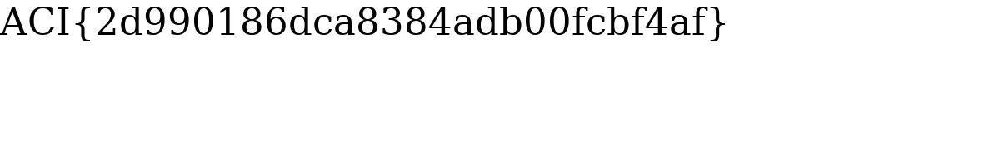

# That's More Than Enough

## Challenge
* Category: Forensics
* Points: 100

We think Jolly Jeff is up to no good. See if you can find the hidden message in his JPEG Jammer.

### Hints
* Hex editors, such as bless or wxHexEditor, are great for viewing file contents. Install bless with "sudo apt install bless" or wxhexeditor with "sudo apt install wxhexeditor".
* Take a look at the JPEG file format specification.

## Solution

http://challenge.acictf.com:54803/jammer

Read up on JPEG file structure.
https://en.wikipedia.org/wiki/JPEG_File_Interchange_Format#File_format_structure

Note:

Start of Image:	`FF D8`

End of Image: `FF D9`

Upload a file, I selected all possible transformations for shiggles.

I uploaded the following image:

After the transformations, you can download the new image.

This is what I downloaded:

Open this new image in a hex editor and notice there are multiple EOF hex bytes. There is an image within the image.

So lets copy everything out from the nested image `FFD8` to `FFD9`

Paste those contents into a new hex editor and save that file as out.png

Open out.png to find the flag:

**ACI{2d990186dca8384adb00fcbf4af}**
