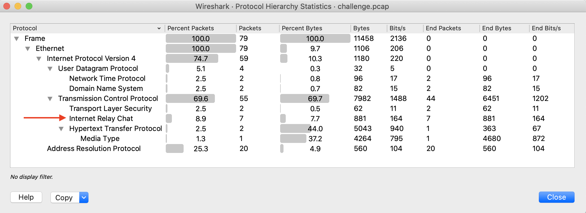

# Turtles All the Way Down

## Challenge
* Category: Forensics
* Points: 100

Early this morning, a breach occurred on the server hosting our next-gen drone development repository. It is your job to figure out what was taken: challenge.zip

### Hints
* Our analysts are using IRC to share information and investigate this breach
* Everything you need lives within these PCAP's, you simply need to carve out the relevant files
* These ZIPS appear to have been generated with 7z
* FTP is a simple text-based protocol, with passive binary streams for file transfers


## Solution

### Tools

* [Wireshark](https://www.wireshark.org/)
* [7z on ubuntu](https://itsfoss.com/use-7zip-ubuntu-linux/)


Ok. Lets start by unzipping the file `challenge.zip` which gives us the file **challenge.pcap**
```
$ unzip challenge.zip
```

### Examine the Traffic:
* Open the PCAP in Wireshark
* Examine Protocols: Statistics > Protocol Hierarchy
* Notice IRC is in the traffic. This is always interesting.
* Right Click IRC > Apply as Filter
* Exit protocol hierarchy window
* Now Right Click the top entry and Follow > TCP Stream



This is the contents of the IRC chat session
```
:doom!sid316808@gateway/web/irccloud.com/x-amtasgjkytkqghpm PRIVMSG #drone-soc :we got alerts about a server intrusion on our drone development server last night
:doom!sid316808@gateway/web/irccloud.com/x-amtasgjkytkqghpm PRIVMSG #drone-soc :thanks to our robust traffic capture infrastructure, we were able to produce a pcap of the event
:doom!sid316808@gateway/web/irccloud.com/x-amtasgjkytkqghpm PRIVMSG #drone-soc :here's a link to an encrypted zip of the traffic capture: http://file.io/jlngsr
:doom!sid316808@gateway/web/irccloud.com/x-amtasgjkytkqghpm PRIVMSG #drone-soc :the password to the zip is 'dronehack2019'
:doom!sid316808@gateway/web/irccloud.com/x-amtasgjkytkqghpm PRIVMSG #drone-soc :please take a look and identify what material they were able to exfiltrate
PING :cherryh.freenode.net
:cherryh.freenode.net PONG cherryh.freenode.net :cherryh.freenode.net

```

Ok. So in IRC, the analyst sent another analyst a link to an encrypted zip containing suspicious traffic.
The password to the zip is **dronehack2019**

Lets get the encrypted zip archive from the pcap.

### Extract Encrypted Zip Archive
* Clear your filter if you have any at the moment
* File > Export Objects > HTTP Objects
* Select line `packet 72, file.io, application/zip, 4264 bytes, jlnsgr` > and Click `Save`

Ok. This archive contains a pcap called challenge.pcap. I dont want it to overwrite my current pcap. So create a directory called subzip

Also, the jlngsr file is a 7z, linuz unzip will not work.

```
$ mkdir subzip
$ mv jlngsr subzip/
$ cd subzip
$ sudo apt-get install -y p7zip-full
$ 7z x jlngsr
enter password at prompt: dronehack2019
```

We have a new challenge.pcap. Open it in Wireshark
### Examine Second PCAP
* Statistics > Protocol Hierarchy
  * We see FTP, let follow that stream
* Select FTP > Right Click > Apply as Filter
* Scroll to the end of the Wireshark main window, select a session and Follow > TCP Stream

So we see someone successfully logged in via FTP and begins searching directories. Note that it ends with the following:
```
PASV
227 Entering Passive Mode (10,1,3,4,216,197).
RETR flag.zip
150 Opening BINARY mode data connection for flag.zip (229 bytes).
226 Transfer complete.
```
Research [PASV](https://www.lifewire.com/definition-of-passive-mode-ftp-816441). The Attacker initiated a file retrieval in binary mode because it was a compressed archive. Now we currently do not see the file in this stream (we are filtering for stream eq 2). So clear you filter and select the next session after `Opening BINARY mode...`. Right click > Follow > TCP Stream

This session contains the actual data transfer of flag.zip
```
PK..
......x.P...{ ... .......flag.txtACI{03edc78eff5f1e320040d73ad48}PK..?.
......x.P...{ ... .....$....... .......flag.txt
. ..........Z.......Z.......Z......PK..........Z...F....................................................
```


You could export this to zip and then unzip it for the file flag.txt, but the contents of flag.txt are already visible.

**ACI{03edc78eff5f1e320040d73ad48}**
