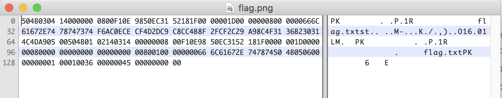

# Filing Extensions

## Challenge
* Category: Forensics
* Points: 10

We went to apply for a tax-filing extension with the IRS, and they replied with this image saying it contained the code we needed. Unfortunately, our computer refuses to display it and just says that it isn't a PNG... flag.png

### Hints
* Is the extension the only way to tell a file's type?
* Wouldn't it be awesome if there was a list of way to identify files.


## Solution
If you try to open the file flag.png you will receive an error:
The file “flag.png” could not be opened.

View it in a hex editor


File signature **PK** means its a zip compressed archive

File signature references: https://www.garykessler.net/library/file_sigs.html

```
$ cp flag.png flag.zip
flag.png  flag.zip
$ unzip flag.zip
Archive:  flag.zip
  inflating: flag.txt

$ cat flag.txt
ACI{Something_witty_d32841ed}
```


**ACI{Something_witty_d32841ed}**
