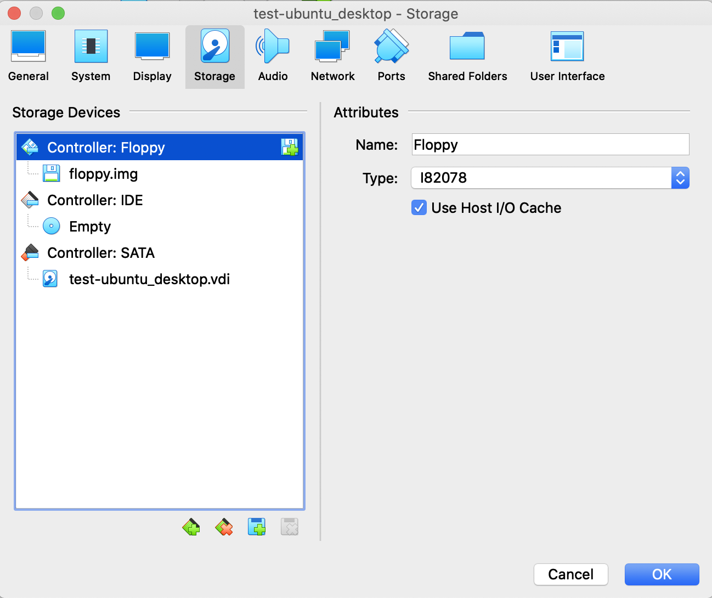
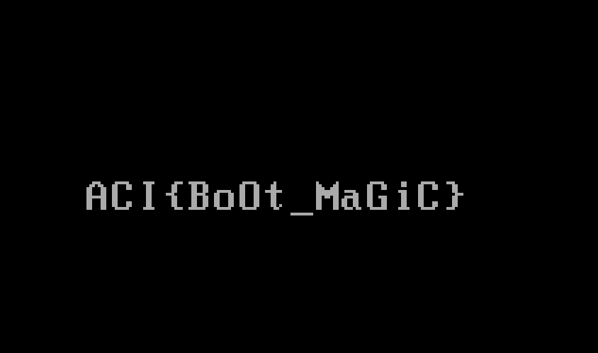

# Bootcamp

## Challenge
* Category: Forensics
* Points: 20

We found an old floppy-drive laying around and think that there may be a flag hidden on it somewhere. We managed to copy the drive image, but there doesn't appear to be any kind of filesystem on it. In fact, all of the data appears to be on the first sector of the disk.

### Hints
* It looks like file floppy.img identifies it as a "DOS/MBR Boot Record"...
* What happens if you try booting the image?
* You probably don't have a real floppy drive that you can use, but what about a 'virtual' one?
* qemu-system-i386 floppy.img is our favorite means of 'booting' floppies, but 'Virtual Box' and 'bochs' are other alternatives (and they are all free).

## Solution
untar the floppy image

`$ tar xzvf files.tar.gz`

Attach the floppy.img to a Virtualbox VM

Boot the VM. The boot order of Floppy first will try to boot from the floppy.img

The flag is loaded from the floppy

**ACI{BoOt_MaGiC}**
