# Drill to the Center

## Challenge
* Category: Forensics
* Points: 300

It looks like our [password generator](https://challenge.acictf.com/static/f10db09d8471b05504505c73216ea6c7/drill) is [crashing](https://challenge.acictf.com/static/f10db09d8471b05504505c73216ea6c7/core) - can you take a look at it for us?

### Hints
* [Core Dump](https://en.wikipedia.org/wiki/Core_dump)
* How much can I malloc?


## Solution

### Tools
* [Ghidra](https://ghidra-sre.org/)
* [IDA v7.0 free](https://www.hex-rays.com/products/ida/support/download_freeware/)
* [gdb](https://www.gnu.org/software/gdb/)
* [Online C Compiler](https://www.onlinegdb.com/online_c_compiler)
* [Hex Fiend](https://ridiculousfish.com/hexfiend/) hex editor
* https://www.rapidtables.com/convert/number/hex-to-decimal.html


I know my list of tools is a bit repetitive. If you are good at Reverse Engineering and debugging, you can probably finish this challenge with one of those debuggers. I was bouncing back and forth between IDA and Ghidra because of how each was presenting the same data. It's nice to see the Ghidra give you re-assembled code. I'm just getting used to IDA, and I like reading assembly in it over Ghidra. All that said, this challenge is definitely a Reverse Engineering challenge. I don't know why it's in the forensics category.

I was able to solve this challenge only after reading [Nic Hartley](https://nic-hartley.github.io/acictf-writeups/drill-to-the-center/) and bobbyD write-ups. Nic's writeup is good. You should definitely go read it. I'm going to try and explain this challenge from the perspective of someone without a RE background.

Let's get started. This is how I feel when someone hands me a binary.


#### Analyze malloc

Since the hints mention [malloc](https://www.tutorialspoint.com/c_standard_library/c_function_malloc.htm), fire up Ghidra and let's try to find where `malloc` is used. From the Ghidra projects menu, select the `CodeBrowser` tool. It's dragon looking icon.

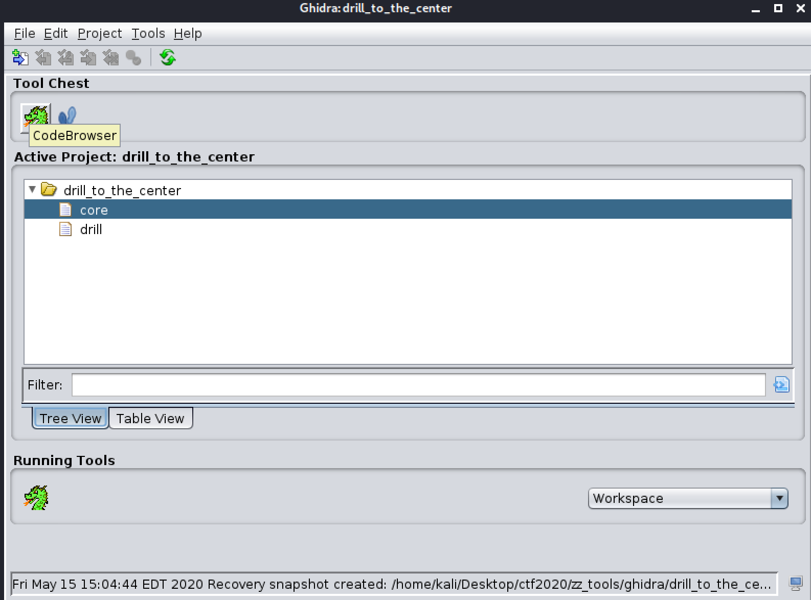

Now click `File` > `Import File ...` and browse to the location of your `drill` binary, selecting the binary for import. It should detect the format as ELF.

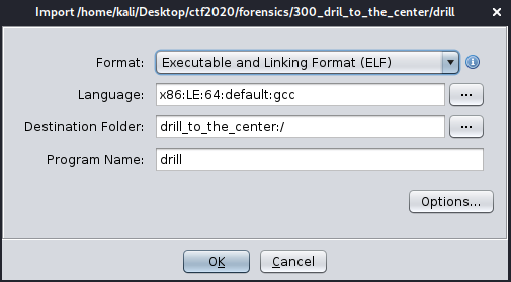

Ghidra will then ask you if you want to perform analysis on the binary. Select `Yes`. For `Analysis Options` you can leave the default boxes checked. Click `Analyze`. The program will run for a while.

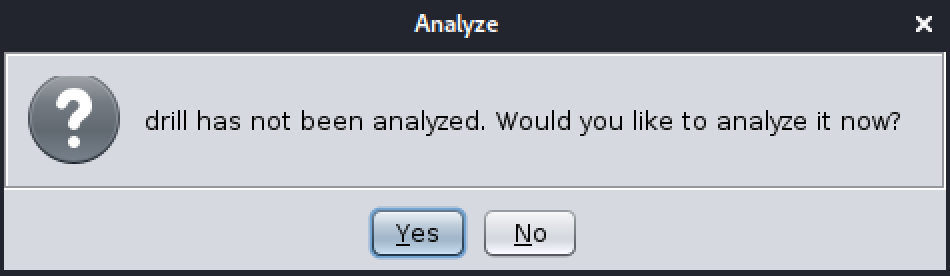

The analysis status bar is in the lower right corner. Wait until it's done. Now let's perform a search for `malloc`. Go to the `Search` Tab and select `Program Text`. Type in `malloc`, select `All Fields` radio button. Then click `search all`.


In a few seconds you should have the search results.

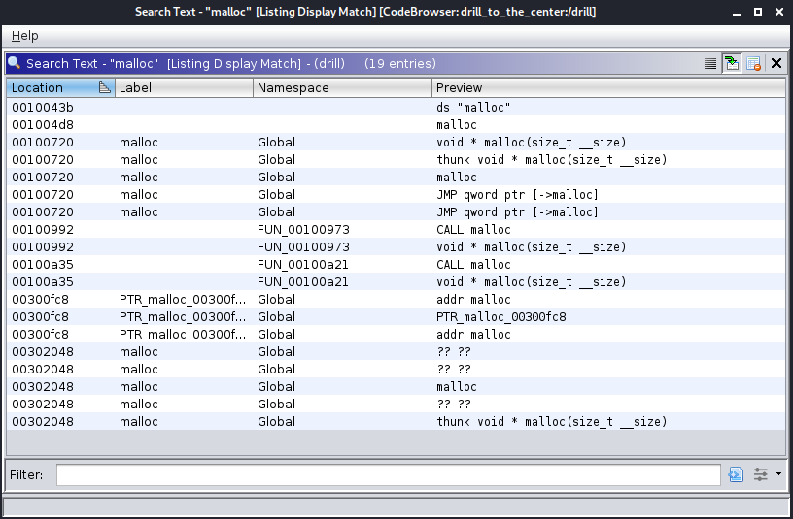

Functions contain code. We are interested in the functions that use `malloc`. Ghidra will create a namespace for unlabeled functions as `FUN_<THE_ADDRESS>`. So here we have two functions `FUN_00100973` and `FUN_00100a21`. This is an awesome feature of Ghidra. Click on both of the functions and Ghidra will give you the decompiled code for that function.

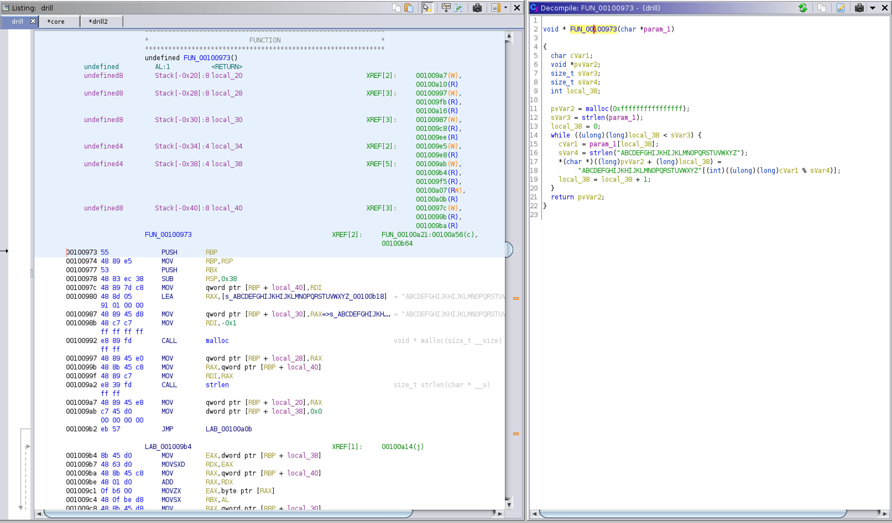

Let's discuss the malloc calls in both of the functions. Make sure you read up on [malloc](https://www.tutorialspoint.com/c_standard_library/c_function_malloc.htm). That website says two things that are important to our code.

```
The C library function void *malloc(size_t size) allocates the requested memory and returns a pointer to it.
size − This is the size of the memory block, in bytes.
```

So malloc is going to take the size given to it and allocate that much space on the stack (memory) and return a pointer (which is a reference to its location). Let's convert each of the hex given to malloc to an integer and see how much we can malloc (hint).

In **FUN_00100973** malloc is given `pvVar2 = malloc(0xffffffffffffffff);` Copy `0xffffffffffffffff` out and paste it into [rapidtables hex to dec](https://www.rapidtables.com/convert/number/hex-to-decimal.html) converter. Hrmmm. `18446744073709551615` is a really long number and the website on malloc says that is bytes. I popped that into a byte to terabyte converter and it turns out malloc is requesting 18446744TB of space. No way most system can run this program. Maybe one of those super computers. This is probably why we the program crashed and we have a `core` file (from a segmentation fault).

In **FUN_00100a21** `__ptr = malloc(0x20);`. Repeat the above step and convert `0x20` into 32. It's a lot more reasonable for the program to request 32 bytes of space.

#### Fix and run drill

They asked us to take a look at the program. So I am assuming they want us to fix and run it. Let's try and change `0xffffffffffffffff` to something a bit more reasonable. I'm going with 255 bytes, or `0xff`. You can use [rapidtables dec to hex](https://www.rapidtables.com/convert/number/decimal-to-hex.html) converter. Plug in a number and it will give you the hex.

###### Find the hex to change

First we need to figure out what we need to change. We will edit the binary in a hex editor, we we will need to find the hex to change. I found this part easier to do in IDA, but figured out how to do it in Ghidra. I'll explain both.

In IDA, You will see the long hex `0FFFFFFFFFFFFFFFFh`. Highlight it and then switch to your `Hex View-1` tab. The Hex is highlighted.

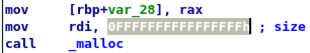

Now the hex is highlighted in the `Hex View-1` tab

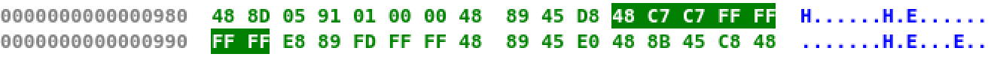

In Ghidra, it was represented as `-0x1`. I converted that to Unsigned Hex just so I was sure of what I was working with.

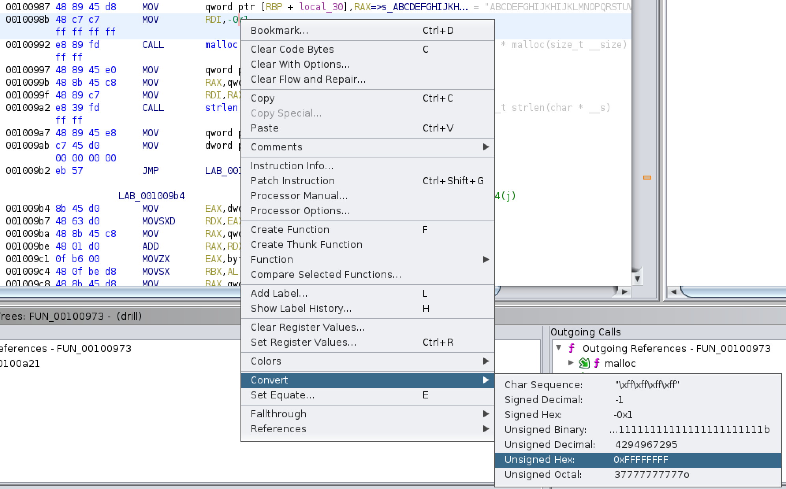

Now that is converted, we can see the hex we need to grab.

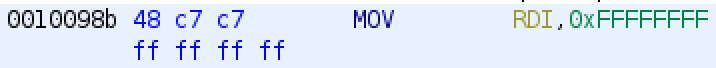

Both methods give us `0x48C7C7FFFFFFFF`. This is what we will change in `drill2`. We are basically removing 3 of the `FF` and replacing with `00`. The result will be `0x48C7C7FF000000`


###### Change the hex in drill2

I don't want to make changes to our original binary, so copy `drill` and name the new file `drill2`. CLI this would be: `$ cp drill drill2`.

Now open `drill2` in a hex editor. I am using [Hex Fiend](https://ridiculousfish.com/hexfiend/) on my mac. I also like [bless hex editor](https://www.thinkpenguin.com/gnu-linux/bless-hex-editor) for linux.

In Hex Fiend select Edit > Find. Type `48 C7 C7 FF FF FF FF` in the Find field and `48 C7 C7 FF 00 00 00` into the replace field. Click `Replace`. Finally, save the new binary.

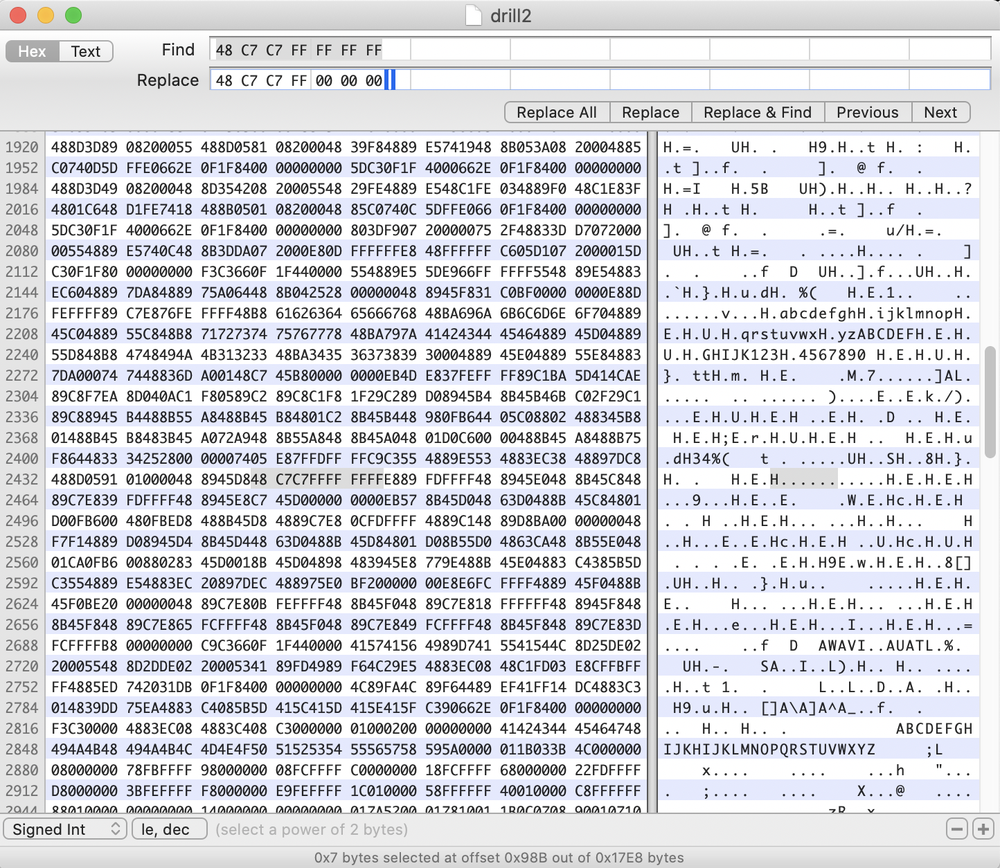

###### Run drill2

Let's try running the new binary.

```
$ chmod a+x drill2
$ ./drill2
QMCOPQWHYHYJIHWZILUKXJPWAXKHJAU
$ ./drill2
OHKVJHTXXTKTHKWAPNMJLLXFNAHKVSP
$ ./drill2
ZISXQOIKQQUKRFSJRTRMJZRNKCTHJPW
$ ./drill2
QHPHLTBQJRJHBKRXROJCIILPMRRAILK
$ ./drill2
QHPHLTBQJRJHBKRXROJCIILPMRRAILK
```

Well, the output does not work as our flag, but we do know we can run the program without a segmentation fault.

#### Find string in core

I must have missed it, but I guess there was an additional hint given that said something about when the drill file is running, it should be in exactly the same situation as the crashed drill file generating the core dump to have the flag print to stdout. I hope you read the hint regarding [core dumps](https://en.wikipedia.org/wiki/Core_dump). A core dump consists of the recorded state of the working memory of a computer program at a specific time, generally when the program has crashed or otherwise terminated abnormally. So we have a snapshot of the systems memory when `drill` produced a segmentation fault. Take a look at function `FUN_00100973`.

```
void * FUN_00100973(char *param_1)

{
  char cVar1;
  void *pvVar2;
  size_t sVar3;
  size_t sVar4;
  int local_38;

  pvVar2 = malloc(0xffffffffffffffff);
  sVar3 = strlen(param_1);
  local_38 = 0;
  while ((ulong)(long)local_38 < sVar3) {
    cVar1 = param_1[local_38];
    sVar4 = strlen("ABCDEFGHIJKHIJKLMNOPQRSTUVWXYZ");
    *(char *)((long)pvVar2 + (long)local_38) =
         "ABCDEFGHIJKHIJKLMNOPQRSTUVWXYZ"[(int)((ulong)(long)cVar1 % sVar4)];
    local_38 = local_38 + 1;
  }
  return pvVar2;
}
```

The function takes `char *param_1`. C uses `char` type to store characters and letters. This means that potentially somewhere in our `core` file there could be a string that was being passed to this function. Let's confirm this hypothesis by examining the core file with `gdb`.

```
$ gdb -c core
Core was generated by `./drill'.
Program terminated with signal SIGSEGV, Segmentation fault.
#0  0x0000562662defa05 in ?? ()
```

Well `0x0000562662defa05` is the address where `drill` terminated. Let's see what is at that address.

```
(gdb) x/x 0x0000562662defa05
0x562662defa05: 0x45830288
```

Ok. I'm not sure what that is, so go back into Ghidra and search `memory` for `45 83 02 88`. Click the `Search` tab and select `Memory` from the dropdown. Now enter `45 83 02 88` and click `Search All`. Welp, it says it found no matches.

Remember endianness? Let's flip the order. Try a search for `88 02 83 45`.

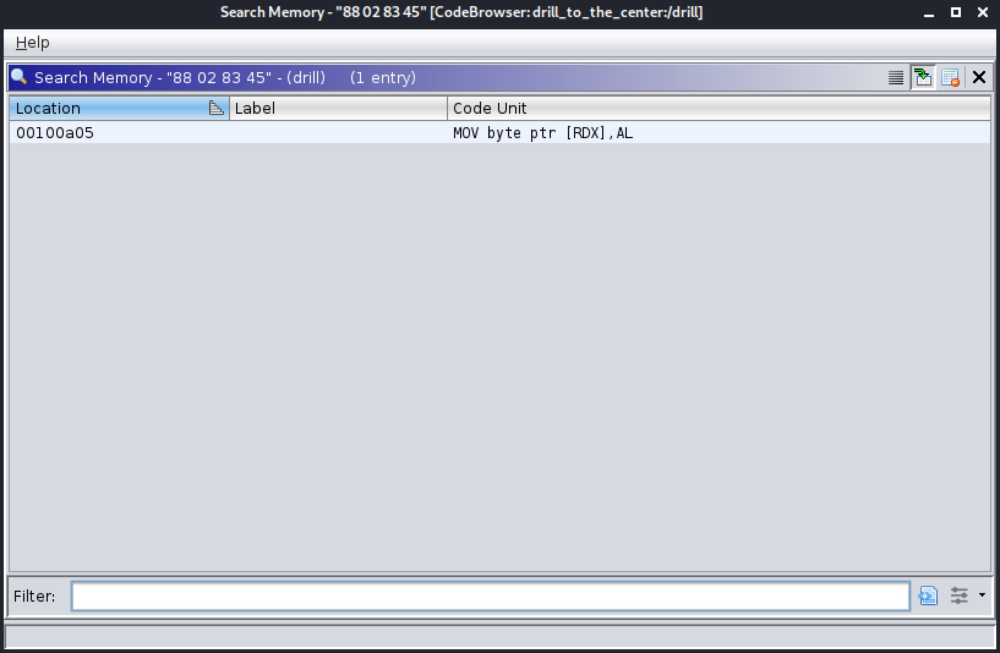

Boom! We have a match and the instruction. Click on it and Ghidra will take us to that point in the code. Scroll a bit up and we realize we are in `FUN_00100973`! This means `drill` faulted in our function, which also means there is string somewhere in the memory dump that we can pass to the fixed `FUN_00100973` to get the flag.

We need to find where this string is in the memory dump. So let's go back to IDA and read some assembly. If IDA starts in graph view, Right-Click the window and select `text view`. Check out the assembly around the `malloc` call.

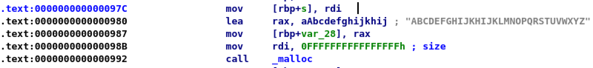

The pointer to the string we are looking for is stored in rdi. Look at this instruction.

```
.text:000000000000097C                 mov     [rbp+s], rdi
```

`mov  [rbp+s], rdi` means the pointer is later stored in stack location `rbp+s`

Convert `s` to hex by highlighting it and clicking `q`.

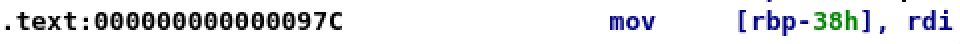

Now you should see the `s` was converted to `-38h`. So now we know the string at the time of fault was at `rbp - 0x38`. We can have gdb to the subtraction for us. Go to the dump and get register addresses.

```
(gdb) info registers
rax            0x49                73
rbx            0x62                98
rcx            0x0                 0
rdx            0x0                 0
rsi            0x0                 0
rdi            0x562662defb18      94722867526424
rbp            0x7fffb3489ff0      0x7fffb3489ff0
rsp            0x7fffb3489fb0      0x7fffb3489fb0
r8             0x7fd53c63e1d0      140553817940432
r9             0x7fd53c63e240      140553817940544
r10            0x96db9f00          2530975488
r11            0x1f                31
r12            0x562662def750      94722867525456
r13            0x7fffb348a100      140736201269504
r14            0x0                 0
r15            0x0                 0
rip            0x562662defa05      0x562662defa05
eflags         0x10246             [ PF ZF IF RF ]
cs             0x33                51
ss             0x2b                43
ds             0x0                 0
es             0x0                 0
fs             0x0                 0
gs             0x0                 0
k0             0x0                 0
k1             0x0                 0
k2             0x0                 0
k3             0x0                 0
k4             0x0                 0
k5             0x0                 0
k6             0x0                 0
k7             0x0                 0
```

rbp is at `0x7fffb3489ff0`

Now let's subtract some hex

```
(gdb) print *(char**)($rbp - 0x38)
$2 = 0x56266419d260 "b4szb3Hminf0ugrjujt2Ajp9xA8jCH2"
```

Awesome. We have the string that was passed to the function when `drill` faulted. Now all we have to do is re-run the corrected drill with that string.

#### Run Fixed Function with String

Ha. Not really. We just have to run the corrected `FUN_00100973` with the string `b4szb3Hminf0ugrjujt2Ajp9xA8jCH2`. Go to this [online c compiler](https://www.onlinegdb.com/online_c_compiler) website and paste in our corrected `FUN_00100973` below.


```c
#include <stdio.h>
#include <string.h>
#include <stdlib.h>

void * FUN_00100973(char *param_1)

{
  char cVar1;
  void *pvVar2;
  size_t sVar3;
  size_t sVar4;
  int local_38;

  pvVar2 = malloc(0xff);
  sVar3 = strlen(param_1);
  local_38 = 0;
  while ((ulong)(long)local_38 < sVar3) {
    cVar1 = param_1[local_38];
    sVar4 = strlen("ABCDEFGHIJKHIJKLMNOPQRSTUVWXYZ");
    *(char *)((long)pvVar2 + (long)local_38) =
         "ABCDEFGHIJKHIJKLMNOPQRSTUVWXYZ"[(int)((ulong)(long)cVar1 % sVar4)];
    local_38 = local_38 + 1;
  }
  return pvVar2;
}

int main(void) {
  char text[] = "b4szb3Hminf0ugrjujt2Ajp9xA8jCH2";
  printf("Before: %s\n", text);
  char* after = FUN_00100973(text);
  printf("After: %s\n", after);
  free(after);
}
```

You have to make a main function so we can call our `FUN_00100973`.

After running, it should look like this.

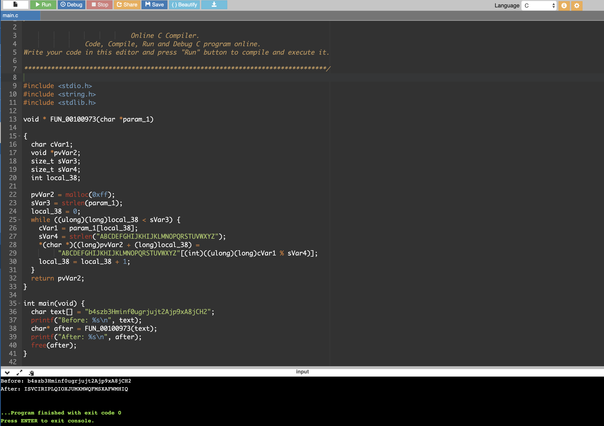

Before: b4szb3Hminf0ugrjujt2Ajp9xA8jCH2
After: ISVCIRIPLQIOXJUMXMWQFMSXAFWMHIQ

The flag is the after output.
**ACI{ISVCIRIPLQIOXJUMXMWQFMSXAFWMHIQ}**
