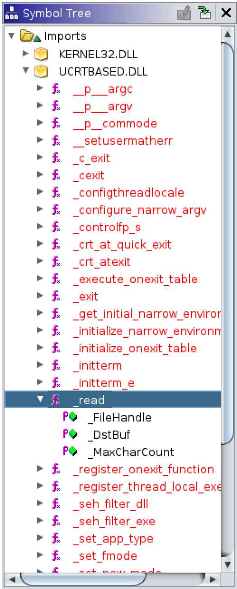
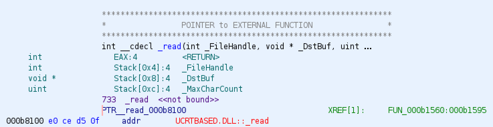
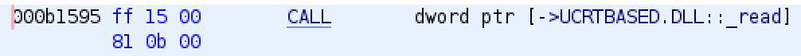
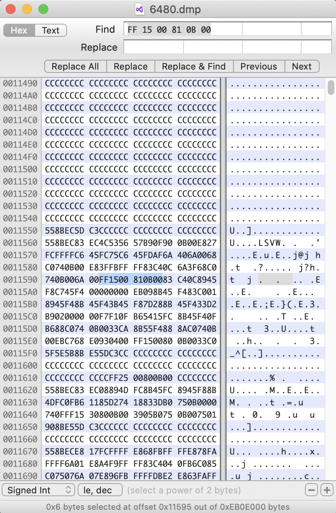
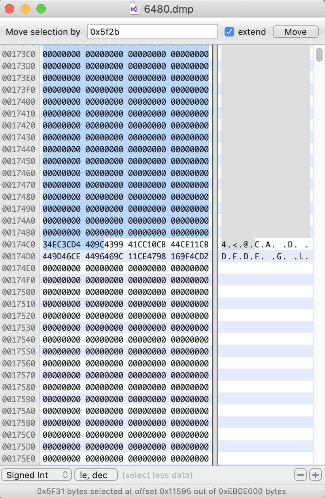
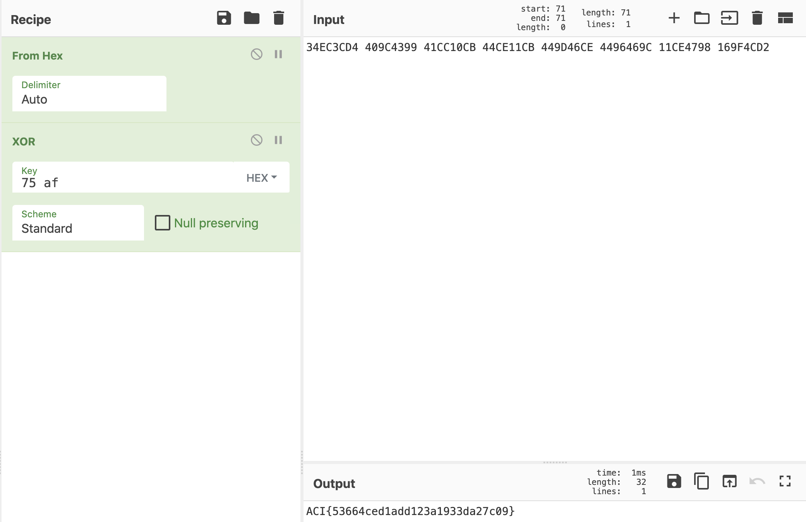

# Needle in the Haystack

## Challenge
* Category: Forensics
* Points: 300

My PC crashed while I was running some program I found on the internet. I forgot what I typed into it, can you look through the [crash dump](https://challenge.acictf.com/static/a409cf13135a1865937dd37c69a81905/ram.img.tar.gz) to find it?

### Hints
* https://github.com/iAbadia/Volatility-Plugin-Tutorial
* volatility -f ram.img --profile=Win10x86_15063 pslist | grep FlagApp
* `.text:00311560 ; int __cdecl main(int argc, co........`


## Solution

### Tools
* [volatility](https://www.volatilityfoundation.org/)
* [Ghidra](https://ghidra-sre.org/)
* [gdb](https://www.gnu.org/software/gdb/)
* [Hex Fiend](https://ridiculousfish.com/hexfiend/) hex editor for macOS
* [CyberChef](https://gchq.github.io/CyberChef/)


This challenge is pretty neat. I learned we can extract an executable from memory and perform analysis on it. Credit `bobbyD` for this approach.


#### Extract FlagApp from memory

Ok. Let's get started by using volatility to analyze the memory dump. They gave us the first command to run in the second hint.

```
$ volatility -f ram.img --profile=Win10x86_15063 pslist | grep FlagApp
Volatility Foundation Volatility Framework 2.6
Offset(V)  Name                    PID   PPID   Thds     Hnds   Sess  Wow64 Start                          Exit
---------- -------------------- ------ ------ ------ -------- ------ ------ ------------------------------ ------------------------------
0xb4287600 FlagApp.exe            6480   6380      3        0      1      0 2019-10-30 20:48:13 UTC+0000
```

Now that we know the process ID (PID), we can extract it from memory and save the executable to disk. Start by making our `dump` directory and then run volatility with `procdump -D dump/ -p 6480`. The [procdump](https://github.com/volatilityfoundation/volatility/wiki/Command-Reference#procdump) flag is used to dump a process's executable.  

```
$ mkdir dump
$ volatility -f ram.img --profile=Win10x86_15063 procdump -D dump/ -p 6480
```

Let's see what kind of file it extracted.

```
$ file dump/executable.6480.exe
dump/executable.6480.exe: PE32 executable (console) Intel 80386, for MS Windows
```

Cool. It's a portable executable for Windows.

We'll need to do one more dump before we start analyzing the exe. We need to extract all memory resident pages related to PID 6480 from the memory dump. In other words, the memory related to the executable we extracted.

```
$ volatility -f ram.img --profile=Win10x86_15063 memdump -D dump/ -p 6480
```

#### Examine FlagApp in Ghidra

From the projects window in Ghidra, Click the `CodeBrowser` (dragon) icon. From there, select File > Import File. Select the `executable.6480.exe` we extracted with volatility. It will ask you if you want to perform analysis on the file. Go ahead and perform analysis. The default analysis settings are adequate.

I was stuck here for a bit. The challenge states `I forgot what I typed into it,`. This led me to believe we needed to find a function containing a [console input](https://docs.microsoft.com/en-us/cpp/c-runtime-library/console-and-port-i-o?view=vs-2019) routine. This is not the case. Instead, the program read from a file. So we lets find a function containing the [_read](https://docs.microsoft.com/en-us/cpp/c-runtime-library/reference/read?view=vs-2019) routine.

In Ghidra, expand each of items under `imports` in the `Symbol Tree`.



Ok. Double-Click the `_read` import and Ghidra will take us to that place in the `Listing` window.



Ghidra will create a namespace for unlabeled functions as `FUN_<THE_ADDRESS>`. So here we have function `FUN_000b1560`. This is a cool part of Ghidra. Double-Click the green `FUN_000b1560` and it takes us to the disassembly of `FUN_000b1560` in the Listing window AND it provides the code in the decompile window.

```c
undefined4 FUN_000b1560(void)

{
  int iVar1;
  uint local_10;
  byte local_8 [4];

  thunk_FUN_000b1620(&DAT_000b900f);
  local_8[0] = 0x75;
  local_8[1] = 0xaf;
  memset(&DAT_000b74c0,0,0x40);
  iVar1 = _read(0,&DAT_000b74c0,0x3f);
  local_10 = 0;
  while ((int)local_10 < iVar1) {
    (&DAT_000b74c0)[local_10] = (&DAT_000b74c0)[local_10] ^ local_8[local_10 % 2];
    local_10 = local_10 + 1;
  }
  Sleep(300000);
  return 0;
}
```

Let's examine this function. There are two important parts we need to remember. First, let's discuss the line `iVar1 = _read(0,&DAT_000b74c0,0x3f);`.

Go back and read the Microsoft documentation on [_read](https://docs.microsoft.com/en-us/cpp/c-runtime-library/reference/read?view=vs-2019) if you have not already. The docs say it **Reads data from a file**. Look at the parameters for `_read`. fd is the File descriptor referring to the open file. buffer is the Storage location for data and buffer_size is the Maximum number of bytes to read.

```
int _read(
   int const fd,
   void * const buffer,
   unsigned const buffer_size
);
```

Our `FUN_000b1560` is giving read the following parameters: `fd = 0`, `destination buffer = &DAT_000b74c0` and `buffer_size = 0x3f`. We are interested in the destination buffer, which is an address `0x000b74c0`. The contents of the "user input" were read into this location!

The second important portion of the function is the [xor operator](https://www.programiz.com/c-programming/bitwise-operators) referenced by `^`. Let's explain what `(&DAT_000b74c0)[local_10] = (&DAT_000b74c0)[local_10] ^ local_8[local_10 % 2];` is doing. The `while` loop is reading each byte from the address `0x000b74c0`,  performing the bitwise operation `xor` on each byte, and then saving the result back into the same memory location. After the xor operation, the while loop increments by `1` and moves onto the next position at the address to perform another xor operation. The xor operation is using the value in the `local_8` variable, which is `0x75af` as the XOR key.

We need to remember this because our flag is most likely XOR'd and we will need to use the key `0x75af` to decode it.

#### Analyze memdump for XOR'd flag

We will need to calculate the place in the memdump `6480.dmp` where our XOR'd flag is. The function read the file into memory. This took up a bit of space on the stack. So we will need to find the end of the file by subtracting some addresses. We'll analyze the memdump `6480.dmp` in a hex editor. But first, let's figure out where (address) we should be looking.

Take a look at the instruction that called the `_read` routine.



In the executable, the instruction is at address `0x000b1595`. Remember the **destination buffer** for the file is at `0x000b74c0`. Since the memory location of the stored input is `0xB74C0`, subtract `0xB1595` from `0xB74C0`. You can use `gdb` to subtract the two addresses.

```
$ gdb
(gdb) x/x 0xB74C0-0xB1595
0x5f2b: Cannot access memory at address 0x5f2b
(gdb) quit
```

Excellent! Now we now know we need to jump `0x5f2b` from our `call _read` instruction. This needs to be done in the `6480.dmp`. How will we know where the `call _read` instruction is at in the memory dump? We can search for its hex **FF 15 00 81 0B 00**!

Open the `6480.dmp` in a hex editor. I am using [Hex Fiend](https://ridiculousfish.com/hexfiend/) on my mac. Start by searching for `FF 15 00 81 0B 00`.  In Hex Fiend, Edit > Find. Paste the hex into the box and click `Next`.



Ok. So we have our starting position. Now we need to jump `0x5f2b`. In Hex Fiend I was able to do this by going to Edit > `Extend Selection` and then enter `0x5f2b`. It will highlight in blue a lot of lines. Scroll to the end of the highlighted area.




At the end of the blue highlighted area we have 32 bytes of hex all by itself.

```
34EC3CD4 409C4399 41CC10CB 44CE11CB 449D46CE 4496469C 11CE4798 169F4CD2
```

This would be our XOR'd flag.

#### Decode the XOR'd flag

Now go over to [CyberChef](https://gchq.github.io/CyberChef/). We will use it to decode our flag. Build a Recipe by double-clicking `From Hex`. You will probably have to type `xor` in the search box, then double-click `XOR` to add it to the recipe. Paste `75 af` into Key field for XOR. Now paste the hex from your hex editor and it should decode our flag!



**ACI{53664ced1add123a1933da27c09}**
