# Kids on the Block

## Challenge
* Category: Forensics
* Points: 400

Help! I was ransomwared and payed the ransom. Now I want to track my coins down and [find the culprit](http://challenge.acictf.com:10132/).

### Hints
* You can access transactions pragmatically with geth's javascript API
* All ransom transactions will move the ransom value or a logical fraction of it (such as a half or a fourth)
* Contracts take arguments from the transaction input data


## Solution

### Tools
* [geth](https://geth.ethereum.org/docs/)
* [maltego](https://www.maltego.com/)
* [web3.py](https://web3py.readthedocs.io/en/stable/)


Alright, so I know next to nothing about blockchain and ethereum mining. Get started by opening up the challenge URL and take a few notes on the instructions.

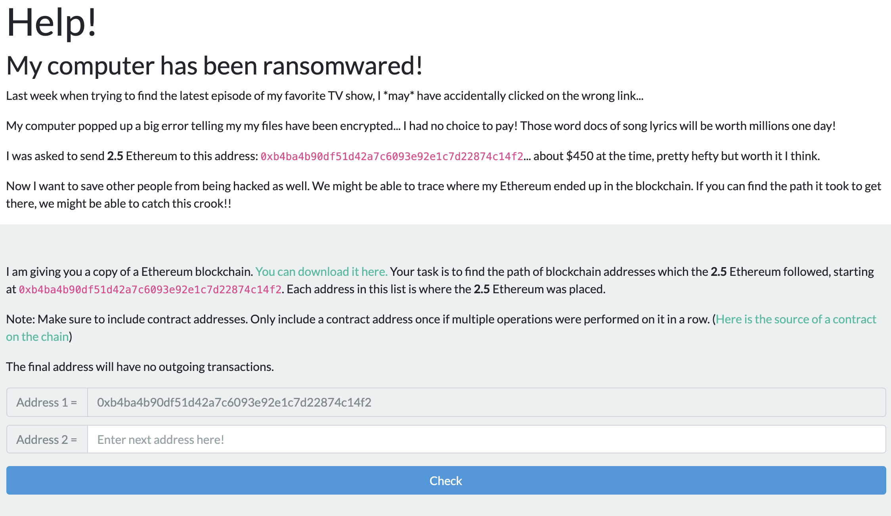

The challenge website gives us a few more things to download. Go ahead and download the [Ethereum blockchain](http://challenge.acictf.com:10132/chain.tar.gz) package and the [contract source](http://challenge.acictf.com:10132/static/wallet.sol) file. Also note that we will most likely need to search the blockchain for `0xb4ba4b90df51d42a7c6093e92e1c7d22874c14f2`.

#### Figure out how to use geth

After several hours of ethereum research my browser was unhappy with me. [geth](https://geth.ethereum.org/docs/) has some good documentation, but learning to querying the API was rough.

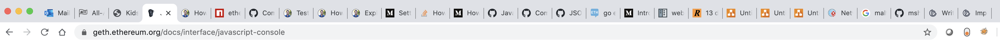

Let's get ready to query the Ethereum Blockchain for some data. I am using a [vagrant](https://www.vagrantup.com/) virtual machine. Specifically, the [ubuntu/bionic64](https://app.vagrantup.com/ubuntu/boxes/bionic64) vagrantbox. You do not have to use Vagrant. Geth is really easy to setup in a Ubuntu 20.04 LTS Desktop.

Follow the [geth installation instructions](https://geth.ethereum.org/docs/install-and-build/installing-geth). We have to add the ethereum personal package archive.

```
sudo add-apt-repository -y ppa:ethereum/ethereum
sudo apt-get update
sudo apt-get install ethereum
```

Extract our ethereum blockchain archive and take a look at its components.

```
$ tar xzvf chain.tar.gz
$ tree geth_data_dir/
geth_data_dir/
├── geth
│   ├── LOCK
│   ├── chaindata
│   │   ├── 000011.ldb
│   │   ├── 000012.log
│   │   ├── 000014.ldb
│   │   ├── CURRENT
│   │   ├── CURRENT.bak
│   │   ├── LOCK
│   │   ├── LOG
│   │   ├── MANIFEST-000013
│   │   └── ancient
│   │       ├── FLOCK
│   │       ├── bodies.0000.cdat
│   │       ├── bodies.cidx
│   │       ├── diffs.0000.rdat
│   │       ├── diffs.ridx
│   │       ├── hashes.0000.rdat
│   │       ├── hashes.ridx
│   │       ├── headers.0000.cdat
│   │       ├── headers.cidx
│   │       ├── receipts.0000.cdat
│   │       └── receipts.cidx
│   ├── lightchaindata
│   │   ├── 000001.log
│   │   ├── CURRENT
│   │   ├── LOCK
│   │   ├── LOG
│   │   └── MANIFEST-000000
│   ├── nodekey
│   └── transactions.rlp
└── history

4 directories, 28 files
```

We need to figure how to use geth to run our existing ethereum blockchain. Check out the [geth command line options](https://github.com/ethereum/go-ethereum/wiki/Command-Line-Options). We will be using the following flags.

```
--datadir value                     Data directory for the databases and keystore (default: "/home/vagrant/.ethereum")
--rpc                               Enable the HTTP-RPC server (deprecated, use --http)
--rpcapi value                      API's offered over the HTTP-RPC interface (deprecated, use --http.api)
```

This took me a while to figure out. The first argument is pretty straight forward that we will use the flag `--datadir geth_data_dir`. This creates a geth.ipc file that we can use geth to query. In my instance it's located at `/home/vagrant/geth_data_dir/geth.ipc`. Since python is my language of choice, I wanted to use the web api to query the blockchain. Adding the `--rpc` flag creates a url available at `http://127.0.0.1:8545/`. Now this is the part that took me a bit to figure out. There are different namespaces available at the [JSON-RPC server](https://geth.ethereum.org/docs/rpc/server) we can add to the rpcapi that will allow us to query the data. We need the `eth` namespace. So we will add the `--rpcapi="eth"` flag. Note, I added this flag later after I figured out what to do. I believe it defaults to allow `eth` and `shh` namespaces.

So putting it all together, our command to run geth is:

```
$ geth --rpc --rpcapi="eth" --datadir geth_data_dir
```

Cool. That command produced a bunch of output, including the url and path to the geth.ipc file. Now we need to figure out how to query the blockchain. Leave the command above running and open a new terminal window. Go and look at the documentation to [use geth's javascript console](https://github.com/ethereum/go-ethereum/wiki/JavaScript-Console#interactive-use-the-jsre-repl--console). It has a couple examples of using the `attach` command. Let's use it to attach to our geth.ipc file.

```
$ geth attach /home/vagrant/geth_data_dir/geth.ipc
Welcome to the Geth JavaScript console!

instance: Geth/v1.9.14-stable-6d74d1e5/linux-amd64/go1.14.2
at block: 62 (Mon Oct 21 2019 00:46:20 GMT+0000 (UTC))
 datadir: /home/vagrant/geth_data_dir
 modules: admin:1.0 debug:1.0 eth:1.0 ethash:1.0 miner:1.0 net:1.0 personal:1.0 rpc:1.0 txpool:1.0 web3:1.0

>
```

Cool. Now what. This is where the geth documentation falls apart. Everything entered here produced an error. There is no help menu in the javascript console as far as I can tell. After reading the [JSON-RPC](https://github.com/ethereum/wiki/wiki/JSON-RPC) api documentation, I typed `eth` into the command prompt and started making progress.

```
> eth
{
  accounts: [],
  blockNumber: 62,
  coinbase: undefined,
  compile: {
    lll: function(),
    serpent: function(),
    solidity: function()
  },
  defaultAccount: undefined,
  defaultBlock: "latest",
  gasPrice: 1000000000,
  hashrate: 0,
  mining: false,
  pendingTransactions: [],
  protocolVersion: "0x41",
  syncing: false,
  call: function(),
  chainId: function(),
  contract: function(abi),
  estimateGas: function(),
  fillTransaction: function(),
  filter: function(options, callback, filterCreationErrorCallback),
  getAccounts: function(callback),
  getBalance: function(),
  getBlock: function(),
  getBlockByHash: function(),
  getBlockByNumber: function(),
  getBlockNumber: function(callback),
  getBlockTransactionCount: function(),
  getBlockUncleCount: function(),
  getCode: function(),
  getCoinbase: function(callback),
  getCompilers: function(),
  getGasPrice: function(callback),
  getHashrate: function(callback),
  getHeaderByHash: function(),
  getHeaderByNumber: function(),
  getMining: function(callback),
  getPendingTransactions: function(callback),
  getProof: function(),
  getProtocolVersion: function(callback),
  getRawTransaction: function(),
  getRawTransactionFromBlock: function(),
  getStorageAt: function(),
  getSyncing: function(callback),
  getTransaction: function(),
  getTransactionCount: function(),
  getTransactionFromBlock: function(),
  getTransactionReceipt: function(),
  getUncle: function(),
  getWork: function(),
  iban: function(iban),
  icapNamereg: function(),
  isSyncing: function(callback),
  namereg: function(),
  resend: function(),
  sendIBANTransaction: function(),
  sendRawTransaction: function(),
  sendTransaction: function(),
  sign: function(),
  signTransaction: function(),
  submitTransaction: function(),
  submitWork: function()
}
```

Ok cool. It looks like `geth` returned some information about our blockchain `blockNumber: 62,` and `defaultBlock: "latest",`. I played around with most of these commands and would get errors because I did not know what parameters the commands needed. I finally tried `> eth.getBlock("latest")` and got some data!

```json
{
  difficulty: 132736,
  extraData: "0xd883010906846765746888676f312e31332e31856c696e7578",
  gasLimit: 4042516952,
  gasUsed: 21562,
  hash: "0x233abcd97c2aaf5bd0b8f48b5afca5652ffa83acedb98d872769bce9d50461cc",
  logsBloom: "0x00000000000000000000000000000000000000000000000000000000000000000000000000000000000000000000000000000000000000000000000000000000000000000000000000000000000000000000000000000000000000000000000000000000000000000000000000000000000000000000000000000000000000000000000000000000000000000000000000000000000000000000000000000000000000000000000000000000000000000000000000000000000000000000000000000000000000000000000000000000000000000000000000000000000000000000000000000000000000000000000000000000000000000000000000000000",
  miner: "0xbe32bc629459c1eff5e157009811ce2e3ccce005",
  mixHash: "0xf6413fef05e6407d3bda449d7235b57bd92ab1b42bacee10e2e0cc82cdb6988f",
  nonce: "0x11c3254deca5692f",
  number: 62,
  parentHash: "0x5a272570a7dc21236936d3aaff117fc9fe3a40ce115d0261012c1b4b65b6f8d5",
  receiptsRoot: "0xdf425b863ac330c5cf232bc8b69720043f32a0893d5616918a7851b09fa68899",
  sha3Uncles: "0x1dcc4de8dec75d7aab85b567b6ccd41ad312451b948a7413f0a142fd40d49347",
  size: 712,
  stateRoot: "0x579b2330e6f5538d801049c9bd5d034063a1d4082bf8add44f9b279439fc4530",
  timestamp: 1571618780,
  totalDifficulty: 8181760,
  transactions: ["0x289ce23887ead3b90bbb56e91539d6100e4cab0d64aaa50a8a14c3a2d4bcc16e"],
  transactionsRoot: "0x0ef41e6f648ae3afd9ec6c3b092945aa0ab11c10076f960fb0cc4da555a229d4",
  uncles: []
}
```

You can skip this step. I then manually incremented back from block `62` until I had no blocks. The last block is `0`. Remember our starting point `0xb4ba4b90df51d42a7c6093e92e1c7d22874c14f2`? Well, using this command did not produce any data with our starting reference.

You can skip this next step as well. I then tried the `eth.getTransactionFromBlock(##)` command from block `62` to `0` and did not see our starting hex. `> eth.getTransactionFromBlock(2)`

```json
{
  blockHash: "0xe117fa8d2405ca3fbf7682bc0be8db74472aa3c8ab4f72d8f5218b83349a0344",
  blockNumber: 2,
  from: "0x605e0cccbf47b01ce2f250dffe397d62a4d131f7",
  gas: 21000,
  gasPrice: 1000000000,
  hash: "0xdc0a7ac7c5fcb65100c59772ceb01fae68aaa1432d21528313f4a9138cdbfa77",
  input: "0x",
  nonce: 0,
  r: "0xb49c1122d5832342e38039939ce2283a8e9a1fedffe907928d2a96e1e68ad87a",
  s: "0x7b62299b10cceb8d89826976277cec899e86d99b705379fcc119d81c02f8e21a",
  to: "0x789fb08034056089423c38e841a644ed96ed1cb6",
  transactionIndex: 0,
  v: "0xab",
  value: 6500000000000000000
}
```

So after a lot of querying I had not found `0xb4ba4b90df51d42a7c6093e92e1c7d22874c14f2` and realized this is not something we should attempt manually. I later realized the `getTransactionFromBlock` command was not returning all of the transactions that occur within a block. It would only return one transaction. For instance, `blockNumber: 2` has **five** transactions, but only 1 is listed above. I realized this by using the [getBlockByNumber](https://github.com/ethereum/wiki/wiki/JSON-RPC#eth_getblockbynumber) command. It takes a `boolean` argument `true` or `false`. The docs state `If true it returns the full transaction objects, if false only the hashes of the transactions`.

So I then went through each block using the `eth.getBlockByNumber("hex", true)` command. If you don't know hex numbers, you can use [rapidtables int to hex](https://www.rapidtables.com/convert/number/decimal-to-hex.html) to convert the block number to the hex you will need for the command. Now, take a look at `> eth.getBlockByNumber("0x2", true)`

```json
{
  difficulty: "0x20000",
  extraData: "0xd883010906846765746888676f312e31332e31856c696e7578",
  gasLimit: "0xff801002",
  gasUsed: "0x1eb08",
  hash: "0xe117fa8d2405ca3fbf7682bc0be8db74472aa3c8ab4f72d8f5218b83349a0344",
  logsBloom: "0x00000000000000000000000000000000000000000000000000000000000000000000000000000000000000000000000000000000000000000000000000000000000000000000000000000000000000000000000000000000000000000000000000000000000000000000000000000000000000000000000000000000000000000000000000000000000000000000000000000000000000000000000000000000000000000000000000000000000000000000000000000000000000000000000000000000000000000000000000000000000000000000000000000000000000000000000000000000000000000000000000000000000000000000000000000000",
  miner: "0x4da56f7f58bc14c785cee861d25b2c417fe6853f",
  mixHash: "0xa1b8db28c0db80a9dc0939b0cfc06d5d451cb66f47d342c3306e429d6e1d72bb",
  nonce: "0x21c8f26f108cb07e",
  number: "0x2",
  parentHash: "0x05ab4b4fedb9b337045bac03f4de35401b236f2693b54d9775b7dae67b68a411",
  receiptsRoot: "0xd48afb012eea7c32f95535c8c15c6ad13b256de9658489517db4db239e40b31e",
  sha3Uncles: "0x1dcc4de8dec75d7aab85b567b6ccd41ad312451b948a7413f0a142fd40d49347",
  size: "0x449",
  stateRoot: "0xd5159ccc5f6f0616f1e95fd017fba6ebfbd1ef71fc8440948ad2e37f3dea11b6",
  timestamp: "0x5dacfd87",
  totalDifficulty: "0x40400",
  transactions: [{
      blockHash: "0xe117fa8d2405ca3fbf7682bc0be8db74472aa3c8ab4f72d8f5218b83349a0344",
      blockNumber: "0x2",
      from: "0x605e0cccbf47b01ce2f250dffe397d62a4d131f7",
      gas: "0x5208",
      gasPrice: "0x3b9aca00",
      hash: "0xdc0a7ac7c5fcb65100c59772ceb01fae68aaa1432d21528313f4a9138cdbfa77",
      input: "0x",
      nonce: "0x0",
      r: "0xb49c1122d5832342e38039939ce2283a8e9a1fedffe907928d2a96e1e68ad87a",
      s: "0x7b62299b10cceb8d89826976277cec899e86d99b705379fcc119d81c02f8e21a",
      to: "0x789fb08034056089423c38e841a644ed96ed1cb6",
      transactionIndex: "0x0",
      v: "0xab",
      value: "0x5a34a38fc00a0000"
  }, {
      blockHash: "0xe117fa8d2405ca3fbf7682bc0be8db74472aa3c8ab4f72d8f5218b83349a0344",
      blockNumber: "0x2",
      from: "0xb4ba4b90df51d42a7c6093e92e1c7d22874c14f2",
      gas: "0x5208",
      gasPrice: "0x3b9aca00",
      hash: "0x8fbf818cf1ebf1c319aa970c2a2f7e9718169a724b79504d4f0051a48118c42f",
      input: "0x",
      nonce: "0x0",
      r: "0xc777c91a4a872d181e999afbc21493273af69bde763760f2c9a21efe4a5d5f53",
      s: "0x3476c54ff87b60bf40caea3194306ea4548f9338c10b84022045d459abefa6c0",
      to: "0xae5165d3d0c9aa682557fe964c6da645b84e9e1d",
      transactionIndex: "0x1",
      v: "0xab",
      value: "0x22b1c8c1227a0000"
  }, {
      blockHash: "0xe117fa8d2405ca3fbf7682bc0be8db74472aa3c8ab4f72d8f5218b83349a0344",
      blockNumber: "0x2",
      from: "0x5e4491492a34b135d7ba9c213ef491ea3655c921",
      gas: "0x2dc6c0",
      gasPrice: "0x3b9aca00",
      hash: "0x1eabb419f2ab5e4f1062cd9dd131df69ad38db0fa050cf9b579209e4c89c5461",
      input: "0xd0e30db0",
      nonce: "0x0",
      r: "0xd00f5b91fc36a94e634b17485f4ded86f26c4b74b88794d2472154ad29c86f20",
      s: "0x509ef527201cc73ef92f9595df315135325e2b018b2ba9a5544311e22c978dfa",
      to: "0x49a1c6ae4330eddad4fc37d1f53e93d943a82e5d",
      transactionIndex: "0x2",
      v: "0xac",
      value: "0x3311fc80a5700000"
  }, {
      blockHash: "0xe117fa8d2405ca3fbf7682bc0be8db74472aa3c8ab4f72d8f5218b83349a0344",
      blockNumber: "0x2",
      from: "0x90a58b3abe2d972f48f9b2f009491a93c5dc63d9",
      gas: "0x5208",
      gasPrice: "0x3b9aca00",
      hash: "0x0aa7a91eba46c86fb588b5293d3d054cb8c43eeea614d6750ff40082dc6d30af",
      input: "0x",
      nonce: "0x0",
      r: "0x278d325385ce194f5032731ebc54b17371b9219d5d8e9feb1fc662764c2c87f8",
      s: "0x1b36741f4bf2c90e6770369d25a288050d2d742e37bb9c596ba60473169ab8db",
      to: "0xd0e272387ec2554d87d24a090c34ad6dbe0af810",
      transactionIndex: "0x3",
      v: "0xab",
      value: "0x5a34a38fc00a0000"
  }, {
      blockHash: "0xe117fa8d2405ca3fbf7682bc0be8db74472aa3c8ab4f72d8f5218b83349a0344",
      blockNumber: "0x2",
      from: "0x5cf614ffecdfefd8d1e5729715df7ad7e0bf93ec",
      gas: "0x5208",
      gasPrice: "0x3b9aca00",
      hash: "0x13d737d75548cfec730c510ae9455940ae6c4a431986d35b82314177cbda23f7",
      input: "0x",
      nonce: "0x0",
      r: "0xdcd2cf2692621fc7f0fea806a90fdec485345d2978d5ba072e71e81e143e7135",
      s: "0x20680f79d9c428df1be8da42341b4f6f2b250cc511eaf479d416570699fa5076",
      to: "0x4eb4e3134634a1fed5fd2c8d37091430317b6548",
      transactionIndex: "0x4",
      v: "0xac",
      value: "0xf9ccd8a1c5080000"
  }],
  transactionsRoot: "0xf00da9bf8f07a07a2dc8507ae65a03cc848936afd31722f961f41a56d7a68f5c",
  uncles: []
}
```

Boom! We found `from: "0xb4ba4b90df51d42a7c6093e92e1c7d22874c14f2",` in a transaction.


#### Tracing Transactions

I had copied the output of all the `> eth.getBlockByNumber("number-hash", true)` to a file. I started by following the `to` and `from` values in each transaction that started from `0xb4ba4b90df51d42a7c6093e92e1c7d22874c14f2`. I quickly realized it was too much data to manually analyze.

The approach of or analysis is that we are going to follow the transactions `from` and `to` fields. We start at `from: "0xb4ba4b90df51d42a7c6093e92e1c7d22874c14f2"`. It has a value `to: "0xae5165d3d0c9aa682557fe964c6da645b84e9e1d",`. From there I was searching the data for all instances of `0xae5165d3d0c9aa682557fe964c6da645b84e9e1d`. Then we would need to search all of the `to` fields that hash connects to. Don't attempt this manually, its a lot of data.

I realized this was basic **link analysis** and decided we could use [maltego](https://www.maltego.com/) to visualize the pattern. Honestly, I probably could have written a python script that accomplished this in less time than I spent dragging nodes across maltego. But I went down this rabbit-hole and was committed.

Before we can use `maltego` we need to extract the `to` and `from` values for every transaction. Maltego has a feature where you can [build a graph from table](https://docs.maltego.com/support/solutions/articles/15000010797-import-graph-from-table). All we need is the transactions in a csv file.

So I wrote a quick python script that pulls all of the transactions from the `geth` api stores them in `transactions.csv`. I started trying to query the api myself using requests. Do not do that. It's a pain to manually handle the api. Instead, use the [web3.py](https://web3py.readthedocs.io/en/stable/) library.

Install web3.

```
$ pip3 install web3
```

Let's explain what `get_transactions.py` is doing. We told web3 where our geth api is with `w3 = Web3(HTTPProvider('http://localhost:8545'))`. Then our python script used `eth_getBlockByNumber` to grab the `latest` block. From there it counts back from the `latest` block until there are no more blocks. While it is counting backward, it iterates over all of the transactions for that block and stores the `blockNumber`, `from`, and `to` values in a list. Once it has grabbed all of the transactions, it writes the list to a csv file.

Now that you have a csv file containing every transaction, lets' spin up maltego.

#### Analyze Transactions in Maltego

I'm using maltego that came installed in Offensive Security's [kali linux](https://www.offensive-security.com/kali-linux-vm-vmware-virtualbox-image-download/) image. The first time you start maltego I will ask you to create an account if you do not already have one. Go ahead and get an account and then log into maltego.

You will need to install `Blockchain.info (Bitcoin)` transform from the `transform hub` if you want pretty blockchain icons with your entities. This is optional.

Let's import our transactions. Within Maltego, Click on the `Import | Export` tab across the top. Now click on the `Import Graph from Table` button. Click Next to proceed to Step 2 and select our `transactions.csv` file.


Select `Fully Meshed` in Step 3. Then Click Next.


There is an important adjustment we are going to make in Step 4 `Mapping Configuration`. Click on the `Connective Table` tab and **deselect** everything except the `from column 1` and `to column 2` relationship. This drastically reduces the clutter that maltego will generate when we import our data. Then click Next.

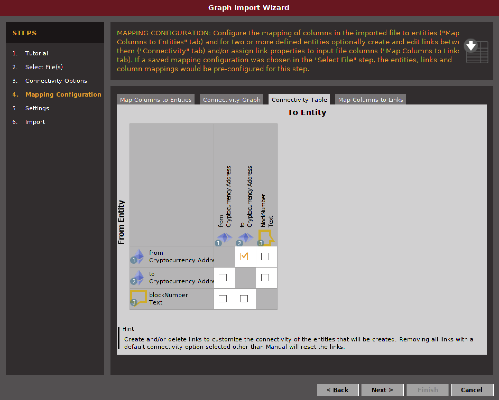

You can leave the defaults as they are in `Step 5`. Click Next.

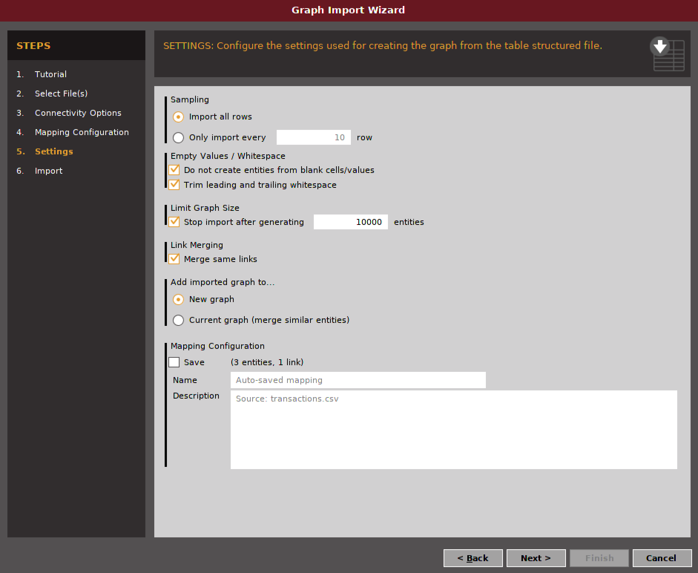

The final import page is a summary of our import data. Click Finish.

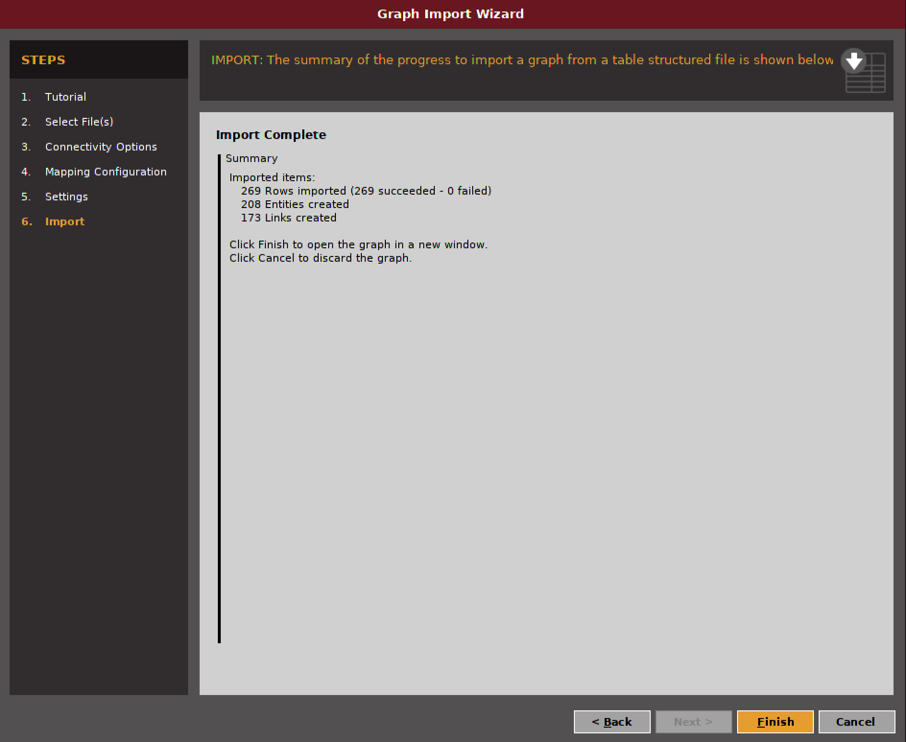


Holy Hell what do we do with that?

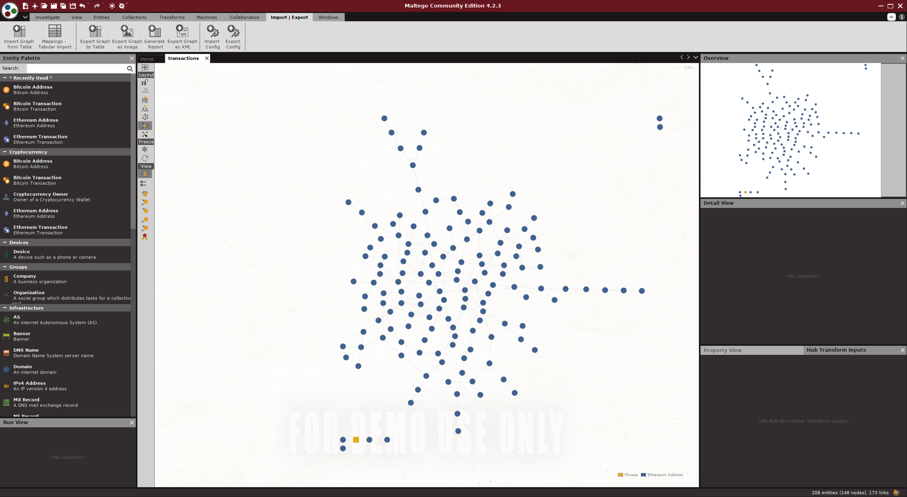

Don't stress. It's not that bad. We just need to start somewhere to make sense of the data. Remember our starting point is `0xb4ba4b90df51d42a7c6093e92e1c7d22874c14f2`? Let's find that node in the graph. To find our start point, Click `Investigate Tab` > `Quick Find`. Then paste `0xb4ba4b90df51d42a7c6093e92e1c7d22874c14f2` into the bar at the bottom of the screen and click Find.

Maltego zoom's into our entity. Drag that entity away from the cluster. Drag the one entity it connects to away from the cluster of entities. It is the `0xae5165d3d0c9aa682557fe964c6da645b84e9e1d` entity. Now click on that entity. Look at its connections. You should see `Incomming` and `Outgoing` connections.

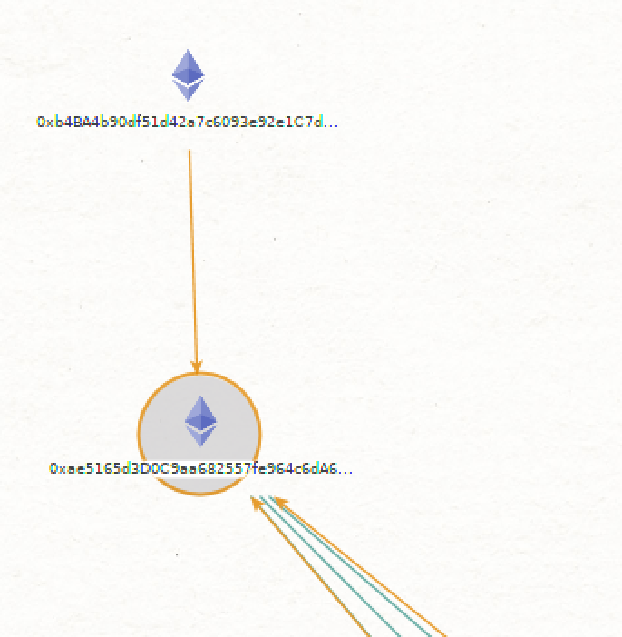

We are only interested in `Outgoing` connections. Remember, we are tracing a path `from` to `to` in the transactions. Thus we only want `Outgoing` relationships (ie the arrows going away from our entity).

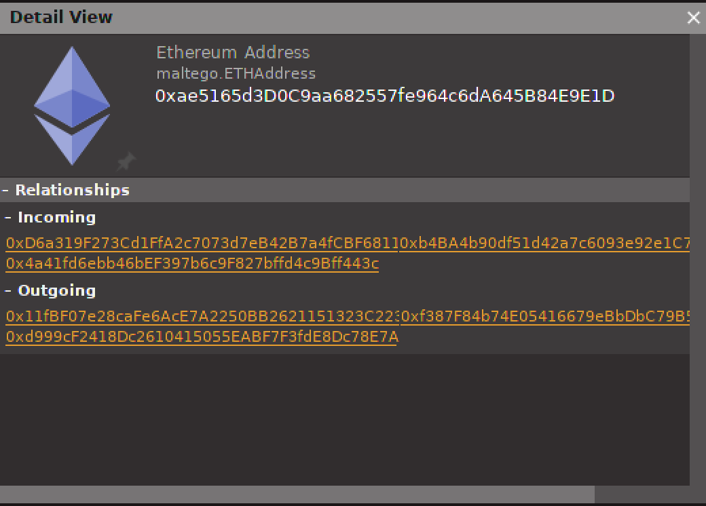

Drag the entities connected by outgoing relationships over to our working area. You should run out of outgoing relationships in a bit.

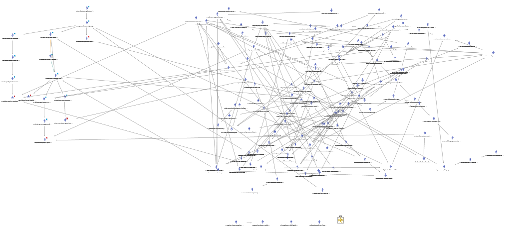


I began bookmarking the entities of interest. When I reached an entity with no more outgoing connections, I marked it with a red bookmark. That's still a lot to look at in maltego. You can delete all entities that did not make it to our work area. You would see something like this:

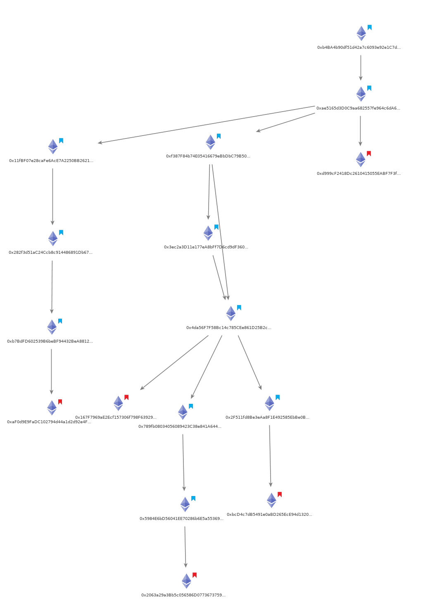


#### Enter Transaction Addresses for the Flag

Now that we have the address paths, I tried entering them into the challenge website. None of the 7 possible combinations worked. After hours of second-guessing my approach and my sanity, I decided to take a look at the data returned when we ran the `> eth.getBlockByNumber("number-hash", true)` commands on each block. We had to be on the right track because we KNOW the starting point is `0xb4ba4b90df51d42a7c6093e92e1c7d22874c14f2` and it ONLY connects to `0xae5165d3d0c9aa682557fe964c6da645b84e9e1d`.

I re-examined the blocks that contained the transactions for each of the entities bookmarked red. Take a look at our transaction containing `to: "0x167f7969ae2ecf157306f798f63929903a02d771"` in block `0x3c`. Go ahead and run `> eth.getBlockByNumber("0x3c", true)`.  Comparing it to the other transactions from the block above it in the chain, it has a different `input` value.

```json
{
    blockHash: "0xd7d938fcefbe821e1ed20b9a96b91e3e9efae9bbe637a1df9ca41d51a9fd1868",
    blockNumber: "0x3c",
    from: "0x4da56f7f58bc14c785cee861d25b2c417fe6853f",
    gas: "0x2dc6c0",
    gasPrice: "0x3b9aca00",
    hash: "0xf678663343298496dcb73f77c0500ec1f19ec94554a73b5495c651e3dc1e2629",
    input: "0xf3fef3a300000000000000000000000050fc67693f00fbabc5473c3705ef057b09acf2c700000000000000000000000000000000000000000000000022b1c8c1227a0000",
    nonce: "0x5",
    r: "0xf19737ca86d51e30d7f1f0b0e81c23b1be920b088ed0acbf6dcbc19425915393",
    s: "0x3f2a09052c3b00b634021751415e39d9d71707d7e379a352f5b532bfb616fcf3",
    to: "0x167f7969ae2ecf157306f798f63929903a02d771",
    transactionIndex: "0x4",
    v: "0xab",
    value: "0x0"
}
```

I had no clue  what the `input` value is. This is where the hint `Contracts take arguments from the transaction input data` helps. After a couple hundred browser tabs on ethereum contracts, I realized we needed to read up on [solidity contracts](https://solidity.readthedocs.io/en/develop/contracts.html#contracts). This probably has something to do with the wallet.sol given to us in the challenge.

The [solidity docs](https://solidity.readthedocs.io/en/develop/abi-spec.html) state: The first four bytes of the call data for a function call specifies the function to be called. It is the first (left, high-order in big-endian) four bytes of the Keccak-256 (SHA-3) hash of the signature of the function.

Thats a lot to digest. To be honest, I didn't really make it past `first four bytes` sentence. The `input` field starts with an interesting four bytes `0xf3fef3a3`. I google that and found https://www.4byte.directory/signatures/?bytes4_signature=0xf3fef3a3. 

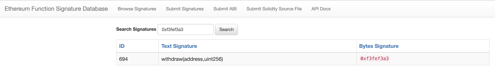

Hey! That's probably something. We are dealing with ethereum transactions, which like a bank, could probably make withdrawals. So keep reading the [solidity docs](https://solidity.readthedocs.io/en/develop/abi-spec.html#examples) and we find that `address` is used to make this field. Then I assumed this was the final address we would need. It is the **contract** address.

Now I tried this chain of addresses

```
0xb4ba4b90df51d42a7c6093e92e1c7d22874c14f2
0xae5165d3D0C9aa682557fe964c6dA645B84E9E1D
0xf387F84b74E05416679eBbDbC79B509F7f2cAA47
0x3ec2a3D11e177eA8bFf7D6cd9dF360EBcC52d584
0x4da56F7F58Bc14c785CEe861D25B2c417FE6853f
0x167F7969aE2Ecf157306f798F63929903a02d771
0x50fc67693f00fbabc5473c3705ef057b09acf2c7
```

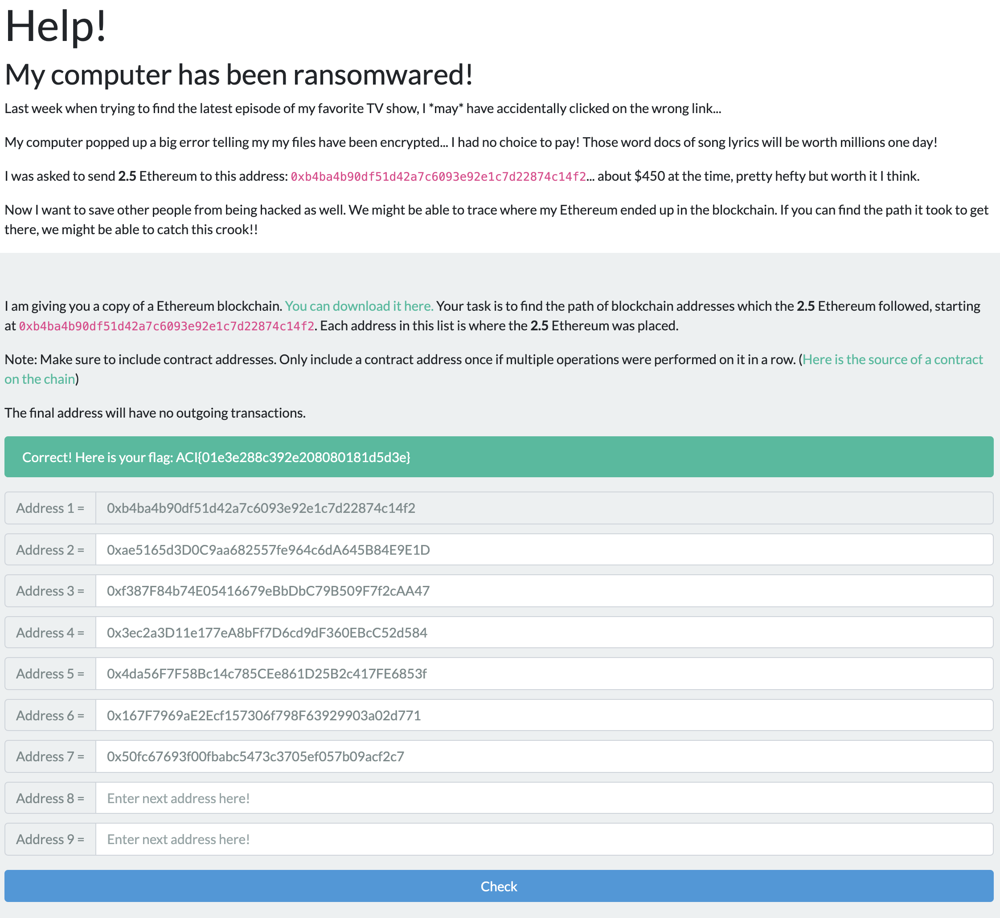


Boom! we got our flag **ACI{01e3e288c392e208080181d5d3e}**
