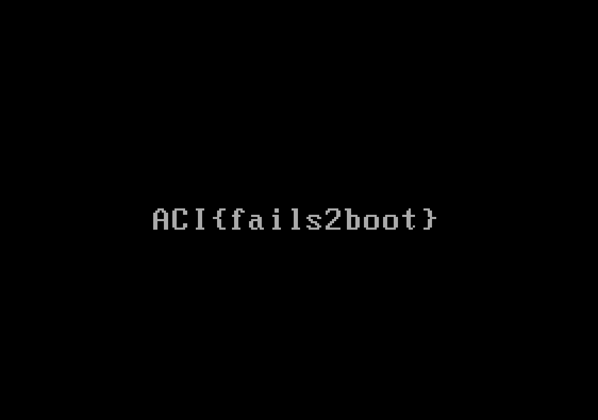

# Boot Master

## Challenge
* Category: Forensics
* Points: 75

We found another floppy disk image, but we can't get this one to boot like we did the last one. The disk had been sitting around for a while so we're wondering if some of the data was corrupted. Any ideas?


### Hints
* It looks like file floppy.img identifies this one as just "data"...
* How does file recognize that an image contains a master boot record?
* You'll probably need some kind of 'hex editor' for this problem.
* Can we change one bit in the image and fix the problem?


## Solution

Looking at floppy from bootcamp, file recognizes it as a MBR

```
$ file floppy.img
floppy.img: DOS/MBR boot sector
```

our current floppy.img is not recognized. meaning the MBR is messed up
```
$ file floppy.img
floppy.img: data
```


OK. MBR starts at offset `0x1FE` (510 bytes in)

https://cpl.li/2019/mbrfat/
In classical MBRs this should read `55AA`
But remember that the official implementation has 0x55 at offset 0x1FE and 0xAA at 0x1FF

our bad floppy as `51AA`. Lets change that to 55AA and try booting it.


Attached floppy to VM and boot


**ACI{fails2boot}**
