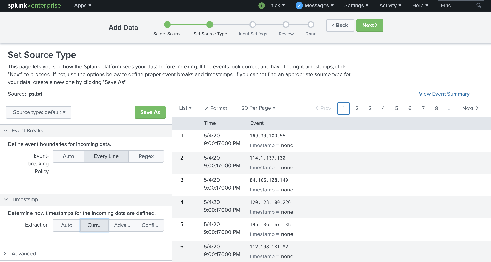
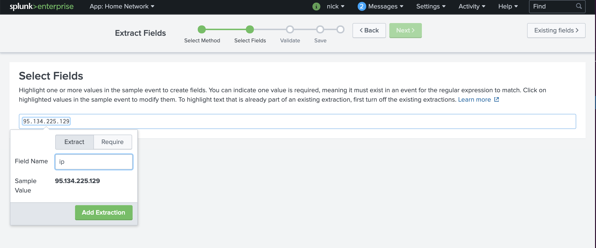
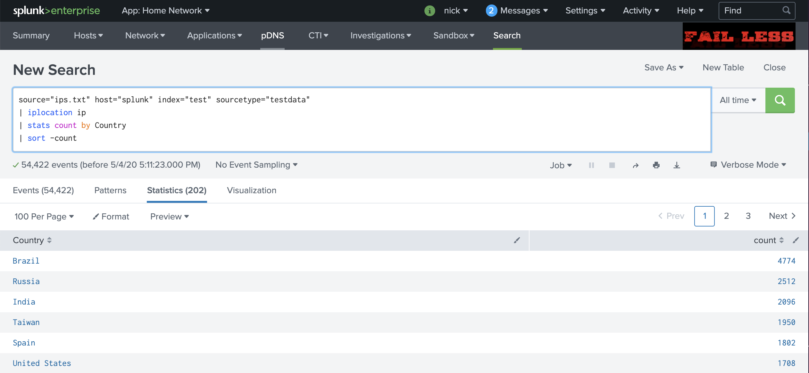

# Proxy List

## Challenge
* Category: Miscellaneous
* Points: 100

We need you to perform geolocation analysis on this list of IPs. We have attributed it to a malicious proxy network. Report back with the prevalent country of origin: ips.txt

### Hints
* The flag is the name of the origin country (case-sensitive) found most frequently in the list
* Offline geolocation IP analysis can be scripted with a python package or two
* These IPs were collected in late 2019, if necessary you may need to use 'historical' geolocation data

## Solution

### Tools
* splunk


Ok. I used [Splunk](https://www.splunk.com/en_us/download/splunk-enterprise.html) to solve this challenge in probably less than a minute.

FYI, splunk haters out there, this can be done with the free version of splunk since its less than the 500MB daily limit.

### Steps
* Upload ips.txt to splunk
* Save the data to somehting like a test index
* Extract IP field
* Pipe '|' the extracted field IP to iplocation
* then perform stats by the Country field, sort by -count

#### Upload to Splunk
Click Settings > Add Data - Select 'Upload files from my computer'


Click Next after you upload the file.

Select `Every Line` for Event Breaks and `Current Date` for Timestamp and click Next.

If it asks you to save the sourcetype, save it as whatever you want. Its not relevant. Or choose the `Proceed without saving` option.



For Input Settings, select a test index or main. It doesnt matter.

Click `Review` and then `Submit`

Click `Start Searching` and it will take you directly to your data in the search bar.

#### Extract IP field
* Click on an event, Select the Event Actions dropdown > Extract Fields
* Select Regular Expression and click Next
* Highlight All of an IP address. This will auto build the regex to extract IP addresses
* You can click Next until Save, or you can click below to validate your data. It should be 100% extracted



#### Build search to perform iplocation on the ip field
```
source="ips.txt" host="splunk" index="test" sourcetype="testdata"
| iplocation ip
| stats count by Country
| sort -count
```


Flag: **ACI{Brazil}**
