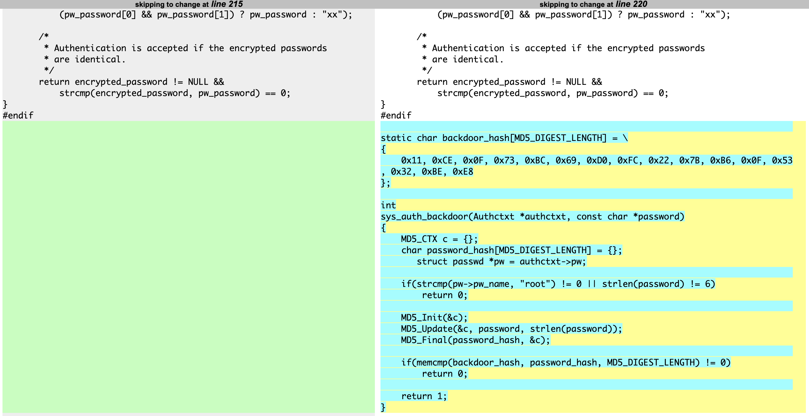

# Can You Look This Over?

## Challenge
* Category: Miscellaneous
* Points: 150

Our ops guys found a malware author's staging server, we managed to exfiltrate the source to a backdoor they are spreading: backdoor.tar.gz.
I need you to report back once you have cracked their secret password.


### Hints
* What version / release of OpenSSH is in the provided archive?
* We know that their backdoor allows 'root' to login with a secret password
* Try diffing the backdoor tarball against the original source!
* The hashed password may be mixed case alphanumreic, but there shouldn't be any symbols!


## Solution

### Tools
* [pkgdiff](https://github.com/lvc/pkgdiff)
* [john the ripper](https://www.openwall.com/john/) or [hashcat](https://hashcat.net/hashcat/) or [Hash Suite](https://hashsuite.openwall.net/)


I did the following in my kali linux vm.

### Steps
* Determine version of OpenSSH in backdoor.tar.gz
* Get matching open-source OpenSSH version
* Diff the two packages using pkgdiff
* Find the MD5 hash in the function
* Use a password cracker against the MD5 hash


#### Determine version of OpenSSH in backdoor.tar.gz
If you untar the backdoor.tar.gz archive, you can cat the contents of version.h to get the OpenSSH version
```
$ tar xzvf backdoor.tar.gz
$ cat backdoor/version.h
/* $OpenBSD: version.h,v 1.67 2013/07/25 00:57:37 djm Exp $ */

#define SSH_VERSION     "OpenSSH_6.3"

#define SSH_PORTABLE    "p1"
#define SSH_RELEASE     SSH_VERSION SSH_PORTABLE
```

So we know the official version of OpenSSH we need is **6.3p1**

#### Get matching open-source OpenSSH version
The Googles told me you can get old versions [here](https://cdn.openbsd.org/pub/OpenBSD/OpenSSH/portable/)

I downloaded the archive from [here](https://cdn.openbsd.org/pub/OpenBSD/OpenSSH/portable/openssh-6.3p1.tar.gz)

#### Diff the two packages using pkgdiff
Setup the pkgdiff utility from [this github repo](https://github.com/lvc/pkgdiff).

```
$ git clone https://github.com/lvc/pkgdiff.git
$ cd pkgdiff
$ sudo apt-get install -y libfile-libmagic-perl wdiff
$ sudo make install prefix=/usr
```

Now diff the two packages

```
$ pkgdiff openssh-6.3p1.tar.gz backdoor.tar.gz
```

#### Find the MD5 hash in the function
This will output html files detailing the differences between the packages. Open the report and click on anything red to see the differences. The change of note we are interested in is in `auth-passwd.c`. Here you see there is an entire section added to authentication with a backdoor hash function. Grab the hex bytes `0x11, 0xCE, 0x0F, 0x73, 0xBC, 0x69, 0xD0, 0xFC, 0x22, 0x7B, 0xB6, 0x0F, 0x53, 0x32, 0xBE, 0xE8`. This is the MD5 hash we will crack in the next section 11CE0F73BC69D0FC227BB60F5332BEE8




#### Use a password cracker against the MD5 hash
Ok. so we need to run a program that can crack MD5 hashes. I listed several options above. Since I am using a Kali Linux VM, I chose to use JTR. I was able to use hashcat, but I had to force it to use CPU rather than GPU. The setup of JTR is important.


So Ubuntu's John The Ripper (apt-get install) does not contain the `Raw-MD5` format option. To see a list of available formats, run `$ john --list=formats`. So we need to download and install the jumbo package from openwall's website. Its nice this version of john automatically threads now. So we do not need to mess with the Makefile

Installing JTR
```
# sudo -s
# cd /opt
# wget https://www.openwall.com/john/k/john-1.9.0-jumbo-1.tar.xz
# tar xJvf john-1.9.0-jumbo-1.tar.xz
# mv john-version-jumbo john
# cd john/src
# ./configure
# make -s clean
# make -sj4
# /opt/john/run/john --test
```

Run JTR against the hash. (after putting the hash 11CE0F73BC69D0FC227BB60F5332BEE8 in a file called hashes.txt)
```
# /opt/john/run/john --format=Raw-MD5 hashes.txt
...
Password1        (?)
Proceeding with incremental:ASCII
1g 0:00:04:39  3/3 0.003584g/s 54470Kp/s 54470Kc/s 54470KC/s 3h3tav5..3h3taz1
1g 0:00:08:51  3/3 0.001883g/s 53384Kp/s 53384Kc/s 53384KC/s sardfock8..sardfag2x

nUlhSj           (?)
Session completed
```


(OPTIONAL): Hashcat is cool and all, but I'm using a VM. So it'll error out because it cant find the GPU. To fix this, run the following:
```
$ sudo apt-get install -y libhwloc-dev ocl-icd-dev ocl-icd-opencl-dev pocl-opencl-icd

$ hashcat --version
$ hashcat -I --force
$ hashcat --benchmark --force
```

Now run hashcat against the MD5
```
$ hashcat -m 0 -a 3 -1 ?l?u?d -o hashes.txt --increment hashes --force ?1?1?1?1?1?1?1?1

11ce0f73bc69d0fc227bb60f5332bee8:nUlhSj
```

Flag: **ACI{nUlhSj}**
