# Whats the Difference?

## Challenge
* Category: Reverse Engineering
* Points: 100

Of course it's safe to download programs ([npp.6.8.7.bin.minimalist.7z](https://challenge.acictf.com/static/73a9d04b71351b92461cdf351b9708a8/npp.6.8.7.bin.minimalist.7z)) from the internet. Although the official archive from https://notepad-plus-plus.org/repository/6.x/6.8.7/npp.6.8.7.bin.minimalist.7z is different (official.npp.6.8.7.bin.minimalist.7z)...

### Hints
* Maybe the binary has been modified.
* You can try using BinDiff, Diaphora, or Ghidra's Program Differences Tool on npp.exe and notepad++.exe.


## Solution

### Tools
* [Ghidra](https://ghidra-sre.org/)
* [BinExport](https://reverseengineering.stackexchange.com/questions/22372/do-i-need-to-have-ida-pro-to-use-the-bindiff-tool)
* [BinDiff](https://www.zynamics.com/bindiff.html)

The approach for this challenge is to examine the two npp (notepad plus plus) executables and find the differences. Once we find the differences we will reproduce the function in a python script for the flag. That's a pretty simple approach right? Well, it did not turn out to be simple. There are numerous methods to `diff` the npp files, but each method was very finicky and required a few exact steps or the programs would run forever.

I will detail 2 methods that `diff` the npp executables. The [first method](#method-1-diff-with-ghidra) uses Ghidra's build in Program Difference Tool. I lost days going down a rabbit-hole with Ghidra's [PatchDiffCorrelator](https://blog.threatrack.de/2019/10/02/ghidra-patch-diff/) plugin. Do not use that plugin. It's not necessary for this challenge. The [second method](#method-2-diff-with-bindiff) uses [BinExport](https://reverseengineering.stackexchange.com/questions/22372/do-i-need-to-have-ida-pro-to-use-the-bindiff-tool) to export files from ghidra and then uses [BinDiff](https://www.zynamics.com/bindiff.html) to find the difference. Again, I lost a lot of time trying to use bindiff within ghidra only to realize that approach was unnecessary. Sure, we can attempt bindiff in Ghidra, but it takes minutes to run it outside of Ghidra using the bindiff files we export from Ghidra.

I am starting with a fresh install of [Ghidra](https://ghidra-sre.org/InstallationGuide.html#Install) so we can detail the installation any plugins throughout this walkthrough.

#### Lab Setup

As usual I am using a [kali linux](https://www.offensive-security.com/kali-linux-vm-vmware-virtualbox-image-download/) Virtual Machine from Offensive Security. Ghidra can be resource intensive, so I usually increase the VM to 2 CPU Cores and 4096 MB Memory.

Follow these instructions to [install ghidra](https://ghidra-sre.org/InstallationGuide.html#Install). My image of Kali already has java installed and added to my path. If you are using something else, you will need to follow instructions for installing [openjdk](https://www.ylmzcmlttn.com/2019/03/26/ghidra-installation-on-ubuntu-18-04-16-04-14-04/) and adding it to your path.

```
$ wget https://ghidra-sre.org/ghidra_9.1.2_PUBLIC_20200212.zip
$ unzip ghidra_9.1.2_PUBLIC_20200212.zip
$ mv ghidra_9.1.2_PUBLIC_20200212 ghidra
```

Start Ghidra
```
$ cd ghidra
$ ./ghidraRun
```

Extract both npp archives. You may need to install 7z (`$ sudo apt-get install p7zip-full`). The official npp will clutter your working directory, so I'm extracting it into a directory. 7z is weird about how it names the dir (I don't like special characters in dir names)
.
```
$ 7z x official.npp.6.8.7.bin.minimalist.7z -o:official_npp
$ mv :official_npp offiical_npp
$ 7z x npp.6.8.7.bin.minimalist.7z
```

#### Method 1: Diff with Ghidra

Start by creating a Ghidra project. In the Ghidra projects window select File > New Project. I am titling mine method1. Now click the `CodeBrowser` tool (its the dragon icon).

Let's import the official npp executable first. Go to File > Import File. Select the `notepad++.exe` file. Ghidra should detect its a PE, click OK.

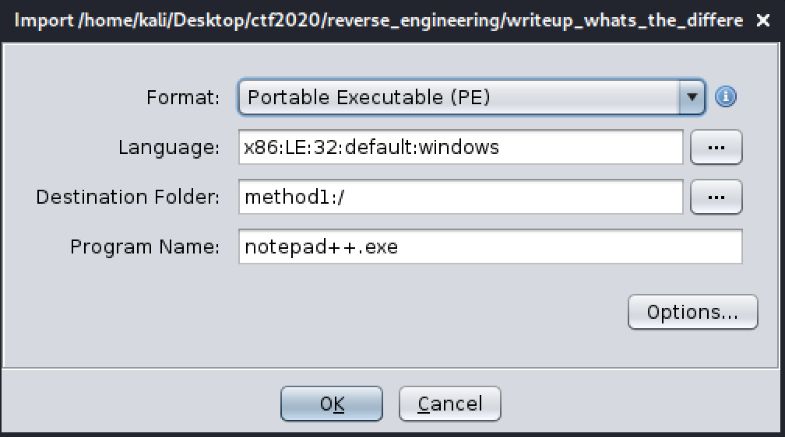

Ghidra will prompt you to perform analysis on the file. Select `Yes`. The default analysis options are fine.

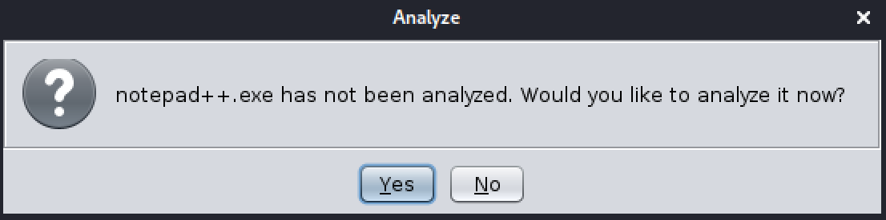

Ghidra will run for a while.

Once Ghidra completes analysis on the official npp executable, repeat the above steps and import the modified `npp.exe` from the npp.6.8.7.bin.minimalist.7z archive. Ghidra will run for a bit again.

If Ghidra threw any warnings during analysis, just click ok.

Let's perform a diff now that analysis is complete on our executables. First, select the `npp.exe` tab in the Listing window. If it's the originating file in the diff, we can view the differences in the decompile window.

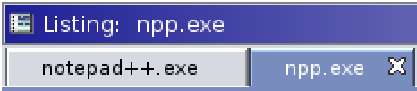

Now start Ghidra's diff tool. Go to `Tools` > `Program Differences`.

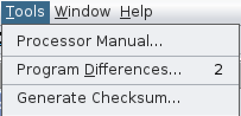

Since our originating file is `npp.exe`, select `notepag++.exe` as the other program. Click Ok.

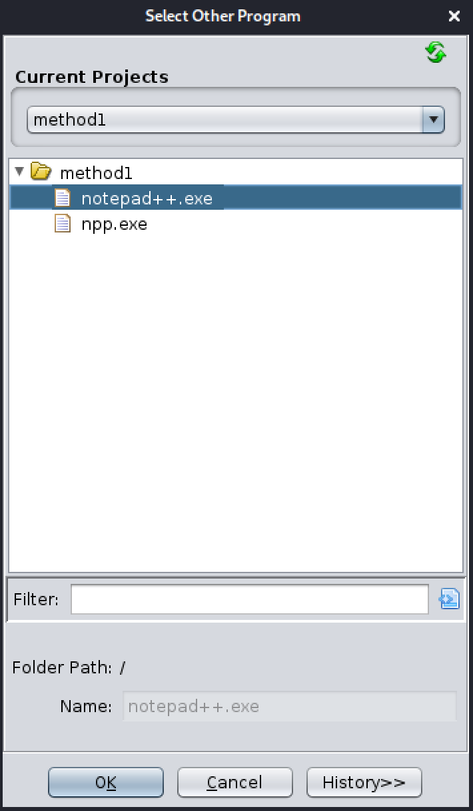

Ghidra defaults to all program differences. That will hit on everything our analysis did. So let's uncheck everything except for `bytes`. Then click Ok.

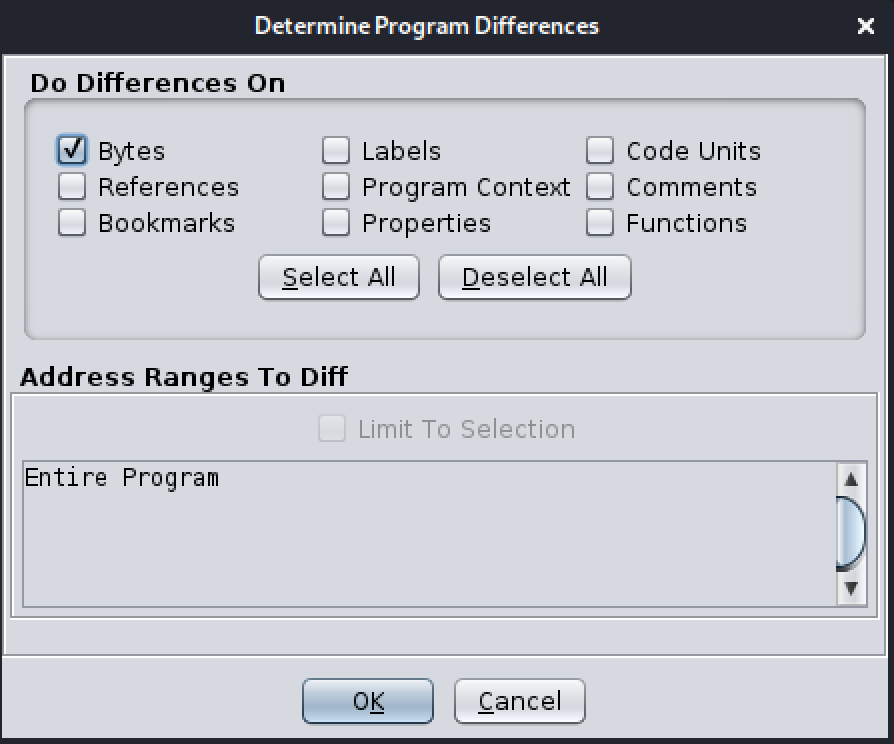

Ghidra will complain about the memory addressed being different. Just click Ok.

Ghidra will highlight the differences in the color orange. So scroll through the diff windows until you see orange. I'll save you the time, its at the bottom.

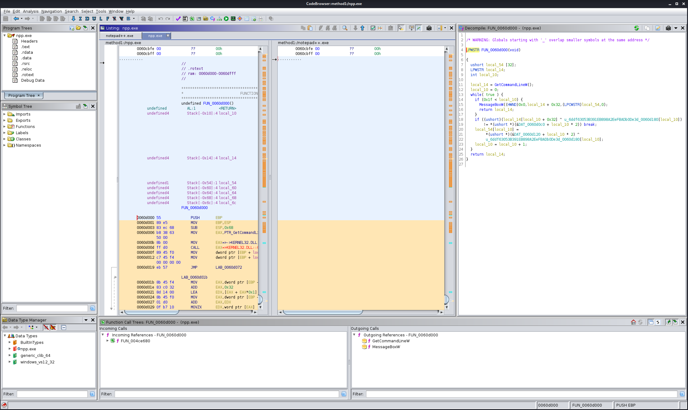

Boom! We found that `npp.exe` has a whole function not in the official executable.

```c
/* WARNING: Globals starting with '_' overlap smaller symbols at the same address */

LPWSTR FUN_0060d000(void)

{
  ushort local_54 [32];
  LPWSTR local_14;
  int local_10;

  local_14 = GetCommandLineW();
  local_10 = 0;
  while( true ) {
    if (0x1f < local_10) {
      MessageBoxW((HWND)0x0,local_14 + 0x32,(LPCWSTR)local_54,0);
      return local_14;
    }
    if ((ushort)(local_14[local_10 + 0x32] ^ u_6ddf63053B391EB898A2EeFBADb0De3d_0060d180[local_10])
        != *(ushort *)(&DAT_0060d0c0 + local_10 * 2)) break;
    local_54[local_10] =
         *(ushort *)(&DAT_0060d120 + local_10 * 2) ^
         u_6ddf63053B391EB898A2EeFBADb0De3d_0060d180[local_10];
    local_10 = local_10 + 1;
  }
  return local_14;
}
```

At this point you can skip to the [Analyze the Difference](#analyze-the-difference) section.


#### Method 2: Diff with BinDiff

Method 2 is going to use Ghidra to analyze the executables and then the Ghidra Plugin BinExport to export files that BinDiff can perform a diff on. There are so many rabbit-holes regarding Ghidra, Bindiff, BinExport and IDA Pro. If you find yourself in Google's BinExport documentation and you are using gradle, you have gone down the hole and need to return from the abyss.

I'm intentionally not linking documentation to the above rabbit-holes to save you from the abyss. The only article I want you to read is this one: https://reverseengineering.stackexchange.com/questions/22372/do-i-need-to-have-ida-pro-to-use-the-bindiff-tool. Follow its steps for setting up BinExport.

We already have Ghidra and java installed. So the first step is installing [Bindiff 6](https://www.zynamics.com/software.html).

```
$ wget https://storage.googleapis.com/bindiff-releases/bindiff_6_amd64.deb
$ sudo dpkg -i bindiff_6_amd64.deb

(Reading database ... 264000 files and directories currently installed.)
Preparing to unpack bindiff_6_amd64.deb ...
bindiff license has already been accepted
Unpacking bindiff (6) over (6) ...
Setting up bindiff (6) ...
No stored path to the IDA Pro installation directory found, not
creating any symlinks to the BinDif IDA plugins.
Use `dpkg-reconfigure bindiff' to set your IDA Pro directory.

To be able to use BinDiff, you also need to set the path to your
IDA Pro installation directory in the following configuration
files:
    /etc/opt/bindiff/bindiff.xml
Processing triggers for kali-menu (2020.1.7) ...
Processing triggers for desktop-file-utils (0.24-1) ...
Processing triggers for mime-support (3.64) ...
Processing triggers for fontconfig (2.13.1-2+b1) ...
```

The installation will not be happy because we do not have IDA installed, but it's not necessary. If the installtion failed due to dependencies, run `$ sudo apt-get -f install`. Once that completes re-run the dpkg command above.

The above command also added the BinExport Ghidra plugin to `/opt/bindiff/extra/ghidra/ghidra_BinExport.zip`.

Now start ghidra, we are going add that plugin.

In the Ghidra Projects Window select File > `Install Extensions`.

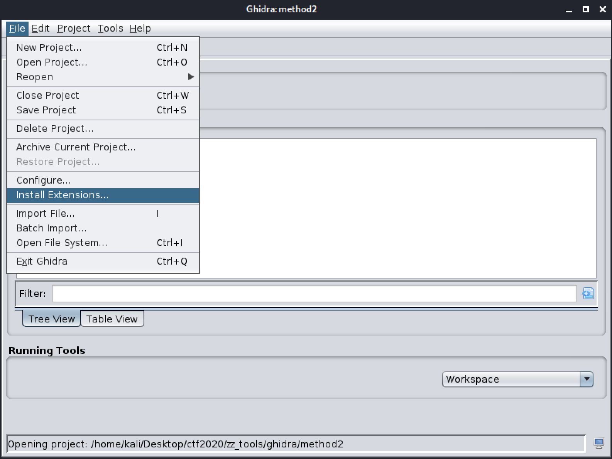

Click the add  in the upper right corner.

Browse to `/opt/bindiff/extra/ghidra/` and select the BinExport archive.

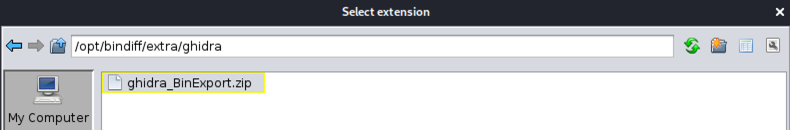

With `BinExport` extension selected, click Ok.

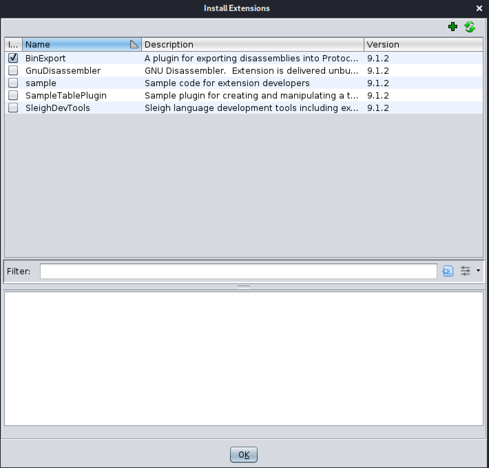

That's it. Now exit out of Ghidra and restart the program.

From here we are going to follow the same process from Method 1 where we imported `npp.exe` and `notepag++.exe`. Let Ghidra perform analysis on both of the executables. Wait a few minutes for the analysis to complete.

Now let's use BinExport. Back in our Ghidra Projects window, right-click each executable in the projects window and select `Export`.

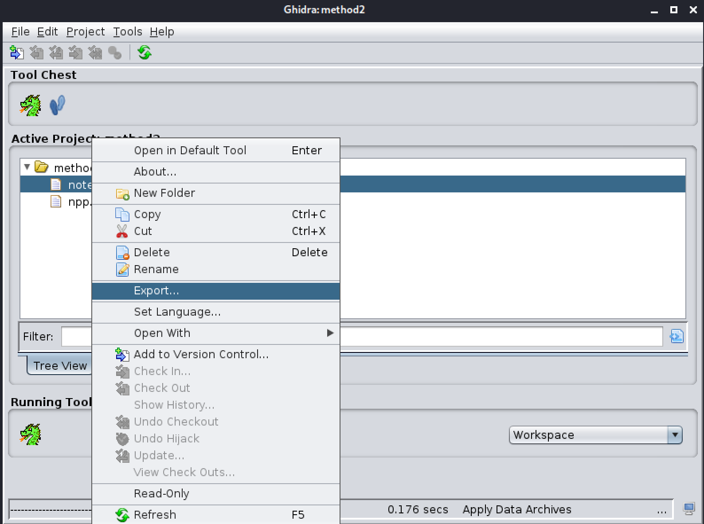

Now select the type of export `Binary BinExport (v2) for BinDiff`

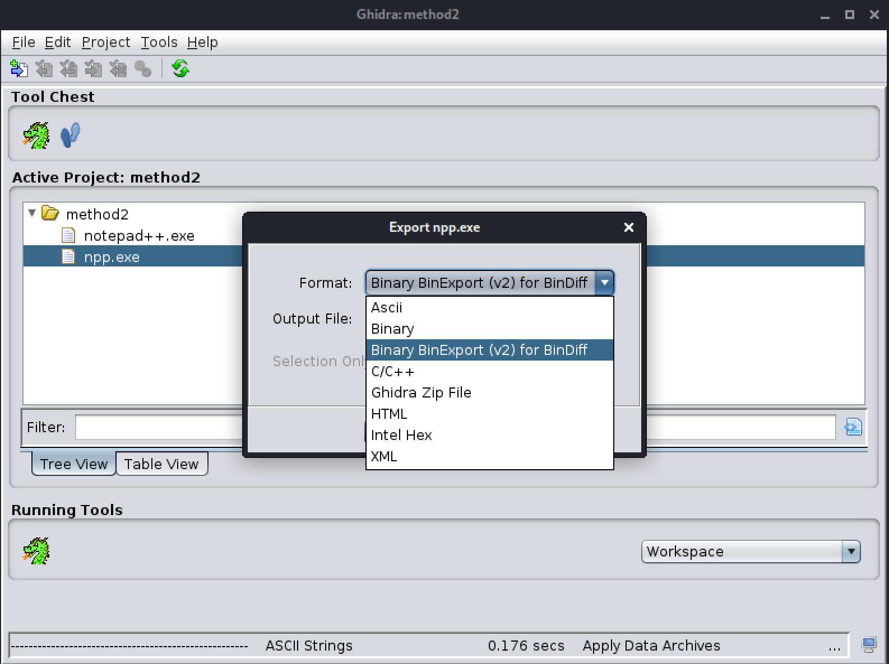

Now we will use `bindiff` to analyse the two binexport files.

```
$ bindiff notepad++.exe.BinExport npp.exe.BinExport
```

That command creates a file `notepad++.exe_vs_npp.exe.BinDiff`. Now let's use `bindiff` to visualize the differences for us.

```
$ bindiff --ui
```

Create a new workspace if needed. Next click `Diffs` > `Add Existing Diff` and select our `notepad++.exe_vs_npp.exe.BinDiff` file. You will now see it in the workspace window. Right-click the diff and click `Open Diff`.

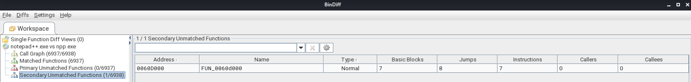

Click on the `Secondary Unmatched Functions (1/6938)` and it will give you the Function address in the next window. You can double-click that function for its full addembly tree.

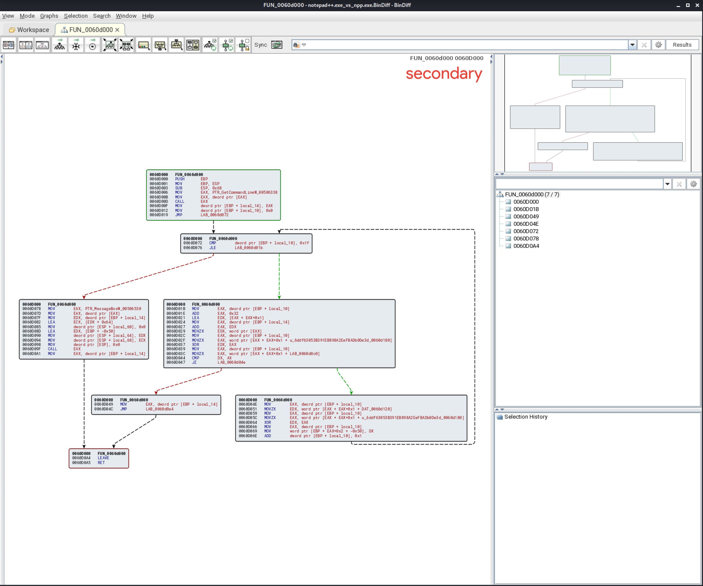

The important note here is that we know the function name `FUN_0060d000`. Let's go take a look at that function in Ghidra.

Navigate to your `Symbols Tree` and expand the `Functions` dropdown. Click on `FUN_0060d000` once you see it.

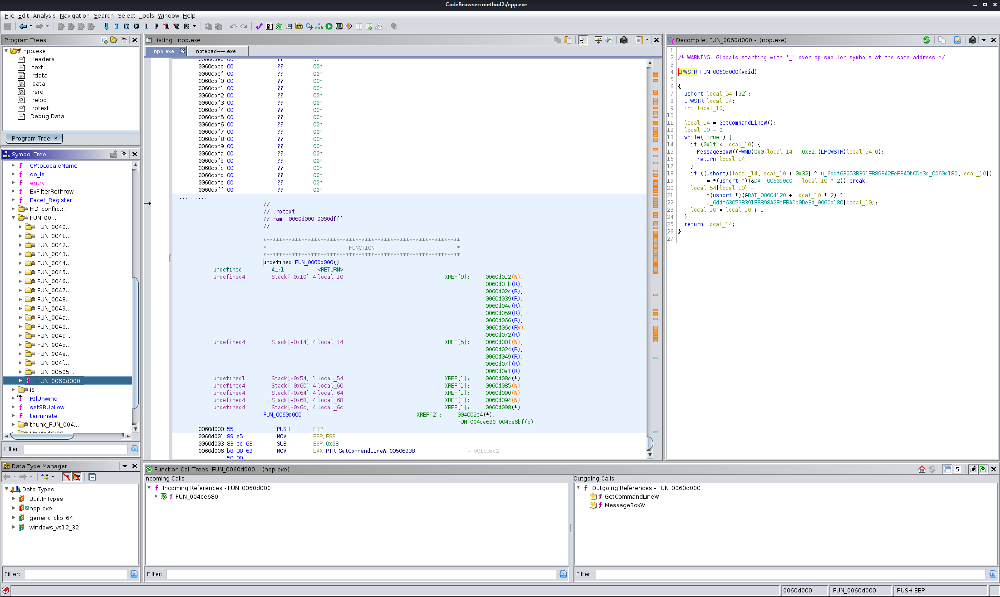

Boom! We found that `npp.exe` has a function `FUN_0060d000` not in the official executable.


#### Analyze the Difference

Both [Method 1](#method-1-diff-with-ghidra) and [Method 2](#method-2-diff-with-bindiff) led us to the same function. C++ can be intimidating if you're not familiar with it. I do not know c++, but can program in other languages. So Let's examine the contents of the function and try to determine what it is doing.

```c
/* WARNING: Globals starting with '_' overlap smaller symbols at the same address */

LPWSTR FUN_0060d000(void)

{
  ushort local_54 [32];
  LPWSTR local_14;
  int local_10;

  local_14 = GetCommandLineW();
  local_10 = 0;
  while( true ) {
    if (0x1f < local_10) {
      MessageBoxW((HWND)0x0,local_14 + 0x32,(LPCWSTR)local_54,0);
      return local_14;
    }
    if ((ushort)(local_14[local_10 + 0x32] ^ u_6ddf63053B391EB898A2EeFBADb0De3d_0060d180[local_10])
        != *(ushort *)(&DAT_0060d0c0 + local_10 * 2)) break;
    local_54[local_10] =
         *(ushort *)(&DAT_0060d120 + local_10 * 2) ^
         u_6ddf63053B391EB898A2EeFBADb0De3d_0060d180[local_10];
    local_10 = local_10 + 1;
  }
  return local_14;
}
```

Let's examine `LPWSTR FUN_0060d000(void)`. This is where we are declaring a function. Ghidra created the label `FUN_0060d000` based off the function's address. LPWSTR is a type declaration in C++ that is a 32-bit pointer to a string of 16-bit Unicode characters, which MAY be null-terminated. `(void)` means our `FUN_0060d000` takes no arguments.

The next three lines are type declarations. In c programming we have to declare variables and their type. `ushort local_54 [32];` declares `local_54` an unsigned 16-bit integer with a length up to 32. `LPWSTR local_14;` is declaring a variable `local_14` to be a 32-bit pointer to a string of 16-bit Unicode characters, a 16-bit UTF-16 code unit. The `int local_10;` is declaring `local_10` to be an integer.

Let's examine the next two lines:

```c
local_14 = GetCommandLineW();
local_10 = 0;
```

The `GetCommandLineW` function, which retrieves the command-line string for the current process, is called and placed into the variable `local_14`. The `local_10` variable is set to 0.

So far we have declared a couple variables and put some things in them. This was all in preparation for the while loop. Let's break the while loop into several sections.

First examine the following:

```c
if (0x1f < local_10) {
  MessageBoxW((HWND)0x0,local_14 + 0x32,(LPCWSTR)local_54,0);
  return local_14;
}
```

If you do not know hex, go ahead and pop `0x1f` into [rapidtables hex to int](https://www.rapidtables.com/convert/number/hex-to-decimal.html) and you will see `0x1f` is decimal `31`. Remember `local_10` is currently `0`. The `if (0x1f < local_10)` statement will only trigger when it returns `true`. Currently, it is false since 31 is not `<` (less than) 0. Deviate from this if statement for a moment and look at the line `local_10 = local_10 + 1;`. This line increments the `local_10` variable for each iteration of the while loop. So when `local_10` is the number `32`, the `if (0x1f < local_10)` statement will return `true` and execute the `MessageBoxW((HWND)0x0,local_14 + 0x32,(LPCWSTR)local_54,0);` line. The gist of this line is that a messagebox will produce a string that is the concatenation of the `local_14` and `local_54` variables.

Let's examine the next line:

```c
if ((ushort)(local_14[local_10 + 0x32] ^ u_6ddf63053B391EB898A2EeFBADb0De3d_0060d180[local_10])
    != *(ushort *)(&DAT_0060d0c0 + local_10 * 2)) break;
```

First examine the last part of the statement: `break;`. If the preceding portions return `true` it will break the while loop. This line `if ((ushort)(local_14[local_10 + 0x32] ^ u_6ddf63053B391EB898A2EeFBADb0De3d_0060d180[local_10]) != *(ushort *)(&DAT_0060d0c0 + local_10 * 2))` is pretty important. There's a lot to unpack there. When you see something like `local_14[]` it means that we are performing an operation on a specific position (index) within that variable. So `local_14[0]` would mean we are doing something with whatever is in the first position of the `local_14` variable. As the while loop increments, we incrementing over the `local_14` variable and performing an operation.

What is that operation? Well `^` is a bitwise XOR operator. The next part `u_6ddf63053B391EB898A2EeFBADb0De3d_0060d180` is a unicode string. So we are XOR'ing each position in the `local_14` variable with a character in each position of the unicode string.

The next part `!=` determines whether we trigger the `break;` for the loop. The `(&DAT_0060d0c0 + local_10 * 2))` is an address. It's referencing `DAT_0060d0c0` plus the `local_10` variable multiplied by 2. We'll revisit `DAT_0060d0c0` in a bit.

Finally, let's examine the last part of the function.

```c
local_54[local_10] = *(ushort *)(&DAT_0060d120 + local_10 * 2) ^ u_6ddf63053B391EB898A2EeFBADb0De3d_0060d180[local_10];
```

This line executes every iteration of the while loop. It's filling the `local_54` variable with each iteration. During the iteration it is grabbing the character at `&DAT_0060d120 + local_10 * 2` and XOR'ing it with a character at the position in the unicode string.

#### Analyze the Data References

Ok. The analysis of the function was a lot to digest. Your head may hurt at this point. But don't check out just yet. We're nearly there. The above analysis boils down to performing an `XOR` on a character in the  `DAT_0060d120` and `DAT_0060d0c0` addresses with the unicode string `6ddf63053B391EB898A2EeFBADb0De3d_0060d180`.

This means that we can replicate the function if we get the characters at those two addresses. Go back into Ghidra and find our `FUN_0060d000`. Just double-click the `&DAT_0060d0c0` and Ghidra will take you directly to that address.


It doesn't look like Ghidra did much decoding the data for us, but we have the hex! Think back to our while loop. As the `local_10` variable increments, the function grabs the hex at `local_10` * 2. The first one, is 0 * 2, is 0. So the resulting hex is `0x77`. In the next iteration of the while loop, its 1 * 2, which is 2. So the resulting hex is `0x27`. Repeat this process of multiplying the `local_10` number by 2 and copy out the hex. In the end you will have the following:

```
"77", "27", "2D", "1D", "53", "56", "54", "04", "05", "7A", "51", "08", "57", "21", "75", "5D", "01", "08", "75", "53", "72", "52", "7F", "70", "73", "22", "04", "02", "76", "55", "00", "19"
```

Now repeat the process for `DAT_0060d120`.

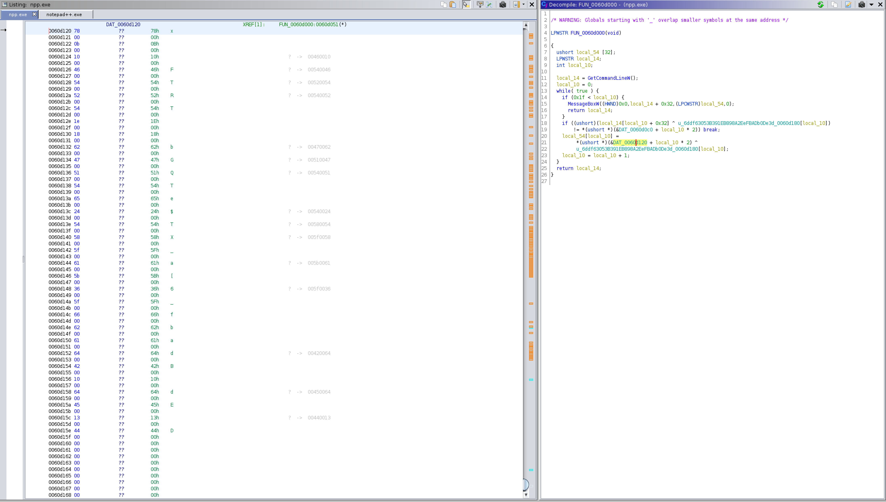

In the end you will have the following hex values:

```
"78", "0B", "10", "46", "54", "52", "54", "1E", "18", "62", "47", "51", "54", "65", "24", "54", "58", "5F", "61", "5B", "36", "5F", "66", "62", "61", "64", "42", "10", "64", "45", "13", "44"
```

#### Get the Flag

Now that we have the contents of the data references and the unicode string, we have all the components necessary to reproduce the function. Since python is my language of choice, I wrote a script [score.py](./score.py) that will produce the flag for us.

I'm not going to just throw the script at you without any explanation. So let's break it down.

We start by putting each of the hex we found at each DAT address into lists.

```python
DAT_0060d0c0_hex = ["77", "27", "2D", "1D", "53", "56", "54", "04", "05", "7A", "51", "08", "57", "21", "75", "5D", "01", "08", "75", "53", "72", "52", "7F", "70", "73", "22", "04", "02", "76", "55", "00", "19"]
DAT_0060d120_hex = ["78", "0B", "10", "46", "54", "52", "54", "1E", "18", "62", "47", "51", "54", "65", "24", "54", "58", "5F", "61", "5B", "36", "5F", "66", "62", "61", "64", "42", "10", "64", "45", "13", "44"]
```

I probably could have written something in python to convert the unicode, but I had already done it in rapidatables. We need to convert the unicode to type `int` because bitwise `XOR` only takes type `int`.

```python
# turing this unicode into a list 6ddf63053B391EB898A2EeFBADb0De3d
unicode_hex1 = ["36", "64", "64", "66", "36", "33", "30", "35", "33", "42", "33", "39", "31", "45", "42", "38", "39", "38", "41", "32", "45", "65", "46", "42", "41", "44", "62", "30", "44", "65", "33", "64"]
# i used rapidtables to convert ascii to hex
unicode_ints = [54, 100, 100, 102, 54, 51, 48, 53, 51, 66, 51, 57, 49, 69, 66, 56, 57, 56, 65, 50, 69, 101, 70, 66, 65, 68, 98, 48, 68, 101, 51, 100]
```

Remember our DAT lists are hex? Well they need to be type `int` just like our unicode string. So the following functions convert the hex lists to type `int`.

```python
# convert DAT_0060d0c0_hex to ints
DAT_0060d0c0_ints = []
for item in DAT_0060d0c0_hex:
    x = int(item, 16)
    DAT_0060d0c0_ints.append(x)

# convert DAT_0060d120_hex to int
DAT_0060d120_ints = []
for item in DAT_0060d120_hex:
    x = int(item, 16)
    DAT_0060d120_ints.append(x)
```

In order to decipher the flag, we will have to convert the data we XOR'd into raw format. Bitwise XOR takes type `int` and produces a resulting `int`. So this function converts the `int` to a raw string.

```python
def dec_to_raw(source_data):
    # convert dec to hex
    myhex = hex(int(source_data))[2:]
    # convert hex to base64
    mybase64 = binascii.b2a_base64(binascii.unhexlify(myhex)).decode().replace("\n", "")
    # convert base64 to raw
    return(binascii.a2b_base64(mybase64).decode())
```

The while loop replicates the goal of the c++ function `FUN_0060d000` in the `npp.exe`.  The loop starts at `0` and xor's the int character at each position in list `local_14` and `local_54` with the int in the corresponding position of our unicode_ints list.

```python
local_14 = []
local_54 = []
count = 0
while True:
    if count > 31:
        break

    # xor the two data sections against the unicode string
    local_14.append(DAT_0060d0c0_ints[count] ^ unicode_ints[count])
    local_54.append(DAT_0060d120_ints[count] ^ unicode_ints[count])

    # increment
    count = count + 1
```

Finally, we need to convert the resulting int to ascii now that we have xor'd the contents of the DAT addresses with the unicode string.

```python
# now lets convert local_54 to something
local_54_str = ""
for item in local_54:
    local_54_str += dec_to_raw(item)

local_14_str = ""
for item in local_14:
    local_14_str += dec_to_raw(item)

print("{}{}".format(local_54_str, local_14_str))
```

Go ahead and run the script.

```
$ python3 score.py
Not bad++ the flag is:          ACI{eed168b1fd7e804a77922ff2203}
```

**ACI{eed168b1fd7e804a77922ff2203}**
