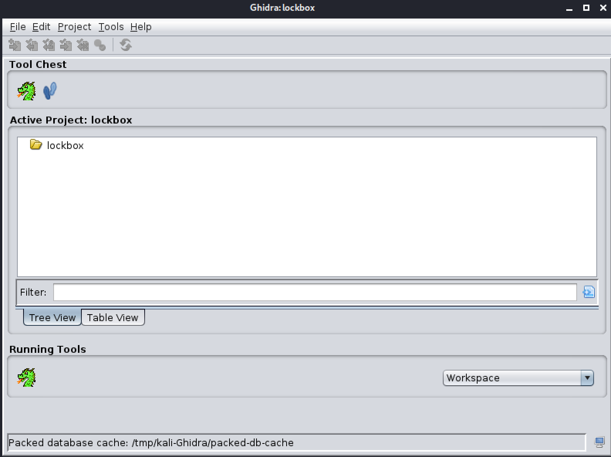
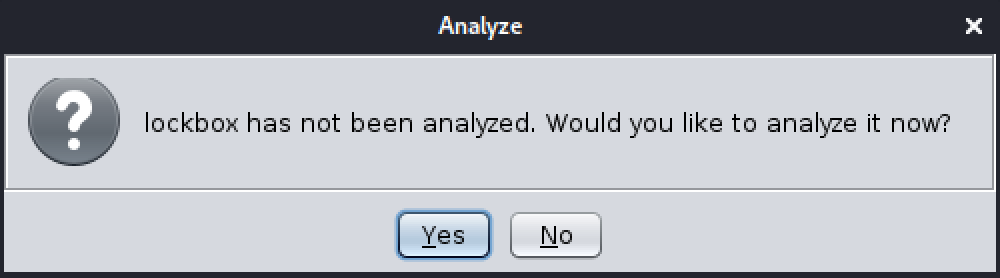
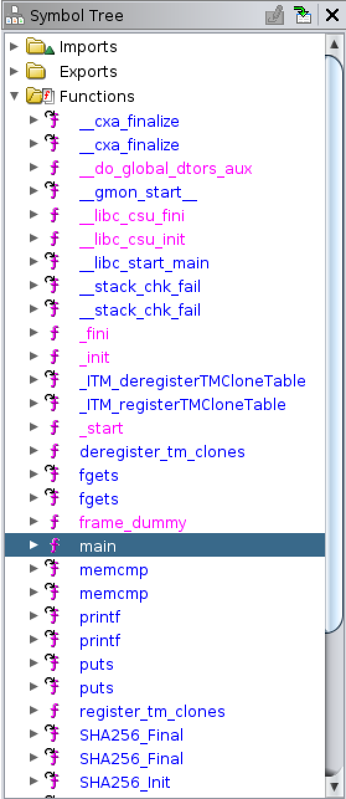
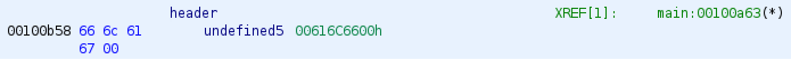
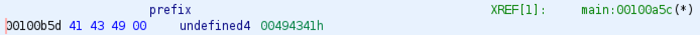
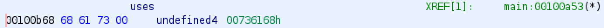
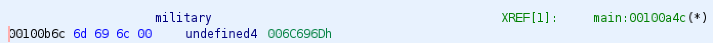

# Lockbox

## Challenge
* Category: Reverse Engineering
* Points: 50

We developed this password-protected [program](https://challenge.acictf.com/static/220d098a4a1aa9d8c3ccd7755d17b7fc/lockbox) which uses a super-secure, military-grade hash function with 256-bits of security to ensure only someone with the proper password can print the flag.

### Hints
* You do not need to crack the password.
* Tools like [ghidra](https://ghidra-sre.org/) are helpful when `strings` isn't enough.
* Looking at calls to `printf` and `puts` is probably a good place to start.


## Solution

### Tools
* [Ghidra](https://ghidra-sre.org/)
* [rapidtables hex to ascii](https://www.rapidtables.com/convert/number/hex-to-ascii.html)

The hint is pretty straight forward for this challenge. We will use ghidar to disassemble the binary and evaluate its functions for any helpful hints.

Start ghidra and create a project. I called mine lockbox. Then click the `CodeBrowser` tool. It's the dragon icon.



Now import lockbox into the tool. Click File > `Import File` and browse to your lockbox binary. Once imported, It should detect the ELF format.


Ghidra will prompt you asking if you would like to analyze the file. Click Yes. More boxes will pop up asking for types of analysis. You can leave the defaults selected. They are adequate for this challenge.



Ghidra will complete its analysis in a bit.

The hint references `printf` and `puts`. Start your analysis by expanding `Functions` under the `Symbol Tree`.



We see two `printf` and `puts` as well as a `main`. In C Programming, the main function is "called" by the operating system when the user runs the program. Let's double-click `main` and takes us to the main function in the Listing and Decompile windows.

This is a really useful feature of Ghidra. It will build what it thinks the program's code is and present it back to you in the decompile window. Check out our `main` function below.

```c
undefined8 main(void)

{
  int iVar1;
  size_t sVar2;
  undefined8 uVar3;
  long in_FS_OFFSET;
  int local_ec;
  SHA256_CTX local_e8;
  uchar local_78 [32];
  char local_58 [72];
  long local_10;

  local_10 = *(long *)(in_FS_OFFSET + 0x28);
  printf("Enter the password to get the flag: ");
  fgets(local_58,0x40,stdin);
  sVar2 = strlen(local_58);
  local_ec = (int)sVar2;
  if (local_58[local_ec + -1] == '\n') {
    local_ec = local_ec + -1;
    local_58[local_ec] = '\0';
  }
  SHA256_Init(&local_e8);
  SHA256_Update(&local_e8,local_58,(long)local_ec);
  SHA256_Final(local_78,&local_e8);
  iVar1 = memcmp(local_78,password_hash,0x20);
  if (iVar1 == 0) {
    printf("%s: %s{%x_%s_%s_%s_%s}\n",&header,&prefix,0xc0de,&uses,&military,"grade","crypto");
    uVar3 = 0;
  }
  else {
    puts("Wrong password so no flag for you!");
    uVar3 = 0xffffffff;
  }
  if (local_10 != *(long *)(in_FS_OFFSET + 0x28)) {
                    /* WARNING: Subroutine does not return */
    __stack_chk_fail();
  }
  return uVar3;
}
```

The hints mentioned `printf` and right there it is concatenating the password string.

```
printf("%s: %s{%x_%s_%s_%s_%s}\n",&header,&prefix,0xc0de,&uses,&military,"grade","crypto");
```

We can manually grab each component of the string from the program and assemble the password. Ghidra will take you to the location by clicking its in the function.

Start by clicking `&header`



We can use [rapidtables hex to ascii](https://www.rapidtables.com/convert/number/hex-to-ascii.html) to convert the hex to ascii characters. Go to their website and paste in `666C6167`. It will return `flag`.

Now, back in the main function click `&prefix`.



At the rapidtables website, paste `41434900`. It will return `ACI`.

The next parameter, `0xC0DE` is already hex. Pop it into rapidtables if you need. It translates to `c0de` in ascii.

Next, back in the main function click `&uses`.



Copy its hex out and paste `68617300` into rapidtables. It will return `has`.

Next, back in the main function click `&military`.



Copy its hex out and paste `6D696C00` into rapidtables. It will return `mil`.

The last two parameters are strings "grade" and "crypto". No hex conversions necessary.

Let's put it all together.

"flag ACI{c0de_has_mil_grade_crypto}"

**ACI{c0de_has_mil_grade_crypto}**
