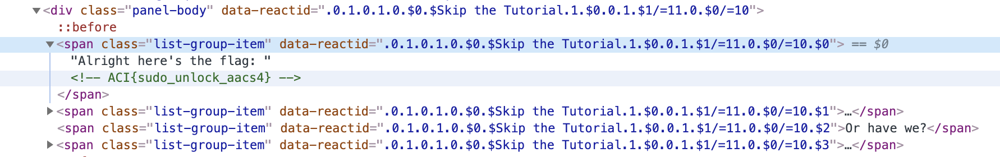

# Skip the Tutorial

## Challenge
* Category: Tutorial
* Points: 0

Are you feeling impatient and just want to dive right in? Solving this problem will allow you to skip the tutorial and start working on the individual categories. If you want to go back and work through the tutorial later, it will still be there.

### Hints
* Alright here's the flag:
* What? You didn't think we'd just give you the flag, did you?
* Or have we?
* If you can't get this now, the hints for 'Out of Site (Web Security)' are applicable here as well. That problem unlocks once you finish the tutorial.

## Solution
Right Click the line on the website that reads `Alright here's the flag:` and click Inspect or Show Source.

Flag: **ACI{sudo_unlock_aacs4}**
