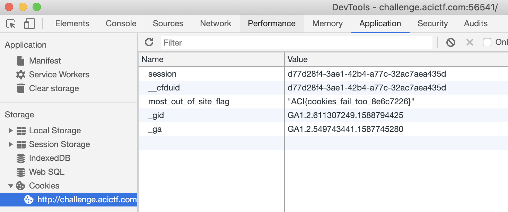

# Most Out of Site

## Challenge
* Category: Web Security
* Points: 20

Alright, one more try. We had to think long and hard about how to keep you from viewing the flag. After a quick snack break, we had an epiphany. Your tricks won't work this time. http://challenge.acictf.com:56541

### Hints
* What on earth could [snack food](https://en.wikipedia.org/wiki/HTTP_cookie) have to do with this problem?
* The browser must be storing these cookies somewhere...
* If you're getting tired of using a browser, the Python [Requests](https://requests.readthedocs.io/en/master/) library is pretty useful for interacting with web servers.


## Solution

Look at the Response Headers. You can look in Chrome or use an intercept like Brup Suite
* In Chrome, Right Click on page and select `Inspect`
* Click Networking Tab
* Select the Page and click the `Headers` subtab

```
GET / HTTP/1.1
Host: challenge.acictf.com:56541
User-Agent: Mozilla/5.0 (X11; Linux x86_64; rv:68.0) Gecko/20100101 Firefox/68.0
Accept: text/html,application/xhtml+xml,application/xml;q=0.9,*/*;q=0.8
Accept-Language: en-US,en;q=0.5
Accept-Encoding: gzip, deflate
Connection: close
Cookie: most_out_of_site_flag="ACI{cookies_fail_too_8e6c7226}"
Upgrade-Insecure-Requests: 1
Cache-Control: max-age=0
```

You can also use the Application Tab in chrome's Dev Tools and you will see the following under the cookies subtab


**ACI{cookies_fail_too_8e6c7226}**
