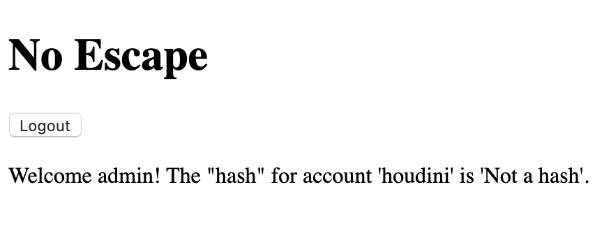

# No Escape

## Challenge
* Category: Web Security
* Points: 60

Since in-person events are currently banned, some magician we've never heard of is trying to sell us on the idea of a "digital" magic show where the magician logs in using an impossible password. For added assurances, one lucky audience member is able to login and see the hash of the password as proof the password is impossible. We're willing to bet the secret to this magic trick is not all that complicated. http://challenge.acictf.com:40194

### Hints
* Inexperienced web application developers don't always esacpe/sanitize user inputs in there database query strings. This frequently allows SQL injection attacks that result in unintended behavior.
* The developer was pretty new, so just causing the query to error out may get you more information for the exploit. What happens when you use a single ' or " in each of the login fields?
* You'll need to login as a specific user. If you're new to SQL syntax, this might be useful resource for understanding the intended query and how you can manipulate it for your purposes.


## Solution

Ok. So the website gives us a Username and Password form. Lets try some SQL injection to see what we are dealing with. This [website](https://www.netsparker.com/blog/web-security/sql-injection-cheat-sheet/) has a bunch of good queries to start with.

Lets start by putting `'admin` in the Username field and anything in the password field.

```
Oops! It looks like the following query caused an error...
SELECT username FROM users WHERE username = ''admin' AND pwHash = 'a593942cb7ea9ffcd8ccf2f0fa23c338e23bfecd9a3e508dfc0bcf07501ead08'
```

Cool. The page returned the SQL query right back to us. This is definately not good. Ok. so lets do another query, but **terminate everything after the username value**.

So put `admin'--'` in the Username field and anything in the password field.



Cool. So we said the account was admin, and terminated the password portion of the SQL query. There was no more validation, and it gave us the admin page. No we know the account to try is `houdini` and we will terminate the remainder of the query again, skipping password validation.

Enter `houdini'--'` into the Username field and anything in the password field.

We see a page that says:

```
Welcome Houdini, here's your flag: ACI{4471130488226d43cf32c71426e}
```

Flag: **ACI{4471130488226d43cf32c71426e}**
