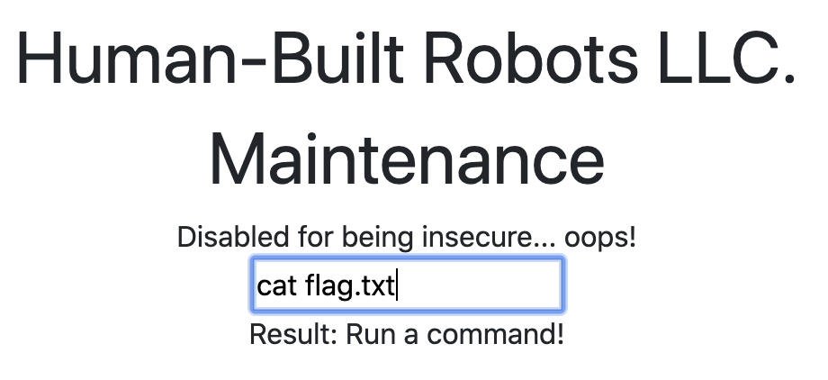

# DENIED

## Challenge
* Category: Web Security
* Points: 75

Sometimes websites are afraid of the terminator finding things out. http://challenge.acictf.com:22362 The flag is in flag.txt.

### Hints
* How can websites keep search engines from finding private information?
* Sometimes the developers leave some comments that give you a hint about what to do...
* You can use the cat command to read files


## Solution

The page is all about Robots. So lets check if it has a robots.txt

Go to http://challenge.acictf.com:22362/robots.txt and we find:

```
User-agent: *
Allow: /index.html
Allow: /products.html
Disallow: /maintenance_foo_bar_deadbeef_12345.html
```

Now go to http://challenge.acictf.com:22362/maintenance_foo_bar_deadbeef_12345.html and Right-Click > Inspect the page.

We find the following HTML thats commented out
```
<!--
            Disabled for being insecure... oops!
        <form action="/secret_maintenance_foo_543212345", method="POST">
            <input name="cmd"/>
        </form>-->
```

So lets remove the comments `<!--` and `-->` and see if we can use the form. Enter into the form input box `cat flag.txt`



The page returns:
Result: ACI{dbf27444473e3d3358392f6cc53}

**ACI{dbf27444473e3d3358392f6cc53}**
